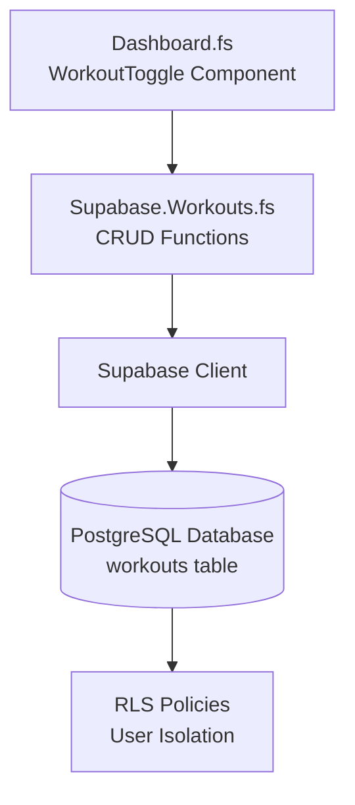
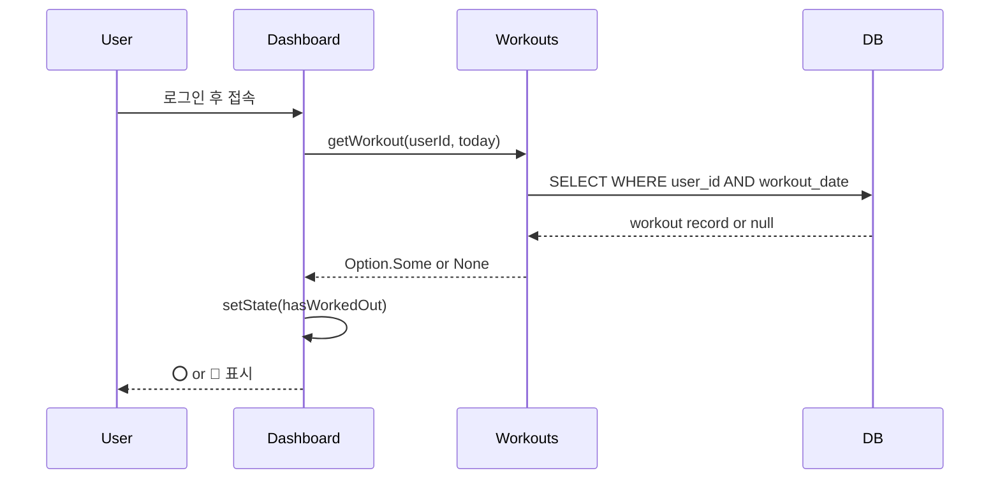
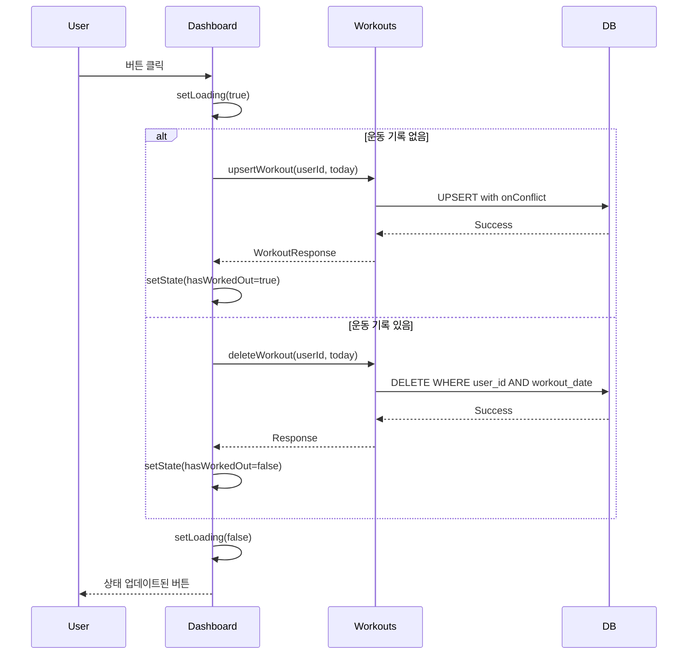

<objective>
Write comprehensive Phase 2 tutorial in Korean for beginner developers covering one-tap workout logging architecture, React state management, Supabase CRUD patterns, and date handling.

Purpose: Document Phase 2 implementation for learning and future reference per DOCS-01 requirement.
Output: tutorial/02-core-loop.md with concept explanations, code examples, UML diagrams, and common pitfalls from RESEARCH.md.
</objective>

<execution_context>
@./.claude/get-shit-done/workflows/execute-plan.md
@./.claude/get-shit-done/templates/summary.md
</execution_context>

<context>
@.planning/PROJECT.md
@.planning/ROADMAP.md
@.planning/REQUIREMENTS.md
@.planning/phases/02-core-loop/02-RESEARCH.md

# Phase 2 implementation:
@.planning/phases/02-core-loop/02-01-SUMMARY.md  # Database schema
@.planning/phases/02-core-loop/02-02-SUMMARY.md  # F# CRUD bindings
@.planning/phases/02-core-loop/02-03-SUMMARY.md  # Dashboard UI
@.planning/phases/02-core-loop/02-04-SUMMARY.md  # Verification results

# Code to reference:
@supabase/migrations/20260210_workouts_schema.sql
@src/Supabase/Workouts.fs
@src/Pages/Dashboard.fs
</context>

<tasks>

<task type="auto">
  <name>Task 1: Write Phase 2 Core Loop tutorial</name>
  <files>tutorial/02-core-loop.md</files>
  <action>
Create tutorial/02-core-loop.md following DOCS-01 requirements:

**Target audience:** 초보 개발자 (beginner developers)
**Language:** 한글 (Korean)
**Content focus:** 개념 위주 설명 (concept-focused explanations)
**Include:** 중요 코드 (important code snippets), UML 다이어그램 (diagrams)

**Structure:**

```markdown
# Phase 2: Core Loop - 원탭 운동 기록

## 개요 (Overview)

Phase 2의 목표와 핵심 가치 설명:
- "오늘 운동했다" 버튼 하나로 기록 완료
- 데이터베이스에 영구 저장
- 사용자 간 데이터 격리 (RLS)

## 아키텍처 (Architecture)

### 시스템 구성도



### 데이터 흐름 (Data Flow)

**1. 초기 로드:**


**2. 토글 클릭:**


## 핵심 개념 (Key Concepts)

### 1. 데이터베이스 스키마

**workouts 테이블 구조:**
```sql
CREATE TABLE workouts (
    user_id UUID NOT NULL,           -- 사용자 식별자
    workout_date DATE NOT NULL,      -- 운동한 날짜 (시간 없음)
    created_at TIMESTAMPTZ NOT NULL, -- 기록 생성 시각
    PRIMARY KEY (user_id, workout_date)  -- 복합 기본키
);
```

**왜 DATE 타입인가?**
- "오늘 운동했나?"라는 질문에는 시간이 필요 없음
- TIMESTAMPTZ 대신 DATE를 쓰면 4바이트 절약 (DATE: 4 bytes, TIMESTAMPTZ: 8 bytes)
- 타임존 혼동 방지

**복합 기본키의 의미:**
- (user_id, workout_date) 조합이 고유해야 함
- 같은 사용자가 같은 날짜에 여러 기록을 만들 수 없음
- "하루 1회 기록" 규칙을 데이터베이스 레벨에서 강제

### 2. Row Level Security (RLS)

**RLS란?**
- PostgreSQL의 보안 기능
- 각 row(행)마다 접근 권한 검사
- 프론트엔드를 신뢰하지 않고 서버에서 강제

**4가지 정책:**
```sql
-- 1. SELECT: 내 기록만 조회 가능
CREATE POLICY "Users can view own workouts"
ON workouts FOR SELECT
USING ((SELECT auth.uid()) = user_id);

-- 2. INSERT: 내 기록만 생성 가능
CREATE POLICY "Users can insert own workouts"
ON workouts FOR INSERT
WITH CHECK ((SELECT auth.uid()) = user_id);

-- 3. UPDATE: 내 기록만 수정 가능
CREATE POLICY "Users can update own workouts"
ON workouts FOR UPDATE
USING ((SELECT auth.uid()) = user_id)
WITH CHECK ((SELECT auth.uid()) = user_id);

-- 4. DELETE: 내 기록만 삭제 가능
CREATE POLICY "Users can delete own workouts"
ON workouts FOR DELETE
USING ((SELECT auth.uid()) = user_id);
```

**성능 최적화:**
- `(SELECT auth.uid())` 형태로 감싸면 쿼리당 1번만 실행 (캐싱)
- `auth.uid()` 직접 사용하면 row마다 실행
- 성능 차이 약 95%

### 3. F# Supabase 바인딩

**promise 계산 표현식 (Computation Expression):**
```fsharp
promise {
    let! result = someAsyncOperation()  // await와 유사
    return result
}
```
- F#의 `async { }`와 비슷하지만 JavaScript Promise로 컴파일됨
- `let!`은 JavaScript의 `await`와 동일
- Supabase SDK가 Promise를 반환하므로 promise CE 사용

**동적 멤버 접근 (Dynamic Member Access):**
```fsharp
supabase?from("workouts")?select("*")?eq("user_id", userId)
```
- `?` 연산자는 JavaScript의 `.` 접근과 동일
- 런타임에 멤버 존재 확인
- 타입 안전성은 낮지만 JS 라이브러리 바인딩에 필수

**unbox<T> vs :?>:**
```fsharp
// ❌ 이건 promise 블록 안에서 에러 발생
let data = result :?> WorkoutRecord

// ✅ 이렇게 써야 함
let data = unbox<WorkoutRecord> result
```
- F# 컴파일러가 promise CE 안에서 `:?>` 금지
- `unbox<T>`는 JS 객체를 F# 타입으로 변환

### 4. React 상태 관리

**useState 패턴:**
```fsharp
let (hasWorkedOut, setHasWorkedOut) = React.useState(false)
let (loading, setLoading) = React.useState(true)
let (error, setError) = React.useState<string option>(None)
```
- 컴포넌트 내부 상태 3개: 운동 여부, 로딩, 에러
- `set*` 함수 호출 시 컴포넌트 재렌더링
- option 타입으로 "있을 수도, 없을 수도"를 표현

**useEffect 마운트 시 실행:**
```fsharp
React.useEffect((fun () ->
    // 이 코드는 컴포넌트가 화면에 나타날 때 1번만 실행
    promise {
        let! workout = getWorkout userId today
        setHasWorkedOut (Option.isSome workout)
    } |> Promise.start
), [||])  // 빈 배열 = 의존성 없음 = 마운트 시에만
```
- 의존성 배열 `[||]`가 핵심
- 배열이 비어있으면 마운트 시 1회만 실행
- 배열에 값이 있으면 그 값 변경 시마다 실행

### 5. 날짜 처리 (Date Handling)

**타임존 버그 방지:**
```fsharp
// ❌ 잘못된 방법: UTC 자정으로 해석됨
let date = JS.Date.Create("2026-02-10")
// 미국 서부(UTC-8)에서는 2026-02-09로 보임!

// ✅ 올바른 방법: 로컬 타임존 사용
let now = JS.Date.Create()
let today = now.toLocaleDateString("en-CA")  // "2026-02-10"
```
- `toLocaleDateString("en-CA")`는 YYYY-MM-DD 형식 반환
- 사용자의 로컬 타임존 기준
- "오늘"은 사용자 달력 기준이어야 함

**왜 "en-CA" 로케일?**
- 캐나다 영어 로케일은 ISO 8601 형식(YYYY-MM-DD) 사용
- 다른 로케일은 MM/DD/YYYY 등 다양한 형식
- 데이터베이스 DATE 타입과 호환

### 6. Upsert의 멱등성 (Idempotency)

**일반 INSERT의 문제:**
```fsharp
// ❌ 이중 클릭 시 에러 발생
if not exists then
    insert()  // 첫 클릭
    // 네트워크 지연...
    insert()  // 둘째 클릭 -> 중복 키 에러!
```

**Upsert의 해결:**
```fsharp
// ✅ 멱등성 보장
upsert(record, { onConflict = "user_id,workout_date" })
// 첫 클릭: INSERT
// 둘째 클릭: UPDATE (에러 없음)
```
- `onConflict`는 복합 기본키와 매칭
- 이미 존재하면 UPDATE, 없으면 INSERT
- 같은 요청을 여러 번 보내도 결과 동일

## 중요 코드 (Important Code)

### Workouts.fs 핵심 함수

**getWorkout - 오늘 운동 여부 확인:**
```fsharp
let getWorkout (userId: string) (date: string) : JS.Promise<WorkoutRecord option> =
    promise {
        let! result =
            supabase?from("workouts")
                ?select("*")
                ?eq("user_id", userId)
                ?eq("workout_date", date)
                ?maybeSingle()  // 0 or 1 row 반환

        let data = result?data
        if isNull (box data) then
            return None  // 기록 없음
        else
            return Some (unbox<WorkoutRecord> data)  // 기록 있음
    }
```

**upsertWorkout - 운동 기록 생성/업데이트:**
```fsharp
let upsertWorkout (userId: string) (date: string) : JS.Promise<WorkoutResponse> =
    promise {
        let record = createObj [
            "user_id" ==> userId
            "workout_date" ==> date
        ]

        let options = createObj [ "onConflict" ==> "user_id,workout_date" ]

        let! result =
            supabase?from("workouts")
                ?upsert(record, options)
                ?select()  // 생성된 record 반환

        return unbox<WorkoutResponse> result
    }
```

**deleteWorkout - 운동 기록 삭제:**
```fsharp
let deleteWorkout (userId: string) (date: string) : JS.Promise<obj> =
    promise {
        let! result =
            supabase?from("workouts")
                ?delete()
                ?eq("user_id", userId)
                ?eq("workout_date", date)

        return result
    }
```

### Dashboard.fs 핵심 로직

**토글 핸들러:**
```fsharp
let handleToggle () =
    if not loading then  // 로딩 중이면 무시
        setLoading true
        setError None

        let today = getTodayDateString()
        let newState = not hasWorkedOut

        promise {
            try
                if hasWorkedOut then
                    let! _ = deleteWorkout userId today
                    ()  // 삭제 성공
                else
                    let! _ = upsertWorkout userId today
                    ()  // 생성 성공

                setHasWorkedOut newState
                setLoading false
            with ex ->
                setError (Some "저장 실패. 다시 시도해주세요.")
                setLoading false
        } |> Promise.start
```

## 흔한 실수 (Common Pitfalls)

### 1. 타임존 버그
**문제:** 저녁 늦게 클릭했는데 어제 날짜로 기록됨
**원인:** UTC 기준으로 날짜 계산
**해결:** `toLocaleDateString("en-CA")` 사용

### 2. 이중 클릭 에러
**문제:** 빠르게 두 번 클릭하면 에러 발생
**원인:** 첫 요청 완료 전 두 번째 INSERT 시도
**해결:**
- `disabled={loading}` 속성으로 버튼 비활성화
- `upsert` 사용으로 멱등성 보장

### 3. RLS SELECT 정책 누락
**문제:** INSERT 성공했는데 `.select()`가 null 반환
**원인:** INSERT 정책만 있고 SELECT 정책 없음
**해결:** SELECT 정책도 함께 생성

### 4. unbox vs :?> 혼동
**문제:** promise 블록에서 타입 캐스팅 에러
**원인:** F# 컴파일러가 promise CE 안에서 `:?>` 금지
**해결:** `unbox<T>` 사용

## 다음 단계 (Next Steps)

Phase 3에서 추가될 기능:
- 달력 뷰 (월별 운동 기록 표시)
- 리스트 뷰 (운동 기록 목록)
- 임의 날짜 기록 (오늘 외 다른 날짜 선택)
- 운동 기록 수정 기능

Phase 2는 "오늘"에만 집중하고, Phase 3에서 "과거/미래" 기록을 다룸.

---
*작성일: 2026-02-10*
*대상: 초보 개발자*
*참고: RESEARCH.md의 Common Pitfalls 섹션*
```

**Formatting:**
- Use Mermaid diagrams for flows (Claude can render these)
- Include actual code from implementation (not pseudocode)
- Explain WHY, not just WHAT
- Korean terminology with English terms in parentheses where helpful
- Code comments in Korean

**Content from RESEARCH.md to include:**
- Pitfall 1: Timezone interpretation (wrong date)
- Pitfall 2: Duplicate key errors on rapid clicks
- Pitfall 3: RLS policy blocks SELECT after INSERT
- Pattern 1: Upsert for idempotent toggle
- Pattern 2: Date handling without timezone
- Pattern 3: React.useState for state management
  </action>
  <verify>
Check tutorial content:
```bash
cat tutorial/02-core-loop.md | wc -l
```
Should be 200+ lines.

Verify structure:
```bash
grep "^#" tutorial/02-core-loop.md
```
Should show clear heading hierarchy.

Check for Mermaid diagrams:
```bash
grep -c "```mermaid" tutorial/02-core-loop.md
```
Should be at least 2 diagrams.
  </verify>
  <done>
tutorial/02-core-loop.md exists with:
- Korean language throughout
- Architecture diagrams (system + sequence)
- 6 key concepts explained in depth
- Important code with Korean comments
- 4 common pitfalls from RESEARCH.md
- 200+ lines of educational content
- Beginner-friendly explanations
  </done>
</task>

</tasks>

<verification>
After tutorial complete:

1. **Content check:**
```bash
cat tutorial/02-core-loop.md
```
Should read naturally in Korean with clear explanations.

2. **Diagram check:**
Mermaid diagrams should be valid syntax (```mermaid ... ```).

3. **Code accuracy:**
Code snippets should match actual implementation in src/.

4. **Completeness:**
All 6 concepts covered, all 4 pitfalls explained.
</verification>

<success_criteria>
- [ ] Tutorial file created at tutorial/02-core-loop.md
- [ ] Written in Korean for beginner developers
- [ ] Includes 2+ UML/Mermaid diagrams
- [ ] Covers all 6 key concepts (schema, RLS, bindings, React, dates, upsert)
- [ ] Includes actual code from Phase 2 implementation
- [ ] Explains 4 common pitfalls from RESEARCH.md
- [ ] 200+ lines of content
- [ ] Clear heading structure
- [ ] Concept-focused (not just code dump)
</success_criteria>

<output>
After completion, create `.planning/phases/02-core-loop/02-05-SUMMARY.md`
</output>
