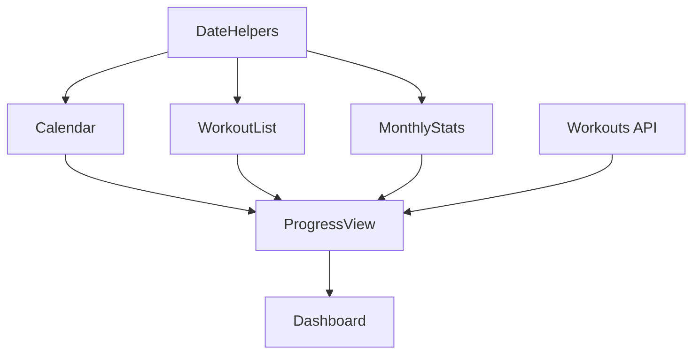
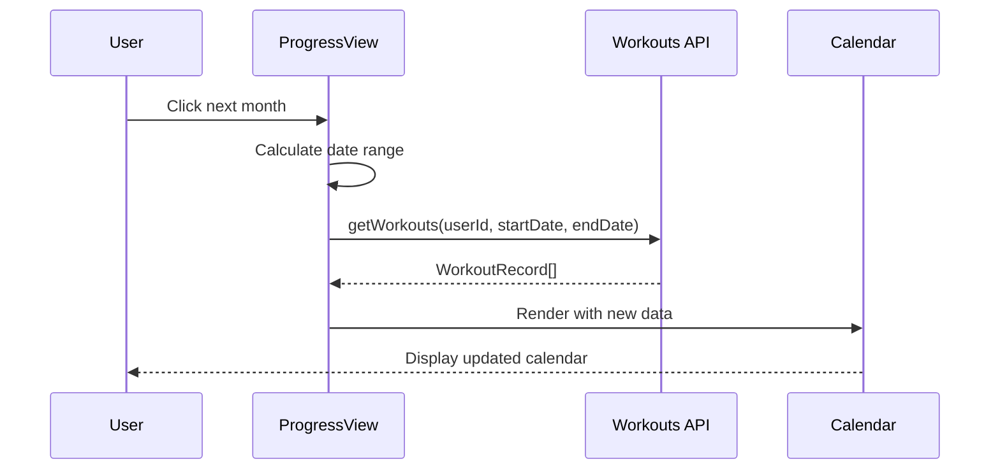

<objective>
Write comprehensive Phase 3 tutorial covering date utilities, calendar grid layout, and multi-view state management

Purpose: Document progress tracking implementation for beginner developers (DOCS-01 requirement)
Output: tutorial/03-progress-tracking.md with Korean explanations, code examples, and UML diagrams
</objective>

<execution_context>
@./.claude/get-shit-done/workflows/execute-plan.md
@./.claude/get-shit-done/templates/summary.md
</execution_context>

<context>
@.planning/PROJECT.md
@.planning/ROADMAP.md
@.planning/phases/03-progress-tracking/03-RESEARCH.md
@tutorial/02-core-loop.md
@src/Utils/DateHelpers.fs
@src/Components/Calendar.fs
@src/Components/WorkoutList.fs
@src/Components/MonthlyStats.fs
@src/Pages/ProgressView.fs
</context>

<tasks>

<task type="auto">
  <name>Task 1: Write Phase 3 tutorial document</name>
  <files>tutorial/03-progress-tracking.md</files>
  <action>
Create tutorial/03-progress-tracking.md following the structure and style of tutorial/02-core-loop.md.

**Required sections:**

1. **개요 (Overview)**
   - Phase 3 목표: 개인 진행 상황 추적 (캘린더, 리스트, 통계)
   - 핵심 가치 연결: 운동 기록 시각화로 동기 부여
   - 구현한 기능: PROG-01 (캘린더 뷰), PROG-02 (리스트 뷰), PROG-03 (월별 통계)

2. **아키텍처 (Architecture)**
   - 시스템 구성도 (Mermaid graph):
     * DateHelpers → Calendar, WorkoutList, MonthlyStats
     * ProgressView → integrates all components
     * Dashboard → tab navigation to ProgressView
   - 데이터 흐름 (Mermaid sequence diagram):
     * User clicks month navigation
     * ProgressView calculates date range
     * getWorkouts API called
     * Components render with new data

3. **핵심 개념 (Key Concepts)** - Minimum 6 subsections:

   a) **날짜 계산 유틸리티 (Date Utilities)**
      - JavaScript Date와 F# emitJsExpr 패턴
      - getDaysInMonth: new Date(year, month, 0).getDate() 트릭
      - getFirstDayOfMonth: 0-indexed 월 주의사항
      - YYYY-MM-DD 포맷 일관성 (DATABASE DATE 타입과 동일)
      - Code example from DateHelpers.fs

   b) **CSS Grid 캘린더 레이아웃 (Calendar Grid Layout)**
      - repeat(7, 1fr) 7열 그리드
      - 첫 날 위치 지정 (grid-column-start)
      - aspect-square로 정사각형 셀 유지
      - Day-of-week 헤더 정렬 (일 월 화 수 목 금 토)
      - Code example: Calendar.fs grid structure

   c) **운동 표시 로직 (Workout Indicators)**
      - hasWorkout 헬퍼로 날짜 매칭
      - 조건부 스타일링 (Tailwind classes)
      - Green background for workout days (bg-green-100)
      - Indigo border for today (border-2 border-indigo-600)
      - Code example: day cell rendering

   d) **React 상태 관리 (State Management)**
      - Multiple useState hooks (viewMode, year, month, workouts, loading, error)
      - Controlled component pattern (month navigation callbacks)
      - useEffect with dependency array [| box currentYear; box currentMonth |]
      - State hoisting (parent holds data, children display)
      - Code example: ProgressView state management

   e) **멀티뷰 패턴 (Multi-View Pattern)**
      - ViewMode discriminated union (Calendar | List)
      - View toggle buttons (setViewMode)
      - Conditional rendering (match viewMode with)
      - Shared data across views (same workouts array)
      - Code example: view toggle and conditional rendering

   f) **월 탐색 로직 (Month Navigation)**
      - goToNextMonth/goToPrevMonth functions
      - Year rollover handling (Dec -> Jan, Jan -> Dec)
      - Date range calculation (startDate/endDate)
      - Server-side filtering (getWorkouts with date range)
      - Code example: month navigation functions

4. **배운 점 (Lessons Learned)**
   - JavaScript 월 0-indexing 함정 (0=January, 11=December)
   - CSS Grid 1-indexing vs JS Day 0-indexing
   - useEffect dependency array의 중요성 (stale data 방지)
   - 컴포넌트 분리의 장점 (Calendar, List, Stats 독립적)
   - 날짜 문자열 일관성 (항상 YYYY-MM-DD 포맷)

5. **다음 단계 (Next Steps)**
   - Phase 4: 팀 기능 (Team Features) - 회원별 월별 운동 횟수
   - Phase 5: 사진 업로드 (Photo Upload) - 사진 기반 기록
   - Phase 6: 프로덕션 준비 (Production Ready) - PWA, Admin 도구

**Requirements:**
- Language: Korean
- Target audience: 초보 개발자
- Content: 개념 위주 설명, 중요 코드 포함
- Diagrams: Mermaid 다이어그램 2개 이상
- Length: 200+ lines minimum
- Style: Match tutorial/02-core-loop.md tone and formatting

**Mermaid diagram examples:**

System architecture:


Data flow:


Use code snippets from actual implementation files, focus on explaining WHY decisions were made (not just WHAT code does).
  </action>
  <verify>
Check tutorial/03-progress-tracking.md:
- File exists and is readable
- Minimum 200 lines
- Contains sections: 개요, 아키텍처, 핵심 개념 (6+ subsections), 배운 점, 다음 단계
- Contains 2+ Mermaid diagrams (```mermaid blocks)
- Korean language throughout
- Code examples from actual implementation
- Targets beginner developers
- Explains date utilities, calendar grid, multi-view pattern
- Matches style of tutorial/02-core-loop.md

Word count check:
```bash
wc -l tutorial/03-progress-tracking.md
```
Should show 200+ lines.
  </verify>
  <done>
tutorial/03-progress-tracking.md exists with comprehensive Korean documentation covering Phase 3 concepts, includes Mermaid diagrams, code examples, and beginner-friendly explanations.
  </done>
</task>

</tasks>

<verification>
After completing task:

1. **File check:**
   ```bash
   ls -lh tutorial/03-progress-tracking.md
   wc -l tutorial/03-progress-tracking.md
   ```
   File exists, 200+ lines.

2. **Content review:**
   - Korean language used throughout
   - 개요 section explains Phase 3 goals
   - 아키텍처 section has Mermaid diagrams
   - 핵심 개념 has 6+ subsections covering:
     * Date utilities
     * CSS Grid calendar layout
     * Workout indicators
     * React state management
     * Multi-view pattern
     * Month navigation
   - 배운 점 section documents lessons learned
   - 다음 단계 section previews Phases 4-6
   - Code examples from actual implementation files
   - Beginner-friendly explanations

3. **Mermaid diagrams:**
   - System architecture diagram (graph)
   - Data flow diagram (sequenceDiagram)
   - Both render correctly (valid syntax)

4. **Comparison with Phase 2 tutorial:**
   - Similar structure and tone
   - Korean language consistency
   - Code example style matches
   - Diagram integration similar
</verification>

<success_criteria>
Plan complete when:
- [x] tutorial/03-progress-tracking.md exists
- [x] Minimum 200 lines
- [x] Korean language throughout
- [x] Contains 개요, 아키텍처, 핵심 개념, 배운 점, 다음 단계 sections
- [x] 6+ subsections in 핵심 개념
- [x] 2+ Mermaid diagrams
- [x] Code examples from actual implementation
- [x] Targets beginner developers
- [x] Covers date utilities, calendar grid, multi-view pattern
- [x] Matches tutorial/02-core-loop.md style
- [x] DOCS-01 requirement met
</success_criteria>

<output>
After completion, create `.planning/phases/03-progress-tracking/03-05-SUMMARY.md`
</output>
