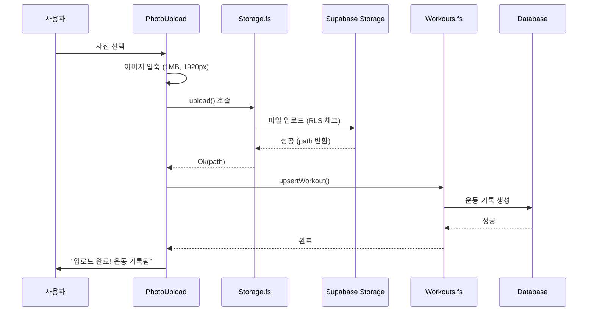

<objective>
Write Phase 5 tutorial documentation covering photo upload implementation

Purpose: Document photo upload patterns for beginner developers (DOCS-01)
Output: Comprehensive Korean tutorial covering Supabase Storage, RLS, compression, and F# bindings
</objective>

<execution_context>
@./.claude/get-shit-done/workflows/execute-plan.md
@./.claude/get-shit-done/templates/summary.md
</execution_context>

<context>
@.planning/PROJECT.md
@.planning/ROADMAP.md
@.planning/STATE.md
@.planning/phases/05-photo-upload/05-RESEARCH.md
@tutorial/04-team-features.md
@supabase/migrations/20260210150000_storage_bucket.sql
@src/Supabase/Storage.fs
@src/Components/PhotoUpload.fs
@src/Components/PhotoGallery.fs
</context>

<tasks>

<task type="auto">
  <name>Task 1: Write Phase 5 tutorial</name>
  <files>tutorial/05-photo-upload.md</files>
  <action>
Create `tutorial/05-photo-upload.md` following the established tutorial structure from Phase 3 and 4.

**Tutorial structure:**

```markdown
# Phase 5: 사진 업로드 튜토리얼

## 개요

이 튜토리얼에서는 Rollbook의 사진 업로드 기능을 구현합니다. 사용자가 운동 사진을 올리면 자동으로 해당 날짜의 운동 기록이 생성됩니다.

**핵심 목표:**
- 사진 업로드로 자동 운동 기록 생성 (WORK-04)
- Supabase Storage를 활용한 비공개 파일 저장
- RLS를 통한 사용자별 사진 격리
- 업로드 진행률 표시
- 클라이언트 사이드 이미지 압축

**구현할 파일:**
- `supabase/migrations/YYYYMMDD_storage_bucket.sql` - 스토리지 버킷 및 RLS
- `src/Supabase/Storage.fs` - 스토리지 API 바인딩
- `src/Components/PhotoUpload.fs` - 사진 업로드 UI
- `src/Components/PhotoGallery.fs` - 사진 갤러리 UI
- `src/Pages/Dashboard.fs` - 대시보드 통합

## 아키텍처

### 전체 흐름

[Include Mermaid diagram showing: User -> Select Photo -> Compress -> Upload -> Create Workout -> Display]



### 스토리지 폴더 구조

[Include folder structure diagram]

```
workout-photos/                 # Private bucket
├── {user_id_1}/               # User 1의 폴더
│   ├── 2026-02-10.jpg
│   └── 2026-02-11.jpg
├── {user_id_2}/               # User 2의 폴더
│   └── 2026-02-10.jpg
└── ...
```

### 컴포넌트 구조

[Include component hierarchy diagram]

## 핵심 개념

### 1. Supabase Storage 버킷

**Private vs Public 버킷:**
- Public: 누구나 URL로 접근 가능 (프로필 이미지 등)
- Private: 인증 + RLS 필요 (개인 사진 등)

**버킷 생성:**
```sql
INSERT INTO storage.buckets (id, name, public, file_size_limit, allowed_mime_types)
VALUES (
  'workout-photos',
  'workout-photos',
  false,                          -- Private
  5242880,                        -- 5MB 제한
  ARRAY['image/jpeg', 'image/png', 'image/webp']::text[]
);
```

**왜 Private인가:**
- 운동 사진은 개인 정보
- 팀원이 볼 수 있어도 외부인은 안 됨
- 향후 팀 가시성 확장 시 RLS만 수정

### 2. Storage RLS 정책

**핵심 함수: storage.foldername()**
```sql
storage.foldername(name)[1]  -- 첫 번째 폴더명 = user_id
```

예: `a1b2c3d4-uuid/2026-02-10.jpg`에서 `a1b2c3d4-uuid` 추출

**INSERT 정책:**
```sql
CREATE POLICY "Users can upload own photos"
ON storage.objects FOR INSERT
TO authenticated
WITH CHECK (
  bucket_id = 'workout-photos' AND
  (storage.foldername(name))[1] = (SELECT auth.uid()::text)
);
```

**SELECT 정책:**
```sql
CREATE POLICY "Users can view own photos"
ON storage.objects FOR SELECT
TO authenticated
USING (
  bucket_id = 'workout-photos' AND
  (storage.foldername(name))[1] = (SELECT auth.uid()::text)
);
```

### 3. 이미지 압축 (browser-image-compression)

**왜 압축이 필요한가:**
- 최신 스마트폰 사진: 10-15MB
- 모바일 네트워크: 느림
- 스토리지 비용: 용량 기반 과금

**압축 설정:**
```fsharp
let compressImage (file: File) : JS.Promise<File> =
    let options = createObj [
        "maxSizeMB" ==> 1.0          // 최대 1MB
        "maxWidthOrHeight" ==> 1920   // 최대 1920px
        "useWebWorker" ==> true       // 백그라운드 처리
        "fileType" ==> "image/jpeg"   // JPEG로 변환
    ]
    imageCompressionLib file options
```

**라이브러리가 처리하는 것:**
- EXIF 회전 보정 (iPhone 세로 사진)
- 품질 자동 조정
- 포맷 변환 (HEIC -> JPEG)
- 웹 워커로 UI 블로킹 방지

### 4. 업로드 진행률 추적

**onUploadProgress 콜백:**
```fsharp
let options = createObj [
    "onUploadProgress" ==> (fun progress ->
        let loaded = progress?loaded |> unbox<float>
        let total = progress?total |> unbox<float>
        if total > 0.0 then
            onProgress ((loaded / total) * 100.0)
    )
]
```

**상태 머신 (PhotoUploadState):**
```fsharp
type PhotoUploadState =
    | Idle                    // 대기
    | Compressing             // 압축 중
    | Uploading of float      // 업로드 중 (0-100%)
    | Success of string       // 완료 (URL)
    | Error of string         // 오류 (메시지)
```

### 5. Signed URL (서명된 URL)

**왜 필요한가:**
- Private 버킷은 직접 URL 접근 불가
- 서명된 URL = 임시 인증 토큰 포함

**생성 방법:**
```fsharp
let createSignedUrl bucket path expiresIn =
    supabase?storage?from(bucket)?createSignedUrl(path, expiresIn)
```

**만료 시간:**
- expiresIn: 초 단위 (3600 = 1시간)
- 만료 후 새 URL 필요

### 6. 사진 업로드 → 운동 기록 연결

**핵심 흐름:**
```fsharp
// 1. 업로드 성공
match uploadResult with
| Ok uploadedPath ->
    // 2. 운동 기록 생성 (자동!)
    let! _ = upsertWorkout userId today
    // 3. 성공 UI
    setUploadState (Success url)
```

**upsertWorkout 사용 이유:**
- INSERT OR UPDATE (중복 방지)
- 이미 운동 기록 있어도 오류 없음
- 하루에 여러 사진 업로드 가능

## 중요 코드

### Storage.fs - 스토리지 바인딩

[Include and explain Storage.fs key functions]

### PhotoUpload.fs - 업로드 컴포넌트

[Include and explain PhotoUpload component]

### PhotoGallery.fs - 갤러리 컴포넌트

[Include and explain PhotoGallery component]

### Dashboard.fs - 통합

[Include and explain Dashboard integration with refresh key pattern]

## 배운 점

### Supabase Storage 패턴
- Private 버킷 + RLS = 안전한 파일 저장
- 폴더 기반 사용자 격리
- Signed URL로 임시 접근 제공

### 이미지 처리
- 클라이언트 압축으로 서버 부하 감소
- browser-image-compression이 EXIF, 포맷 처리

### F# 비동기 패턴
- Result 타입으로 일관된 오류 처리
- Promise.all로 병렬 URL 생성

## 흔한 실수

### 1. 버킷 생성 누락
**문제:** 업로드 시 "Bucket not found" 오류
**해결:** 마이그레이션에서 storage.buckets에 INSERT

### 2. RLS 정책 누락
**문제:** 업로드 성공해도 조회 불가
**해결:** INSERT, SELECT, DELETE 정책 모두 필요

### 3. 대용량 파일 업로드
**문제:** 업로드 타임아웃 또는 느린 진행
**해결:** compressImage로 사전 압축 (1MB 이하)

### 4. MIME 타입 불일치
**문제:** "Invalid file type" 오류
**해결:** allowed_mime_types에 필요한 타입 추가

### 5. 운동 기록 생성 실패
**문제:** 사진 업로드 후 운동 기록 없음
**해결:** 업로드 성공 시 upsertWorkout 호출 확인

## 테스트

### 수동 테스트 체크리스트

1. **업로드 테스트**
   - [ ] 데스크톱에서 파일 선택 업로드
   - [ ] 모바일에서 카메라 촬영 업로드
   - [ ] 대용량 파일 (5MB+) 압축 확인

2. **진행률 테스트**
   - [ ] 압축 중 표시
   - [ ] 업로드 % 증가
   - [ ] 완료 메시지

3. **RLS 테스트**
   - [ ] 다른 사용자 사진 접근 불가
   - [ ] 본인 사진만 갤러리에 표시

4. **연동 테스트**
   - [ ] 업로드 후 운동 버튼 상태 변경
   - [ ] 새로고침 후 데이터 유지

### 개발자 도구 검증

**Network 탭:**
- POST storage/v1/object/workout-photos/{user_id}/{date}.jpg
- 응답 200 OK

**Application 탭:**
- Supabase 세션 토큰 확인

## 다음 단계

Phase 6: Production Ready
- 오프라인 지원 (PWA)
- 관리자 도구
- 성능 최적화
```

**Requirements:**
- 한글로 작성
- 초보 개발자 대상
- Mermaid 다이어그램 3개 이상
- 모든 핵심 코드에 상세 주석
- 실제 파일 경로 참조
- 최소 400줄
  </action>
  <verify>
1. Check file exists and has minimum content:
```bash
wc -l /home/shoh/vibe-coding/rollbook/tutorial/05-photo-upload.md
```
Should be 400+ lines.

2. Check structure:
- 개요, 아키텍처, 핵심 개념, 중요 코드, 배운 점, 흔한 실수, 테스트, 다음 단계 sections
- At least 3 Mermaid diagrams
- All key code snippets included with Korean explanations

3. Check Korean language:
```bash
head -20 /home/shoh/vibe-coding/rollbook/tutorial/05-photo-upload.md
```
Content should be in Korean.
  </verify>
  <done>
tutorial/05-photo-upload.md exists with 400+ lines, comprehensive Korean tutorial covering Supabase Storage, RLS policies, image compression, progress tracking, and F# bindings. Includes Mermaid diagrams and code explanations.
  </done>
</task>

</tasks>

<verification>
After completing task:

1. **File check:**
   ```bash
   wc -l tutorial/05-photo-upload.md
   ```
   400+ lines.

2. **Structure check:**
   - 개요 section present
   - 아키텍처 section with diagrams
   - 핵심 개념 with 6 concepts
   - 중요 코드 with explanations
   - 배운 점, 흔한 실수, 테스트, 다음 단계

3. **Content check:**
   - Storage bucket creation explained
   - RLS policies documented
   - browser-image-compression covered
   - Progress tracking pattern included
   - All in Korean
</verification>

<success_criteria>
Plan complete when:
- [ ] tutorial/05-photo-upload.md exists
- [ ] 400+ lines of content
- [ ] Written in Korean
- [ ] 개요 introduces photo upload features
- [ ] 아키텍처 has 3+ Mermaid diagrams
- [ ] 핵심 개념 covers 6 concepts
- [ ] 중요 코드 includes Storage.fs, PhotoUpload, PhotoGallery
- [ ] 배운 점 summarizes learnings
- [ ] 흔한 실수 documents pitfalls
- [ ] 테스트 provides testing guidance
- [ ] 다음 단계 points to Phase 6
</success_criteria>

<output>
After completion, create `.planning/phases/05-photo-upload/05-07-SUMMARY.md`
</output>
