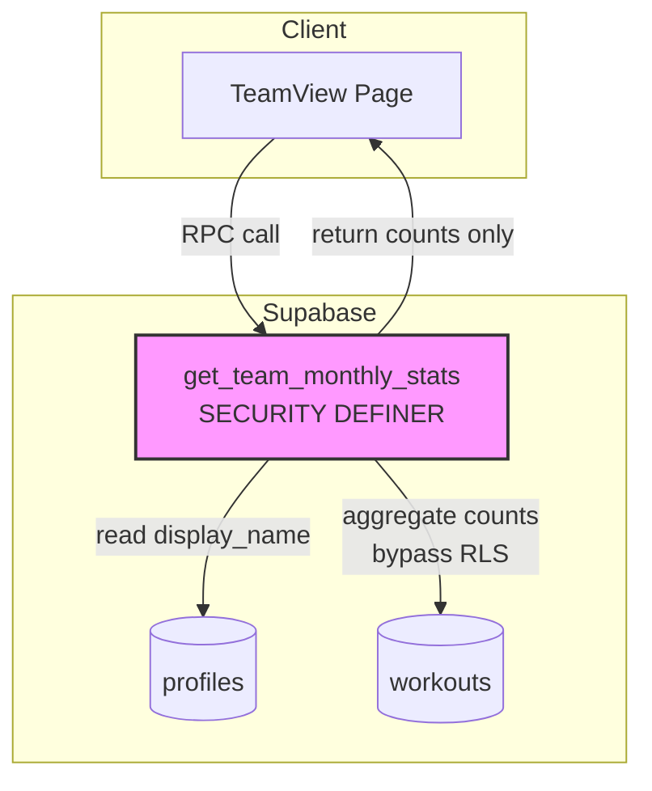
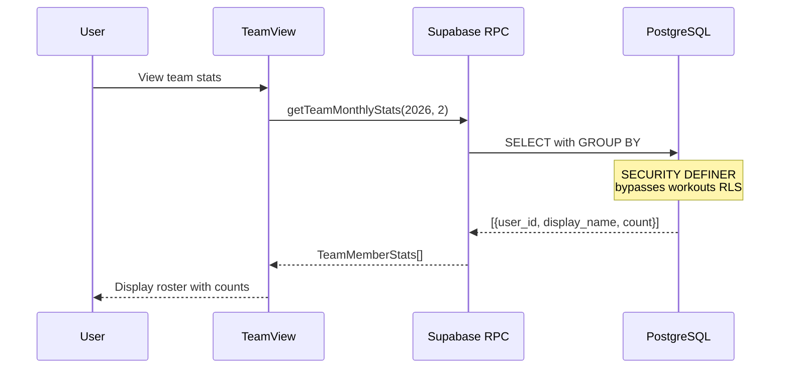

<objective>
Write comprehensive Phase 4 tutorial covering SECURITY DEFINER functions, RPC calls, and privacy-first team features

Purpose: Document team features implementation for beginner developers (DOCS-01 requirement)
Output: tutorial/04-team-features.md with Korean explanations, code examples, and security diagrams
</objective>

<execution_context>
@./.claude/get-shit-done/workflows/execute-plan.md
@./.claude/get-shit-done/templates/summary.md
</execution_context>

<context>
@.planning/PROJECT.md
@.planning/ROADMAP.md
@.planning/phases/04-team-features/04-RESEARCH.md
@tutorial/03-progress-tracking.md
@supabase/migrations/20260210_team_features.sql
@src/Supabase/Team.fs
@src/Pages/TeamView.fs
@src/Pages/Dashboard.fs
</context>

<tasks>

<task type="auto">
  <name>Task 1: Write Phase 4 tutorial document</name>
  <files>tutorial/04-team-features.md</files>
  <action>
Create tutorial/04-team-features.md following the structure and style of tutorial/03-progress-tracking.md.

**Required sections:**

1. **개요 (Overview)**
   - Phase 4 목표: 프라이버시 우선 팀 동기부여 (월별 통계만)
   - 핵심 가치 연결: 팀원들의 운동 현황 공유로 동기 부여
   - 구현한 기능: TEAM-01 (팀원별 월별 운동 횟수 조회)
   - 프라이버시 원칙: 집계된 카운트만 공개, 개별 운동 날짜/사진/메모 비공개

2. **아키텍처 (Architecture)**
   - 보안 모델 다이어그램 (Mermaid graph):
     * Client -> RPC Function (SECURITY DEFINER)
     * RPC Function -> Profiles table (read display_name)
     * RPC Function -> Workouts table (bypass RLS, aggregate only)
     * Returns: aggregated counts only
   - 데이터 흐름 다이어그램 (Mermaid sequence):
     * TeamView -> getTeamMonthlyStats RPC
     * PostgreSQL aggregates with GROUP BY
     * Returns TeamMemberStats array

3. **핵심 개념 (Key Concepts)** - Minimum 6 subsections:

   a) **SECURITY DEFINER 함수 (Security Definer Functions)**
      - RLS를 우회하는 함수 패턴
      - 왜 필요한가: 집계 통계를 위해 다른 사용자 데이터 접근 필요
      - 보안 주의사항: SET search_path 필수
      - 반환값 제한: 집계 데이터만, 원시 레코드 절대 금지
      - Code example: get_team_monthly_stats 함수

   b) **RLS 정책 설계 (RLS Policy Design)**
      - 기존 정책: 자신의 데이터만 볼 수 있음
      - 새 정책: 프로필은 팀 전체가 볼 수 있음
      - 정책 조합: Postgres는 OR로 결합
      - 칼럼 제한 고려사항 (email 노출 여부)
      - Code example: profiles RLS policy

   c) **Supabase RPC 호출 (Supabase RPC Calls)**
      - supabase.rpc() 메서드 사용법
      - 파라미터 전달: createObj with ==> operator
      - 결과 처리: unbox<T> 패턴
      - 에러 핸들링: result?error 체크
      - Code example: getTeamMonthlyStats F# 함수

   d) **LEFT JOIN 집계 패턴 (LEFT JOIN Aggregation)**
      - 왜 INNER JOIN이 아닌가: 0 운동 사용자도 표시해야 함
      - COALESCE로 NULL 처리 (display_name)
      - COUNT와 BIGINT 캐스팅
      - ORDER BY 정렬 전략
      - Code example: SQL aggregation query

   e) **컴포넌트 패턴 재사용 (Component Pattern Reuse)**
      - ProgressView 패턴을 TeamView에 적용
      - 월 네비게이션 함수 공유
      - useEffect 의존성 배열
      - 로딩/에러 상태 관리
      - Code example: TeamViewPage state management

   f) **대시보드 탭 확장 (Dashboard Tab Extension)**
      - TabMode 판별 유니온 확장 (Home | Progress | Team)
      - 탭 버튼 추가 패턴
      - match 표현식 완전성
      - 사용자 ID 전달
      - Code example: Dashboard tab navigation

4. **배운 점 (Lessons Learned)**
   - SECURITY DEFINER의 강력함과 위험성 (항상 집계만 반환)
   - search_path 설정의 중요성 (보안 취약점 방지)
   - LEFT JOIN으로 0 값 사용자 포함하기
   - RLS 정책은 OR로 결합됨 (가장 허용적인 정책 우선)
   - F# 타입으로 SQL 결과 안전하게 매핑하기

5. **보안 체크리스트 (Security Checklist)**
   - [ ] SECURITY DEFINER 함수는 집계 데이터만 반환
   - [ ] SET search_path 설정됨
   - [ ] GRANT EXECUTE는 authenticated만
   - [ ] 원시 workout 레코드는 반환하지 않음
   - [ ] 함수 테스트: 다른 사용자 날짜 접근 불가 확인

6. **다음 단계 (Next Steps)**
   - Phase 5: 사진 업로드 (Photo Upload) - 사진 기반 기록
   - Phase 6: 프로덕션 준비 (Production Ready) - PWA, Admin 도구

**Requirements:**
- Language: Korean
- Target audience: 초보 개발자
- Content: 개념 위주 설명, 중요 코드 포함
- Diagrams: Mermaid 다이어그램 2개 이상
- Length: 200+ lines minimum
- Style: Match tutorial/03-progress-tracking.md tone and formatting
- Security focus: Emphasize privacy-first approach

**Mermaid diagram examples:**

Security model:


Data flow:


Use code snippets from actual implementation files, emphasize WHY the security model works and WHAT could go wrong without proper precautions.
  </action>
  <verify>
Check tutorial/04-team-features.md:
- File exists and is readable
- Minimum 200 lines
- Contains sections: 개요, 아키텍처, 핵심 개념 (6 subsections), 배운 점, 보안 체크리스트, 다음 단계
- Contains 2+ Mermaid diagrams (```mermaid blocks)
- Korean language throughout
- Code examples from actual implementation
- Targets beginner developers
- Explains SECURITY DEFINER, RPC, RLS patterns
- Matches style of tutorial/03-progress-tracking.md

Word count check:
```bash
wc -l /home/shoh/vibe-coding/rollbook/tutorial/04-team-features.md
```
Should show 200+ lines.
  </verify>
  <done>
tutorial/04-team-features.md exists with comprehensive Korean documentation covering Phase 4 security concepts, includes Mermaid diagrams, code examples, and beginner-friendly explanations with security focus.
  </done>
</task>

</tasks>

<verification>
After completing task:

1. **File check:**
   ```bash
   ls -lh /home/shoh/vibe-coding/rollbook/tutorial/04-team-features.md
   wc -l /home/shoh/vibe-coding/rollbook/tutorial/04-team-features.md
   ```
   File exists, 200+ lines.

2. **Content review:**
   - Korean language used throughout
   - 개요 section explains Phase 4 goals and privacy principles
   - 아키텍처 section has security model diagrams
   - 핵심 개념 has 6 subsections covering:
     * SECURITY DEFINER functions
     * RLS policy design
     * Supabase RPC calls
     * LEFT JOIN aggregation
     * Component pattern reuse
     * Dashboard tab extension
   - 배운 점 section documents security lessons
   - 보안 체크리스트 with actionable items
   - 다음 단계 section previews Phases 5-6
   - Code examples from actual implementation files
   - Beginner-friendly explanations with security emphasis

3. **Mermaid diagrams:**
   - Security model diagram (graph)
   - Data flow diagram (sequenceDiagram)
   - Both render correctly (valid syntax)

4. **Comparison with Phase 3 tutorial:**
   - Similar structure and tone
   - Korean language consistency
   - Code example style matches
   - Diagram integration similar
</verification>

<success_criteria>
Plan complete when:
- [x] tutorial/04-team-features.md exists
- [x] Minimum 200 lines
- [x] Korean language throughout
- [x] Contains 개요, 아키텍처, 핵심 개념, 배운 점, 보안 체크리스트, 다음 단계 sections
- [x] 6 subsections in 핵심 개념
- [x] 2+ Mermaid diagrams
- [x] Code examples from actual implementation
- [x] Targets beginner developers
- [x] Covers SECURITY DEFINER, RPC, RLS, privacy patterns
- [x] Matches tutorial/03-progress-tracking.md style
- [x] DOCS-01 requirement met
</success_criteria>

<output>
After completion, create `.planning/phases/04-team-features/04-06-SUMMARY.md`
</output>
