# 사용자 인터랙션 시퀀스 다이어그램

각 사용자 행동이 어떤 컴포넌트를 거쳐 어떻게 처리되는지 시퀀스 다이어그램으로 정리.
모든 다이어그램은 실제 F# 소스 코드 기반.

## 1. 회원가입

`Pages/Signup.fs` → `Supabase/Auth.fs` → GoTrue → SendGrid

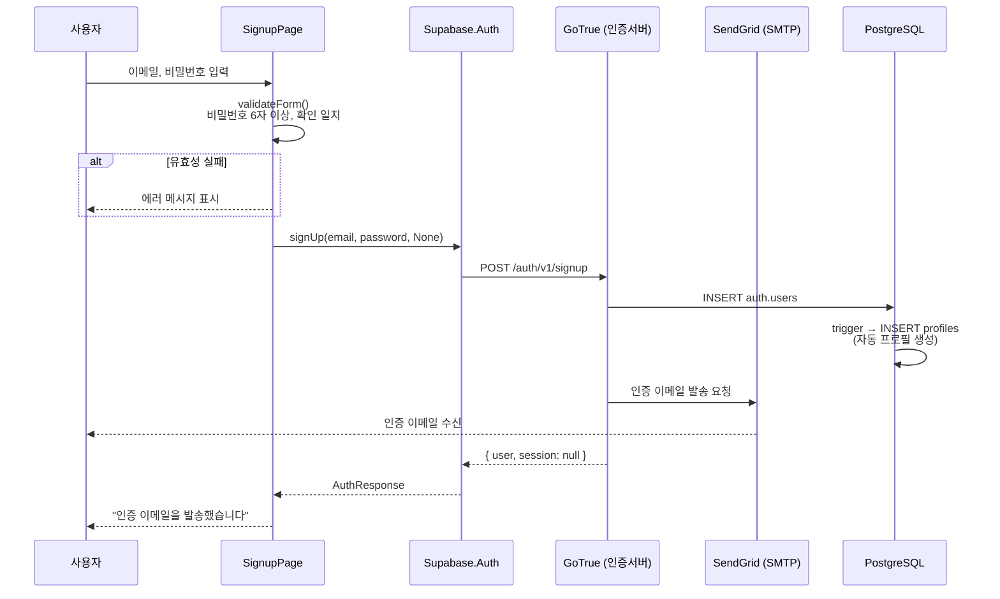

## 2. 이메일 인증

사용자가 이메일 링크를 클릭하면 Supabase가 처리 후 프론트엔드로 리다이렉트.

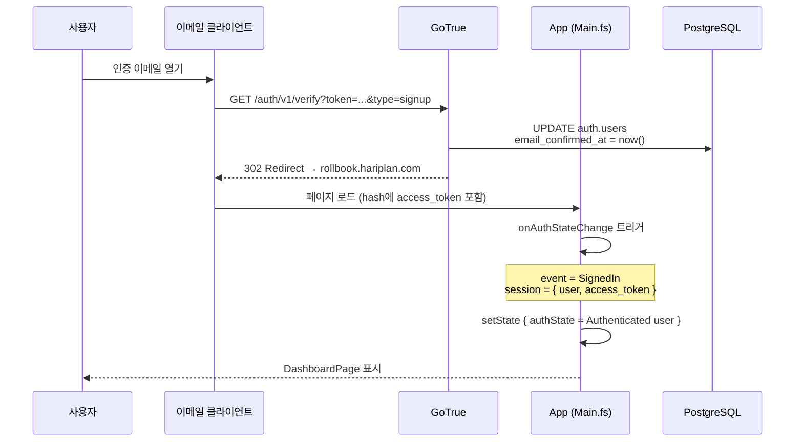

## 3. 로그인

`Pages/Login.fs` → `Supabase/Auth.fs` → GoTrue

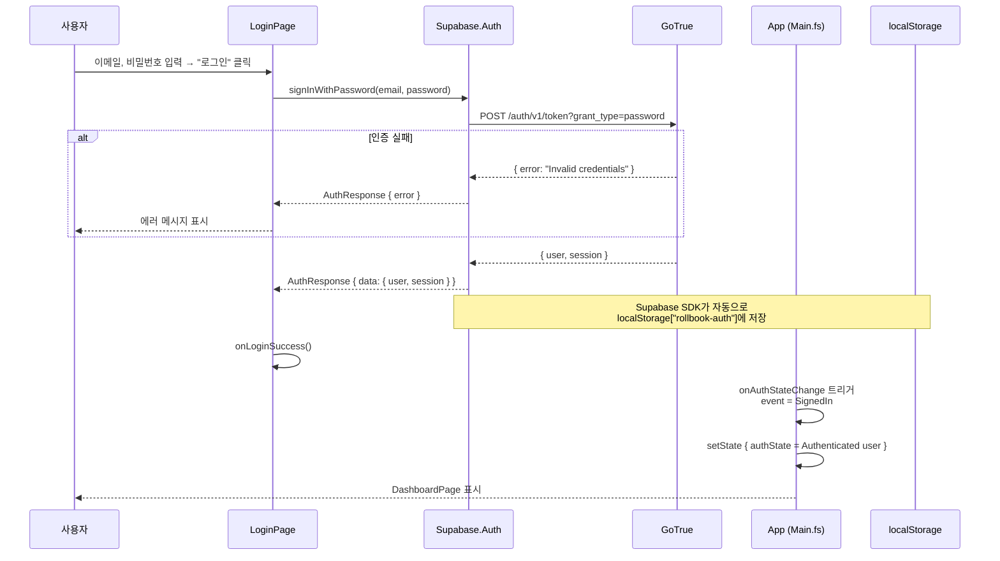

## 4. 세션 복원 (새로고침)

브라우저 새로고침 시 localStorage에서 세션을 자동 복원.

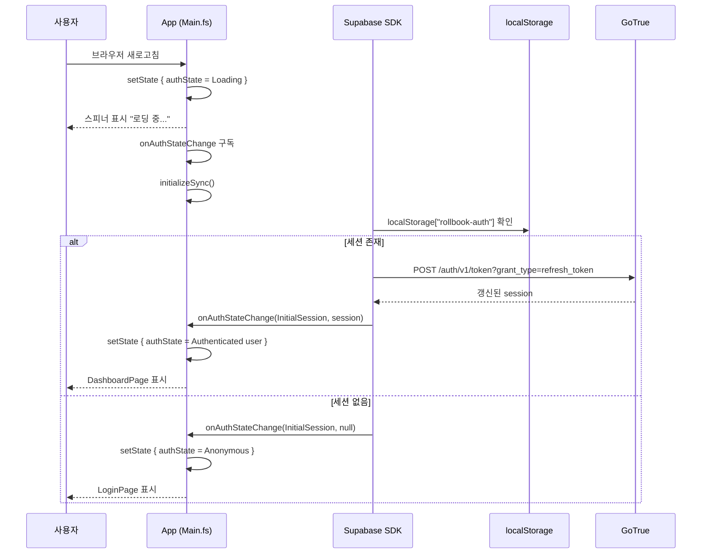

## 5. 비밀번호 재설정

두 단계: (1) 재설정 이메일 요청, (2) 새 비밀번호 설정.

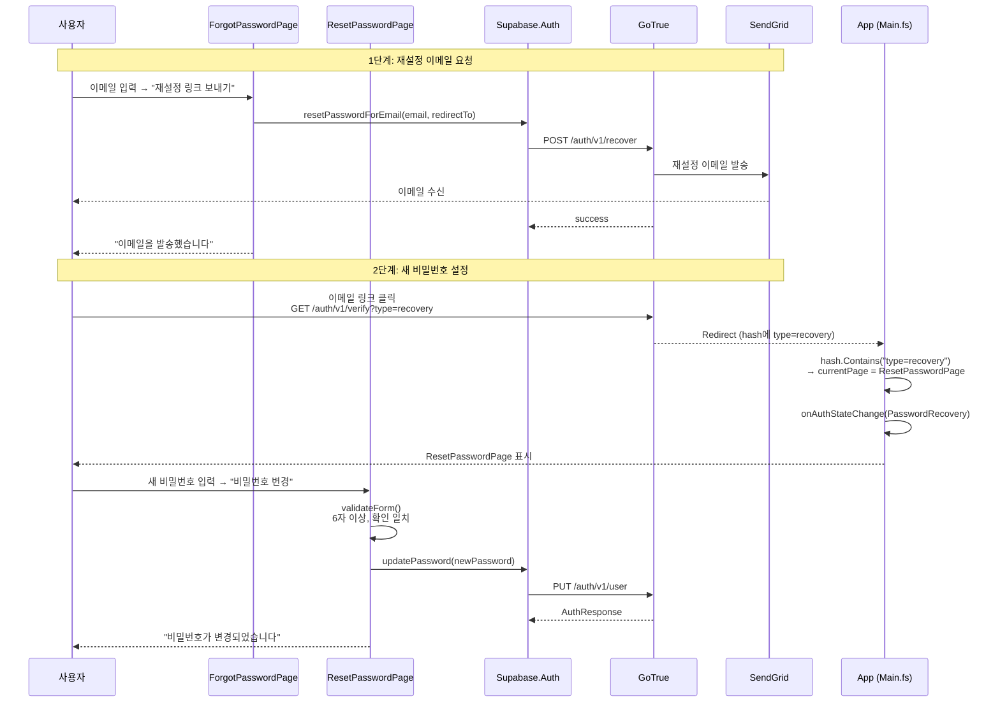

## 6. 운동 기록 (온라인)

핵심 기능. `Dashboard.fs` → `Supabase/Workouts.fs` → PostgREST.

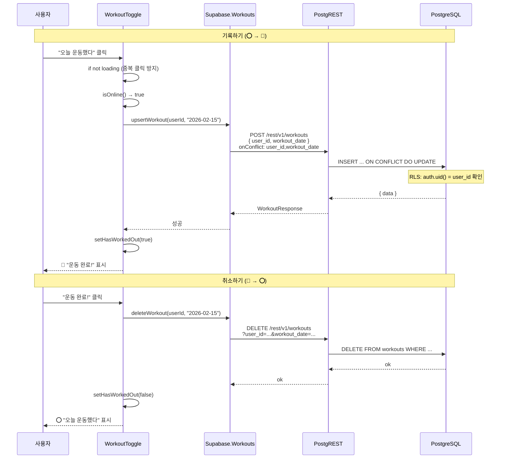

## 7. 운동 기록 (오프라인)

오프라인일 때 IndexedDB에 큐잉, 온라인 복귀 시 자동 동기화.

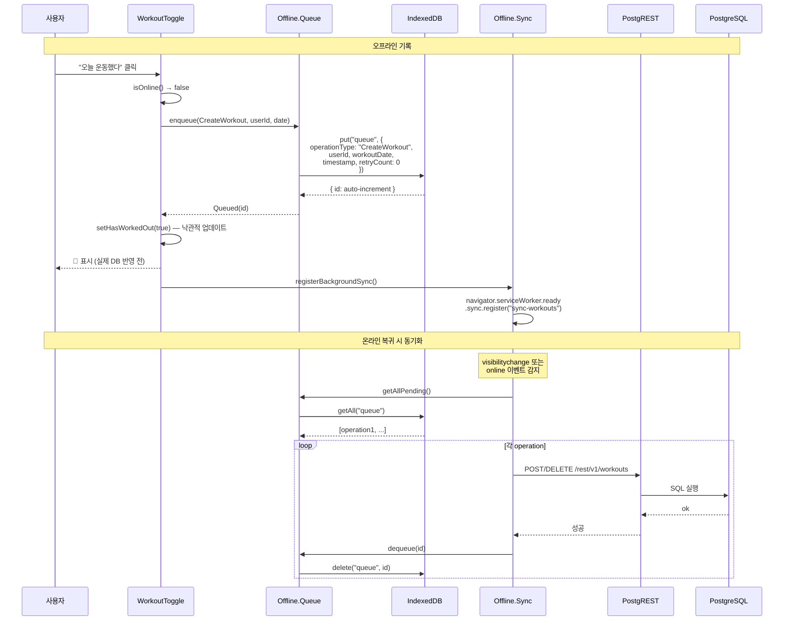

## 8. 사진 업로드

`Components/PhotoUpload.fs` → 압축 → Storage → 운동 기록 자동 생성.

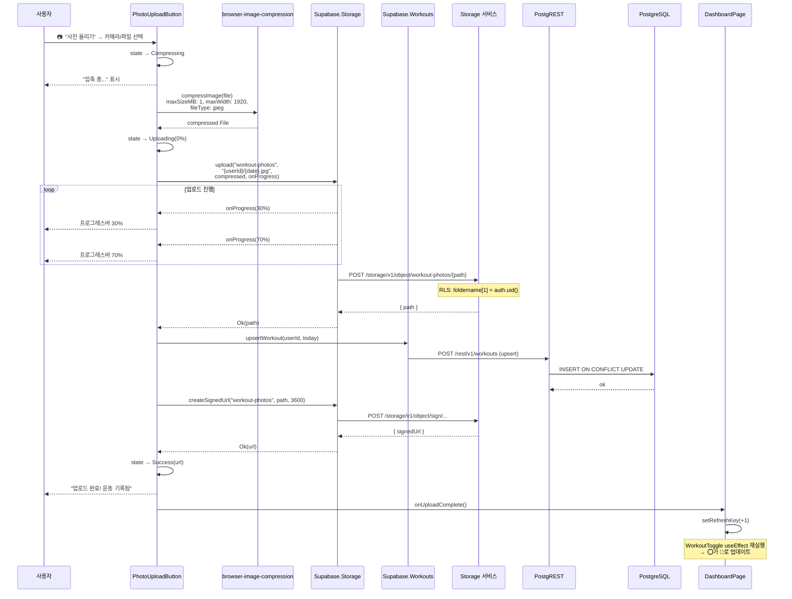

## 9. 사진 갤러리 조회

`Components/PhotoGallery.fs` → Storage 목록 → signed URL 생성.

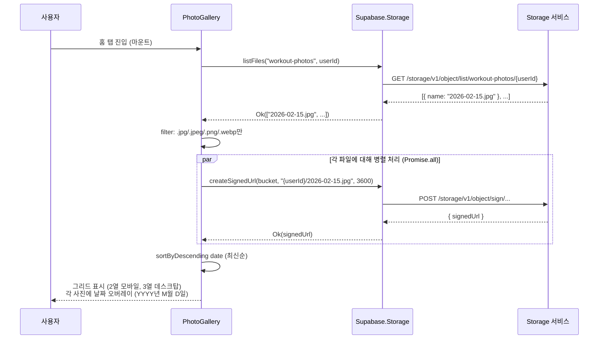

## 10. 내 기록 조회 (캘린더/리스트)

`Pages/ProgressView.fs` → `Supabase/Workouts.fs` → 월별 데이터.

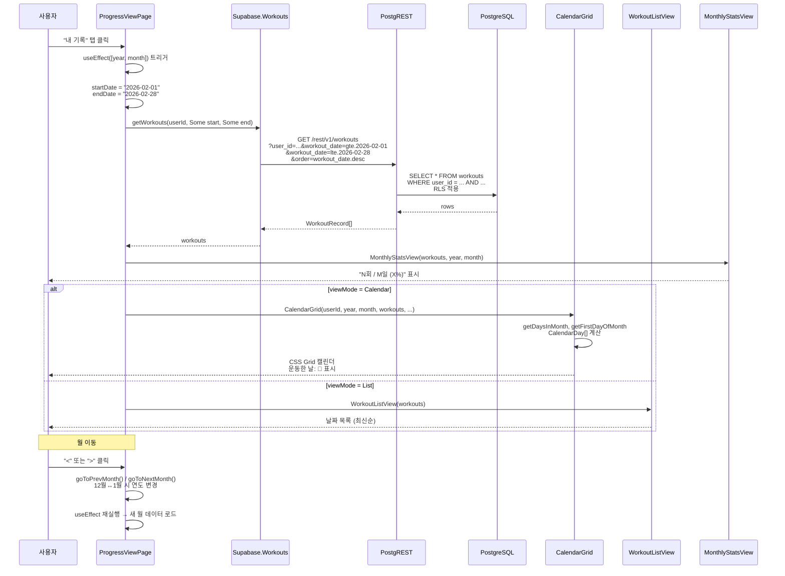

## 11. 팀 조회

`Pages/TeamView.fs` → `Supabase/Team.fs` → FK 조인 쿼리.

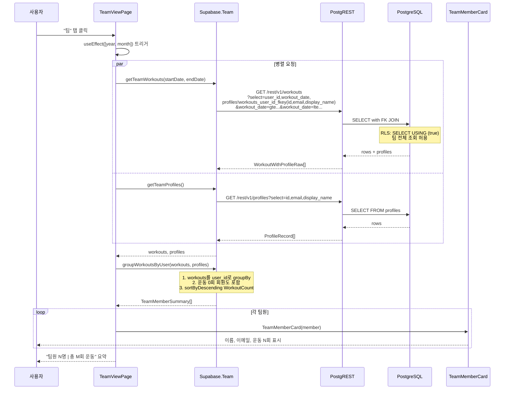

## 12. 관리자 — 회원 삭제

`Pages/AdminPage.fs` → `Supabase/Admin.fs` → RLS + is_admin() 확인.

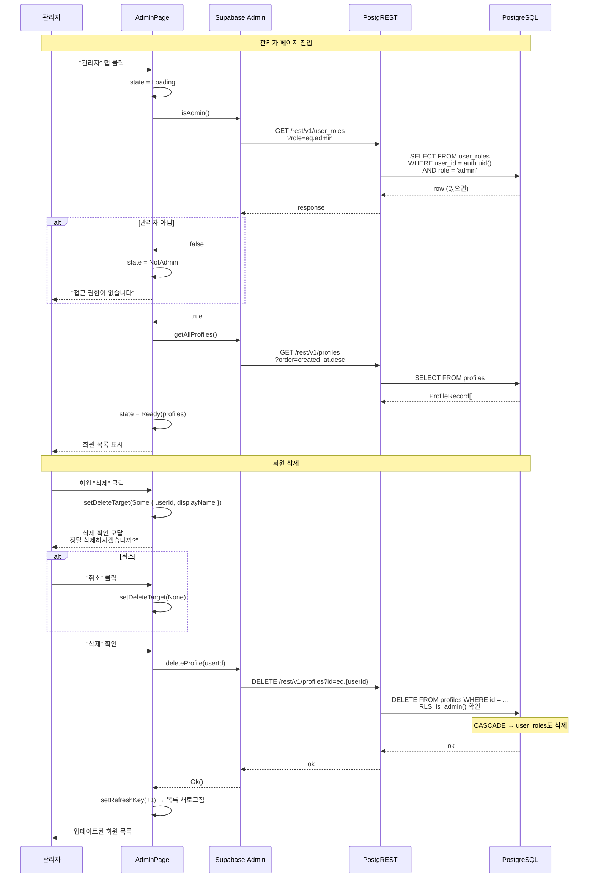

## 13. 로그아웃

`Dashboard.fs` → `Supabase/Auth.fs` → 세션 정리.

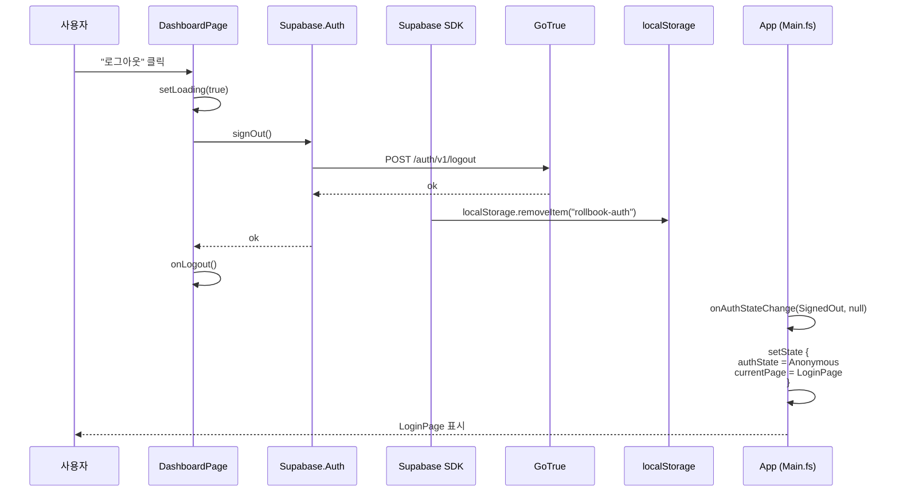

## 14. PWA 설치

브라우저의 "홈 화면에 추가" 또는 설치 배너.

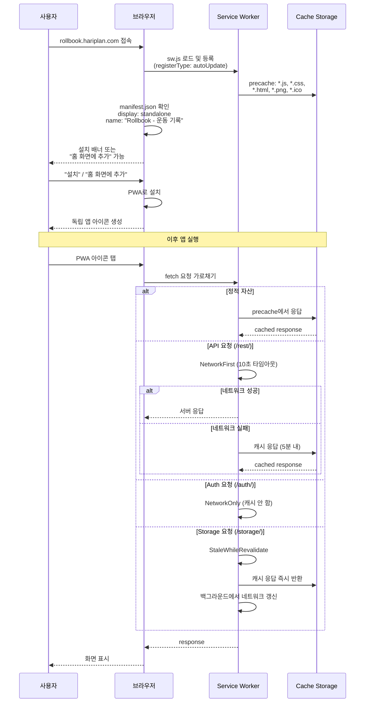

## 관련 문서

- `architecture-overview.md` — 전체 아키텍처 개요
- `service-guide.md` — 서비스 관리 명령어
- `deploy-tunnel.md` — Cloudflare Tunnel 설정
