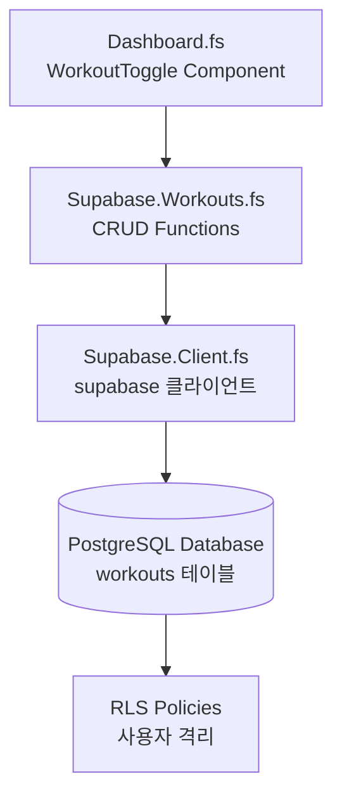
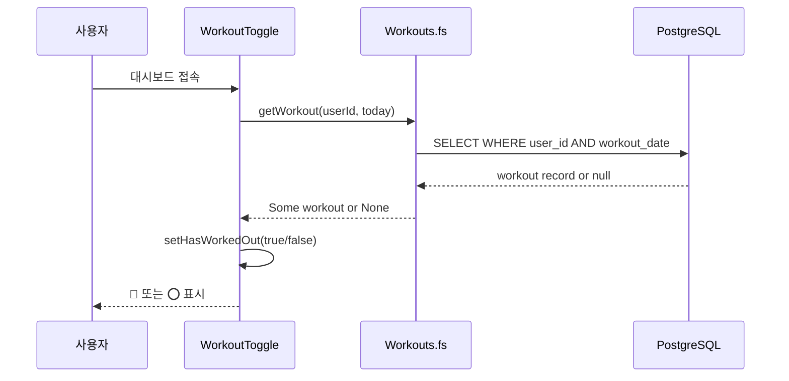
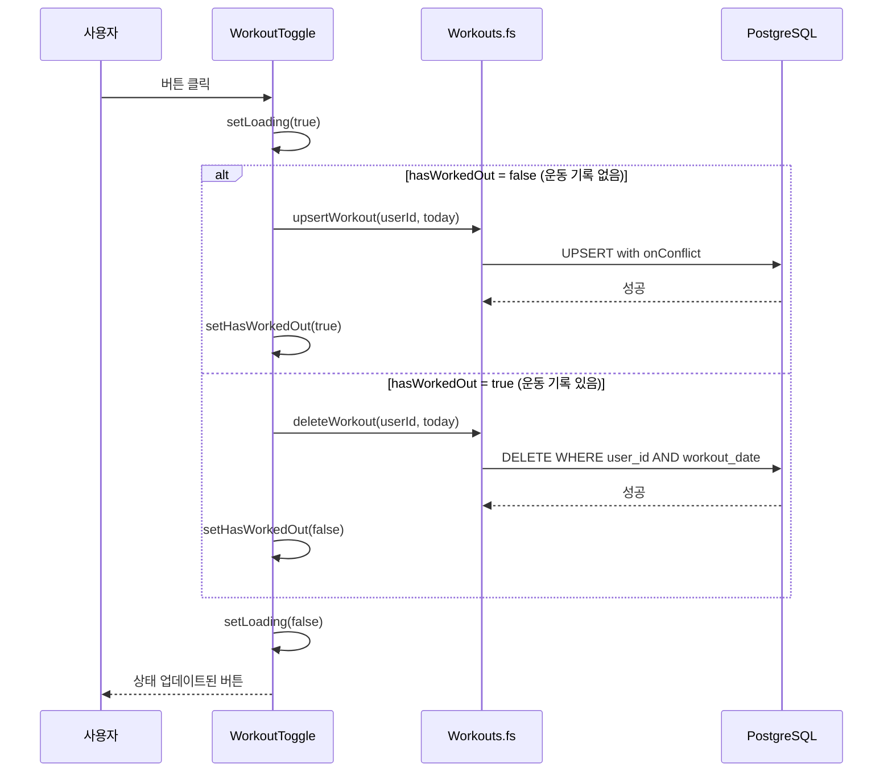

# Phase 2: Core Loop - 원탭 운동 기록

## 개요 (Overview)

Phase 2의 핵심 가치는 **"원탭 운동 기록"**입니다.

앱을 열고 "오늘 운동했다" 버튼 하나로 기록을 완료할 수 있습니다. 복잡한 폼 작성이나 여러 단계가 필요 없이, 한 번의 탭으로 오늘의 운동을 기록하거나 취소할 수 있습니다.

**이 Phase에서 구현한 것:**
- PostgreSQL 데이터베이스에 운동 기록 테이블 생성
- Row Level Security(RLS)로 사용자별 데이터 격리
- F# 바인딩으로 Supabase CRUD 작업 수행
- React 컴포넌트로 토글 UI 구현

## 아키텍처 (Architecture)

### 시스템 구성도



**각 계층의 역할:**
- **Dashboard.fs**: 사용자 인터페이스, 버튼 클릭 처리, 상태 관리
- **Workouts.fs**: 데이터베이스 CRUD 작업을 F# 함수로 캡슐화
- **Client.fs**: Supabase JavaScript SDK와의 연결 설정
- **PostgreSQL**: 실제 데이터 저장, RLS로 보안 강제

### 데이터 흐름 (Data Flow)

**1. 초기 로드 (컴포넌트 마운트 시):**



**2. 토글 클릭:**



## 핵심 개념 (Key Concepts)

### 1. 데이터베이스 스키마

**workouts 테이블 구조:**

```sql
create table public.workouts (
  user_id uuid not null references auth.users(id) on delete cascade,
  workout_date date not null,
  created_at timestamptz default now() not null,
  primary key (user_id, workout_date)
);
```

**각 컬럼의 의미:**

| 컬럼 | 타입 | 설명 |
|------|------|------|
| user_id | UUID | 사용자 고유 식별자 (auth.users 참조) |
| workout_date | DATE | 운동한 날짜 (시간 정보 없음) |
| created_at | TIMESTAMPTZ | 기록이 생성된 정확한 시각 |

**왜 DATE 타입인가?**

"오늘 운동했나?"라는 질문에는 시간이 필요 없습니다.

```
TIMESTAMPTZ (8 bytes): 2026-02-10 14:30:00+09:00
DATE (4 bytes):        2026-02-10
```

- 저장 공간 절약 (4바이트 vs 8바이트)
- 타임존 혼동 방지
- 쿼리 단순화 (`WHERE workout_date = '2026-02-10'`)

**복합 기본키 (Composite Primary Key):**

```sql
primary key (user_id, workout_date)
```

이 제약조건이 의미하는 것:
- (user_id, workout_date) 조합이 고유해야 함
- 같은 사용자가 같은 날짜에 2개 이상의 기록을 만들 수 없음
- "하루 1회 기록" 규칙을 데이터베이스 레벨에서 강제

애플리케이션 코드가 아닌 데이터베이스에서 이 규칙을 강제하면:
- 버그가 있어도 중복 데이터 발생 방지
- 모든 클라이언트(웹, 모바일, API)에 일관되게 적용

### 2. Row Level Security (RLS)

**RLS란?**

Row Level Security는 PostgreSQL의 보안 기능으로, 테이블의 각 행(row)마다 접근 권한을 검사합니다.

```
일반 쿼리:  SELECT * FROM workouts
RLS 적용:   SELECT * FROM workouts WHERE user_id = 현재_로그인_사용자
```

RLS를 사용하면 프론트엔드 코드를 신뢰할 필요가 없습니다. 악의적인 사용자가 브라우저 개발자 도구에서 쿼리를 조작해도, 데이터베이스가 자신의 데이터만 반환합니다.

**4가지 정책:**

```sql
-- 1. SELECT: 내 기록만 조회 가능
create policy "Users can view own workouts"
  on public.workouts for select
  to authenticated
  using ((select auth.uid()) = user_id);

-- 2. INSERT: 내 기록만 생성 가능
create policy "Users can insert own workouts"
  on public.workouts for insert
  to authenticated
  with check ((select auth.uid()) = user_id);

-- 3. UPDATE: 내 기록만 수정 가능
create policy "Users can update own workouts"
  on public.workouts for update
  to authenticated
  using ((select auth.uid()) = user_id)
  with check ((select auth.uid()) = user_id);

-- 4. DELETE: 내 기록만 삭제 가능
create policy "Users can delete own workouts"
  on public.workouts for delete
  to authenticated
  using ((select auth.uid()) = user_id);
```

**USING vs WITH CHECK:**
- `USING`: 기존 행에 대한 조건 (SELECT, UPDATE의 WHERE, DELETE)
- `WITH CHECK`: 새로운/수정된 행에 대한 조건 (INSERT, UPDATE의 새 값)

**성능 최적화 팁:**

```sql
-- 느림: row마다 함수 호출
using (auth.uid() = user_id)

-- 빠름: 쿼리당 1번만 호출 (결과 캐싱)
using ((select auth.uid()) = user_id)
```

`(SELECT auth.uid())` 형태로 감싸면 PostgreSQL이 결과를 캐싱하여 약 95% 성능 향상을 얻을 수 있습니다.

### 3. F# Supabase 바인딩

**Promise 계산 표현식 (Computation Expression):**

F#에서 비동기 작업을 처리하는 방법입니다.

```fsharp
promise {
    let! result = someAsyncOperation()  // await와 유사
    return result
}
```

JavaScript의 async/await와 비교:

```javascript
// JavaScript
async function example() {
    const result = await someAsyncOperation();
    return result;
}
```

```fsharp
// F#
let example () =
    promise {
        let! result = someAsyncOperation()
        return result
    }
```

- `let!`는 JavaScript의 `await`와 동일
- `promise { }` 블록은 `Promise<T>`를 반환
- Supabase SDK가 Promise를 반환하므로 promise CE 사용

**동적 멤버 접근 (? 연산자):**

```fsharp
supabase?from("workouts")?select("*")?eq("user_id", userId)
```

이것은 다음 JavaScript와 동일합니다:

```javascript
supabase.from("workouts").select("*").eq("user_id", userId)
```

`?` 연산자는:
- JavaScript 객체의 멤버에 런타임에 접근
- 타입 안전성은 낮지만 JS 라이브러리 바인딩에 필수
- Fable이 `.` 접근으로 컴파일

**unbox<T> 사용:**

```fsharp
// ❌ 이건 promise 블록 안에서 컴파일 에러
let data = result :?> WorkoutRecord

// ✅ 이렇게 써야 함
let data = unbox<WorkoutRecord> result
```

- F# 컴파일러가 promise CE 안에서 `:?>` (downcast) 금지
- `unbox<T>`는 JavaScript 객체를 F# 타입으로 변환
- 런타임에 타입 검사 없이 캐스팅 (unsafe하지만 JS interop에 필요)

### 4. React 상태 관리

**useState 패턴:**

```fsharp
let (hasWorkedOut, setHasWorkedOut) = React.useState(false)
let (loading, setLoading) = React.useState(true)
let (error, setError) = React.useState<string option>(None)
```

3개의 독립적인 상태:

| 상태 | 타입 | 의미 |
|------|------|------|
| hasWorkedOut | bool | 오늘 운동 기록이 있는가? |
| loading | bool | API 요청 중인가? |
| error | string option | 에러 메시지 (있으면 Some, 없으면 None) |

`set*` 함수를 호출하면:
1. 해당 상태값이 변경됨
2. React가 컴포넌트를 다시 렌더링
3. 새 상태값으로 UI 업데이트

**useEffect로 마운트 시 실행:**

```fsharp
React.useEffect((fun () ->
    // 이 코드는 컴포넌트가 화면에 나타날 때 1번만 실행
    promise {
        let! workout = getWorkout userId today
        setHasWorkedOut (Option.isSome workout)
    } |> Promise.start
), [||])  // ← 빈 배열이 핵심!
```

의존성 배열 `[||]`의 의미:
- `[||]` (빈 배열): 마운트 시 1회만 실행
- `[| someValue |]`: someValue가 변경될 때마다 실행
- 배열 생략: 매 렌더링마다 실행 (위험!)

### 5. 날짜 처리 (Date Handling)

**타임존 버그의 원인:**

```fsharp
// ❌ 잘못된 방법
let date = JS.Date.Create("2026-02-10")
// 이 날짜는 UTC 자정(00:00)으로 해석됨
// 한국(UTC+9)에서는 2026-02-10 09:00으로 보임
// 미국 서부(UTC-8)에서는 2026-02-09 16:00으로 보임!
```

**올바른 방법:**

```fsharp
// ✅ 로컬 타임존 사용
let getTodayDateString () : string =
    let now = System.DateTime.Now
    emitJsExpr now "$0.toLocaleDateString('en-CA')"
```

`toLocaleDateString("en-CA")`를 사용하는 이유:
- 캐나다 영어 로케일은 ISO 8601 형식(YYYY-MM-DD) 반환
- 사용자의 로컬 타임존 기준
- 데이터베이스 DATE 타입과 호환

```
미국: toLocaleDateString("en-US") → "2/10/2026"  ❌
한국: toLocaleDateString("ko-KR") → "2026. 2. 10."  ❌
캐나다: toLocaleDateString("en-CA") → "2026-02-10"  ✅
```

**핵심 원칙:**
"오늘"은 서버 시간이 아니라 사용자의 달력 기준이어야 합니다.

### 6. Upsert의 멱등성 (Idempotency)

**멱등성이란?**

같은 작업을 여러 번 실행해도 결과가 동일한 것입니다.

**일반 INSERT의 문제:**

```fsharp
// 사용자가 버튼을 빠르게 두 번 클릭
if not exists then
    insert()  // 첫 클릭: 성공
    // 네트워크 지연으로 첫 응답 안 옴
    insert()  // 둘째 클릭: 중복 키 에러!
```

**Upsert로 해결:**

```fsharp
let upsertWorkout (userId: string) (date: string) : JS.Promise<WorkoutResponse> =
    promise {
        let record = createObj [
            "user_id" ==> userId
            "workout_date" ==> date
        ]
        let options = createObj [
            "onConflict" ==> "user_id,workout_date"  // 복합 기본키
        ]
        let query = supabase?from("workouts")?upsert(record, options)?select()
        let! result = query
        return unbox<WorkoutResponse> result
    }
```

**동작 원리:**

```
첫 번째 요청: 레코드 없음 → INSERT 수행
두 번째 요청: 레코드 있음 → UPDATE 수행 (에러 없음)
세 번째 요청: 레코드 있음 → UPDATE 수행 (에러 없음)
```

`onConflict`는 "어떤 컬럼에서 충돌을 감지할지" 지정합니다. 복합 기본키인 `user_id,workout_date`를 지정하면, 이 조합이 이미 존재할 때 UPDATE로 처리합니다.

## 중요 코드 (Important Code)

### Workouts.fs - CRUD 함수들

**getWorkout - 오늘 운동 여부 확인:**

```fsharp
let getWorkout (userId: string) (date: string) : JS.Promise<WorkoutRecord option> =
    promise {
        let query =
            supabase?from("workouts")
                ?select("*")
                ?eq("user_id", userId)
                ?eq("workout_date", date)
                ?maybeSingle()  // 0개 또는 1개 row 반환
        let! result = query
        let data = result?data

        if isNull data then
            return None      // 기록 없음 → ⭕ 표시
        else
            return Some (unbox<WorkoutRecord> data)  // 기록 있음 → 💪 표시
    }
```

**maybeSingle()의 의미:**
- 결과가 0개: `data`가 `null`
- 결과가 1개: `data`가 해당 레코드
- 결과가 2개 이상: 에러 (복합 기본키 덕분에 발생 불가)

**deleteWorkout - 운동 기록 삭제:**

```fsharp
let deleteWorkout (userId: string) (date: string) : JS.Promise<obj> =
    promise {
        let query =
            supabase?from("workouts")
                ?delete()
                ?eq("user_id", userId)
                ?eq("workout_date", date)
        let! result = query
        return result
    }
```

### Dashboard.fs - 토글 UI

**WorkoutToggle 컴포넌트:**

```fsharp
[<ReactComponent>]
let WorkoutToggle (userId: string) =
    // 상태 정의
    let (hasWorkedOut, setHasWorkedOut) = React.useState(false)
    let (loading, setLoading) = React.useState(true)
    let (error, setError) = React.useState<string option>(None)

    // 마운트 시 오늘 운동 기록 확인
    React.useEffect((fun () ->
        promise {
            try
                let today = getTodayDateString()
                let! workout = getWorkout userId today
                setHasWorkedOut (Option.isSome workout)
                setLoading false
            with ex ->
                setError (Some "운동 기록을 불러올 수 없습니다")
                setLoading false
        } |> Promise.start
    ), [||])

    // 토글 핸들러
    let handleToggle () =
        if not loading then  // 로딩 중이면 무시 (이중 클릭 방지)
            setLoading true
            setError None

            let today = getTodayDateString()

            promise {
                try
                    if hasWorkedOut then
                        let! _ = deleteWorkout userId today
                        ()  // 삭제 → ⭕로 변경
                    else
                        let! _ = upsertWorkout userId today
                        ()  // 생성 → 💪로 변경

                    setHasWorkedOut (not hasWorkedOut)
                    setLoading false
                with ex ->
                    setError (Some "저장 실패. 다시 시도해주세요.")
                    setLoading false
            } |> Promise.start

    // UI 렌더링 (버튼 + 에러 메시지)
    Html.div [
        // ... 버튼 렌더링 코드
    ]
```

**핵심 로직:**
1. `if not loading` - 이미 요청 중이면 새 요청 막음
2. `setLoading true` - 버튼 비활성화
3. `hasWorkedOut` 상태에 따라 upsert 또는 delete 실행
4. 성공 시 상태 반전, 실패 시 에러 표시
5. `setLoading false` - 버튼 다시 활성화

## 흔한 실수 (Common Pitfalls)

### 1. 타임존 버그

**증상:** 저녁 늦게 클릭했는데 어제 날짜로 기록됨

**원인:**
```javascript
new Date("2026-02-10")  // UTC 자정으로 해석
// → 한국에서는 2026-02-10 09:00 AM
// → 자정에 가까우면 "어제"로 보일 수 있음
```

**해결:**
```fsharp
// 항상 로컬 타임존 기준으로 날짜 생성
let now = System.DateTime.Now
emitJsExpr now "$0.toLocaleDateString('en-CA')"
```

### 2. 이중 클릭 에러

**증상:** 빠르게 두 번 클릭하면 에러 또는 중복 기록

**원인:**
- 첫 요청이 완료되기 전에 두 번째 요청 발생
- INSERT 두 번 실행 → 중복 키 에러

**해결 (2가지):**
```fsharp
// 1. UI에서 버튼 비활성화
prop.disabled loading

// 2. 핸들러에서 가드 절
let handleToggle () =
    if not loading then  // 로딩 중이면 무시
        // ...
```

```fsharp
// 3. Upsert로 멱등성 보장
let options = createObj [ "onConflict" ==> "user_id,workout_date" ]
supabase?from("workouts")?upsert(record, options)
```

### 3. RLS SELECT 정책 누락

**증상:** INSERT 성공했는데 `.select()` 결과가 null

**원인:**
```sql
-- INSERT 정책만 있고
create policy "insert" on workouts for insert ...

-- SELECT 정책이 없으면
-- INSERT 후 .select()가 null 반환!
```

**해결:** INSERT와 SELECT 정책 모두 생성

```sql
create policy "select" on workouts for select
  using ((select auth.uid()) = user_id);

create policy "insert" on workouts for insert
  with check ((select auth.uid()) = user_id);
```

### 4. unbox vs :?> 혼동

**증상:** promise 블록에서 타입 캐스팅 컴파일 에러

**원인:**
```fsharp
promise {
    let! result = query
    let data = result :?> WorkoutRecord  // ❌ 컴파일 에러
}
```

**해결:**
```fsharp
promise {
    let! result = query
    let data = unbox<WorkoutRecord> result  // ✅ OK
}
```

F# 컴파일러가 computation expression 내부에서 `:?>` 연산자 사용을 제한합니다. `unbox<T>`를 사용하세요.

## 테스트 체크리스트

Phase 2가 제대로 작동하는지 확인하는 방법:

- [ ] 로그인 후 대시보드에 ⭕ 버튼이 보이는가?
- [ ] 버튼 클릭 시 💪로 변경되는가?
- [ ] 다시 클릭 시 ⭕로 돌아오는가?
- [ ] 페이지 새로고침 후 상태가 유지되는가?
- [ ] 빠르게 여러 번 클릭해도 에러 없이 작동하는가?
- [ ] 다른 사용자의 기록이 보이지 않는가?

## 다음 단계 (Next Steps)

Phase 3에서 추가될 기능:

- **달력 뷰**: 월별 운동 기록을 달력 형태로 표시
- **리스트 뷰**: 운동 기록을 목록으로 조회
- **임의 날짜 기록**: 오늘이 아닌 다른 날짜 선택해서 기록
- **운동 기록 수정**: 이미 기록된 운동 정보 편집

Phase 2는 "오늘"에만 집중했고, Phase 3에서 "과거/미래" 기록을 다룹니다.

---

*작성일: 2026-02-10*
*대상 독자: 초보 개발자*
*언어: 한글*
