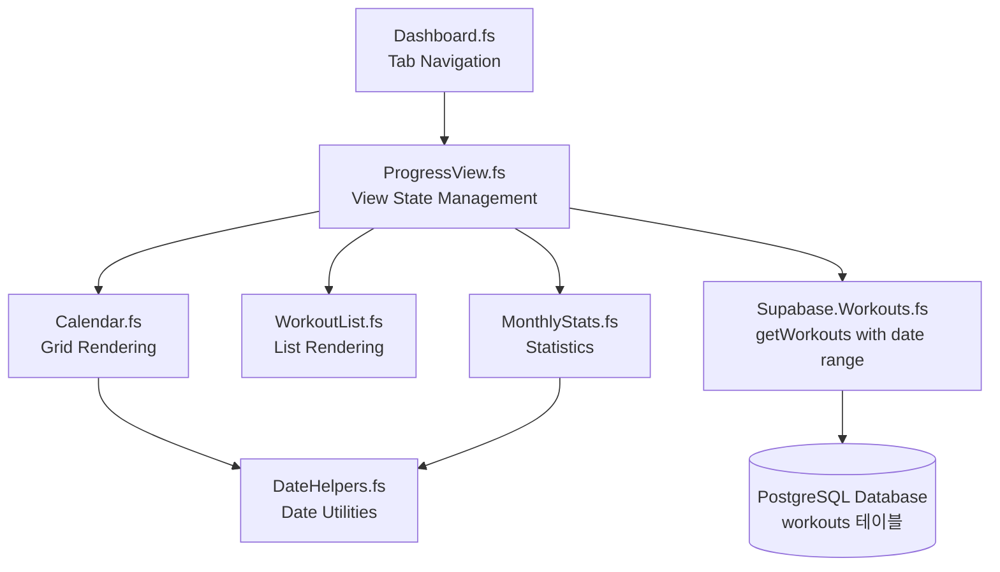
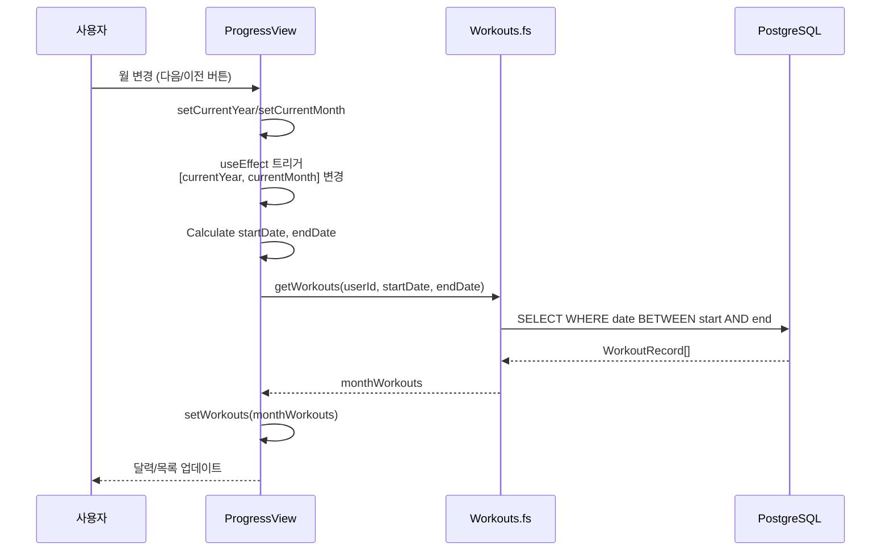
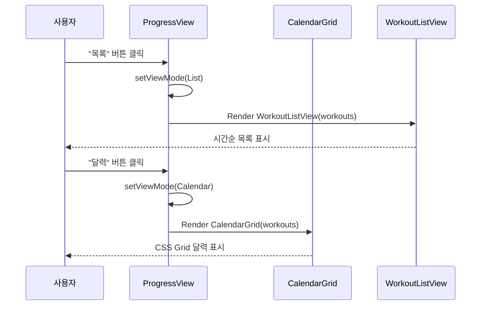

# Phase 3: Progress Tracking - 진행 상황 추적

## 개요 (Overview)

Phase 3의 핵심 가치는 **"진행 상황 시각화"**입니다.

운동 기록을 달력으로 보고, 목록으로 확인하고, 월별 통계로 동기부여를 받을 수 있습니다. Phase 2에서 "오늘" 운동을 기록했다면, Phase 3에서는 "지난 한 달" 전체를 한눈에 볼 수 있습니다.

**이 Phase에서 구현한 것:**
- 달력 뷰(PROG-01): 월별 운동 기록을 달력 그리드로 표시
- 리스트 뷰(PROG-02): 운동 기록을 시간순 목록으로 조회
- 월별 통계(PROG-03): 운동 횟수와 달성률 계산
- 멀티뷰 탐색: 달력/목록 간 전환, 월 탐색
- 날짜 계산 유틸리티: JavaScript Date API를 F#에서 사용

## 아키텍처 (Architecture)

### 시스템 구성도



**각 계층의 역할:**
- **Dashboard.fs**: 홈/내기록 탭 전환 (TabMode)
- **ProgressView.fs**: 뷰 모드 상태 관리 (Calendar/List), 월 탐색 로직
- **Calendar.fs**: CSS Grid 달력 레이아웃, 운동 표시
- **WorkoutList.fs**: 시간순 정렬, 목록 렌더링
- **MonthlyStats.fs**: 운동 횟수, 달성률 계산
- **DateHelpers.fs**: 날짜 계산 함수들 (getDaysInMonth, formatDateString 등)
- **Workouts.fs**: 날짜 범위 필터링 (`startDate`, `endDate` 파라미터)

### 데이터 흐름 (Data Flow)

**1. 월 변경 시 데이터 로드:**



**2. 뷰 전환 (달력 ↔ 목록):**



## 핵심 개념 (Key Concepts)

### 1. 날짜 계산 유틸리티 (Date Utilities)

**JavaScript Date API의 함정:**

JavaScript의 `Date` 객체는 월이 **0부터 시작**합니다.

```javascript
// JavaScript
new Date(2026, 0, 1)  // → 2026년 1월 1일 (0 = January)
new Date(2026, 11, 1) // → 2026년 12월 1일 (11 = December)
```

F#에서는 사람이 읽기 쉬운 1-12월을 사용하므로, JavaScript Date를 호출할 때 **-1 보정**이 필수입니다.

**getDaysInMonth - 월의 일수 계산:**

```fsharp
let getDaysInMonth (year: int) (month: int) : int =
    emitJsExpr (year, month) "new Date($0, $1, 0).getDate()"
```

**동작 원리:**

```javascript
// JavaScript: new Date(year, month, 0)는 이전 달의 마지막 날
new Date(2026, 2, 0)  // → 2026-02-28 (2월의 마지막 날)
new Date(2024, 2, 0)  // → 2024-02-29 (윤년)
```

F#에서 `getDaysInMonth 2026 2`를 호출하면:
1. `emitJsExpr (2026, 2)` → JavaScript `new Date(2026, 2, 0)` 생성
2. 2월(month=2) 0일 → 1월의 마지막 날 = 2월 마지막 날
3. `.getDate()` → 28 또는 29 반환

**getFirstDayOfMonth - 월의 첫 날 요일:**

```fsharp
let getFirstDayOfMonth (year: int) (month: int) : int =
    emitJsExpr (year, month - 1) "new Date($0, $1, 1).getDay()"
```

여기서는 `-1` 보정이 **명시적**으로 적용됩니다.

```
F# 호출:        getFirstDayOfMonth 2026 2
JavaScript 변환: new Date(2026, 1, 1).getDay()
결과:           6 (토요일, 0=일요일, 6=토요일)
```

`.getDay()` 반환값:
- 0 = 일요일
- 1 = 월요일
- ...
- 6 = 토요일

**formatDateString - YYYY-MM-DD 형식:**

```fsharp
let formatDateString (year: int) (month: int) (day: int) : string =
    sprintf "%04d-%02d-%02d" year month day
```

`sprintf` 포맷 문자열:
- `%04d`: 4자리 정수 (앞을 0으로 패딩)
- `%02d`: 2자리 정수 (앞을 0으로 패딩)

```
formatDateString 2026 2 5  → "2026-02-05"
formatDateString 2026 12 25 → "2026-12-25"
```

데이터베이스 DATE 타입과 정확히 일치하므로 변환 없이 쿼리 가능합니다.

### 2. CSS Grid 캘린더 레이아웃 (Calendar Grid Layout)

**CSS Grid의 1-indexing:**

CSS Grid는 1부터 시작하는 컬럼/로우 번호를 사용합니다.

```css
.grid {
  grid-column-start: 1;  /* 첫 번째 컬럼 */
  grid-column-start: 7;  /* 일곱 번째 컬럼 (토요일) */
}
```

**JavaScript getDay()의 0-indexing:**

```
Sunday = 0, Monday = 1, ..., Saturday = 6
```

**F# 코드에서 보정:**

```fsharp
let calendarDays =
    [| 1 .. daysInMonth |]
    |> Array.mapi (fun i day ->
        let dateString = formatDateString year month day
        {
            Day = day
            DateString = dateString
            HasWorkout = hasWorkout dateString workouts
            IsToday = dateString = todayString
            // CSS는 1-indexed이므로 +1
            GridColumnStart = if i = 0 then Some (firstDayOfWeek + 1) else None
        }
    )
```

**렌더링 시 적용:**

```fsharp
Html.div [
    match dayRecord.GridColumnStart with
    | Some col ->
        prop.style [ style.gridColumnStart col ]
    | None -> ()

    prop.text (string dayRecord.Day)
]
```

**예시: 2026년 2월 달력**

```
2026-02-01은 토요일 (getDay() = 6)
CSS grid-column-start = 6 + 1 = 7

일 월 화 수 목 금 토
                  1   ← 7번째 컬럼
 2  3  4  5  6  7  8
 9 10 11 12 13 14 15
...
```

첫 날(1일)만 `GridColumnStart`를 설정하고, 나머지는 자연스럽게 다음 컬럼으로 흐릅니다.

### 3. 운동 표시 로직 (Workout Indicators)

**hasWorkout 유틸리티 함수:**

```fsharp
let hasWorkout (date: string) (workouts: WorkoutRecord array) : bool =
    workouts
    |> Array.exists (fun w -> w.workout_date = date)
```

`Array.exists`는 조건을 만족하는 요소가 **하나라도** 있으면 `true` 반환합니다.

**달력 셀 스타일링:**

```fsharp
prop.className (
    "aspect-square flex items-center justify-center rounded-lg " +
    if dayRecord.IsToday then
        "border-2 border-indigo-600 font-bold "
    else
        ""
    +
    if dayRecord.HasWorkout then
        "bg-green-100 text-green-800"
    else
        "text-gray-700"
)
```

**시각적 결과:**

| 상태 | 클래스 | 외형 |
|------|--------|------|
| 오늘 + 운동함 | `border-indigo-600 bg-green-100 font-bold` | 초록 배경 + 파란 테두리 + 굵은 글씨 |
| 오늘 + 운동 안함 | `border-indigo-600 font-bold` | 흰 배경 + 파란 테두리 + 굵은 글씨 |
| 과거 + 운동함 | `bg-green-100` | 초록 배경 |
| 과거 + 운동 안함 | `text-gray-700` | 회색 글씨 |

### 4. React 상태 관리 (State Management)

**ProgressView의 6가지 상태:**

```fsharp
let (viewMode, setViewMode) = React.useState(Calendar)           // 뷰 모드
let (currentYear, setCurrentYear) = React.useState(2026)         // 현재 연도
let (currentMonth, setCurrentMonth) = React.useState(2)          // 현재 월
let (workouts, setWorkouts) = React.useState<WorkoutRecord array>([||])  // 운동 데이터
let (loading, setLoading) = React.useState(true)                 // 로딩 상태
let (error, setError) = React.useState<string option>(None)      // 에러 메시지
```

**왜 연도와 월을 분리했나?**

월 탐색 시 연도 변경이 필요하기 때문입니다.

```fsharp
let goToNextMonth () =
    if currentMonth = 12 then
        setCurrentYear (currentYear + 1)  // 12월 → 1월이면 연도 증가
        setCurrentMonth 1
    else
        setCurrentMonth (currentMonth + 1)

let goToPrevMonth () =
    if currentMonth = 1 then
        setCurrentYear (currentYear - 1)  // 1월 → 12월이면 연도 감소
        setCurrentMonth 12
    else
        setCurrentMonth (currentMonth - 1)
```

**useEffect의 의존성 배열:**

```fsharp
React.useEffect((fun () ->
    promise {
        // 월별 데이터 로드
        let startDate = formatDateString currentYear currentMonth 1
        let! monthWorkouts = getWorkouts userId (Some startDate) (Some endDate)
        setWorkouts monthWorkouts
    } |> Promise.start
), [| box currentYear; box currentMonth |])
```

`[| box currentYear; box currentMonth |]`의 의미:
- `currentYear` 또는 `currentMonth`가 변경될 때마다 useEffect 재실행
- `box` 키워드: F# 값을 JavaScript 객체로 boxing (React가 비교하기 위해 필요)
- 사용자가 "다음 월" 클릭 → `currentMonth` 변경 → useEffect 트리거 → 새 데이터 로드

### 5. 멀티뷰 패턴 (Multi-View Pattern)

**ViewMode 판별 공용체:**

```fsharp
type ViewMode = Calendar | List
```

이것은 TypeScript의 union type과 유사합니다:

```typescript
type ViewMode = "Calendar" | "List";
```

F#에서는 **컴파일 타임에 모든 케이스를 확인**할 수 있습니다.

**패턴 매칭으로 뷰 전환:**

```fsharp
match viewMode with
| Calendar ->
    CalendarGrid userId currentYear currentMonth workouts goToPrevMonth goToNextMonth
| List ->
    WorkoutListView workouts
```

새로운 뷰 모드를 추가하면 (예: `Chart`):

```fsharp
type ViewMode = Calendar | List | Chart
```

컴파일러가 **자동으로 에러**를 표시합니다:

```
Error: Incomplete pattern matches on this expression.
The following patterns are missing: Chart
```

TypeScript의 `switch`보다 안전합니다.

### 6. 월 탐색 로직 (Month Navigation)

**연도 롤오버 처리:**

```fsharp
let goToNextMonth () =
    if currentMonth = 12 then
        setCurrentYear (currentYear + 1)
        setCurrentMonth 1
    else
        setCurrentMonth (currentMonth + 1)
```

**상태 변화 시나리오:**

| 현재 상태 | 액션 | 새 상태 |
|-----------|------|---------|
| 2026-01 | 이전 | 2025-12 |
| 2026-12 | 다음 | 2027-01 |
| 2026-06 | 다음 | 2026-07 |

**왜 두 개의 `useState`를 사용하나?**

하나의 `Date` 객체를 사용할 수도 있지만:

```fsharp
// ❌ 더 복잡한 방법
let (currentDate, setCurrentDate) = React.useState(System.DateTime.Now)

let goToNextMonth () =
    setCurrentDate (currentDate.AddMonths(1))
```

분리된 year/month 접근이 더 명확한 이유:
1. **의도가 명확**: 연도와 월이 독립적 상태임을 표현
2. **useEffect 의존성 추적**: React가 정확히 "무엇이" 변경되었는지 알 수 있음
3. **디버깅 용이**: DevTools에서 year와 month를 개별적으로 확인 가능
4. **JavaScript Date의 복잡성 회피**: Date 객체의 타임존, 시간 정보 불필요

## 중요 코드 (Important Code)

### DateHelpers.fs - 날짜 유틸리티

**전체 구조:**

```fsharp
module Utils.DateHelpers

open Fable.Core
open Fable.Core.JsInterop
open Supabase.Types

// 월의 일수 (28-31)
let getDaysInMonth (year: int) (month: int) : int =
    emitJsExpr (year, month) "new Date($0, $1, 0).getDate()"

// 월의 첫 날 요일 (0=일요일, 6=토요일)
let getFirstDayOfMonth (year: int) (month: int) : int =
    emitJsExpr (year, month - 1) "new Date($0, $1, 1).getDay()"

// YYYY-MM-DD 형식 문자열 생성
let formatDateString (year: int) (month: int) (day: int) : string =
    sprintf "%04d-%02d-%02d" year month day

// YYYY년 M월 한국어 형식
let formatMonthYear (year: int) (month: int) : string =
    sprintf "%d년 %d월" year month

// 특정 날짜에 운동 기록이 있는지 확인
let hasWorkout (date: string) (workouts: WorkoutRecord array) : bool =
    workouts
    |> Array.exists (fun w -> w.workout_date = date)
```

**핵심 설계 원칙:**
- **순수 함수**: 부작용 없음, 같은 입력 → 같은 출력
- **타입 안전**: F# 타입 시스템으로 잘못된 날짜 계산 방지
- **JavaScript interop**: `emitJsExpr`로 최적화된 JS 코드 생성

### Calendar.fs - 달력 그리드

**CalendarDay 레코드 타입:**

```fsharp
type CalendarDay = {
    Day: int                    // 1-31
    DateString: string          // "2026-02-05"
    HasWorkout: bool            // 운동 여부
    IsToday: bool               // 오늘 날짜 여부
    GridColumnStart: int option // CSS grid-column-start (첫 날만)
}
```

`option` 타입 사용:
- `Some 7`: 토요일부터 시작 (7번째 컬럼)
- `None`: grid-column-start 설정 불필요

**달력 데이터 구성:**

```fsharp
let calendarDays =
    [| 1 .. daysInMonth |]
    |> Array.mapi (fun i day ->
        let dateString = formatDateString year month day
        {
            Day = day
            DateString = dateString
            HasWorkout = hasWorkout dateString workouts
            IsToday = dateString = todayString
            GridColumnStart = if i = 0 then Some (firstDayOfWeek + 1) else None
        }
    )
```

`Array.mapi`의 역할:
- `i`: 배열 인덱스 (0부터 시작)
- `day`: 실제 날짜 (1부터 시작)
- 첫 날(`i = 0`)에만 `GridColumnStart` 설정

### WorkoutList.fs - 시간순 목록

**정렬 로직:**

```fsharp
let sortedWorkouts =
    workouts
    |> Array.sortByDescending (fun w -> w.workout_date)
```

`sortByDescending`:
- `"2026-02-10"` > `"2026-02-05"` → 최신 날짜가 위로
- 문자열 비교가 날짜 비교와 일치 (ISO 8601 형식 덕분)

**렌더링:**

```fsharp
for workout in sortedWorkouts do
    Html.div [
        prop.key workout.workout_date
        prop.className "bg-white rounded-lg p-4 shadow-sm flex items-center gap-3"
        prop.children [
            Html.div [
                prop.className "text-2xl"
                prop.text "💪"
            ]
            Html.div [
                prop.className "text-gray-800 font-medium flex-1"
                prop.text workout.workout_date
            ]
        ]
    ]
```

`prop.key`의 중요성:
- React가 리스트 아이템을 추적하는 데 사용
- `workout_date`가 고유하므로 적합한 key

### MonthlyStats.fs - 월별 통계

**달성률 계산:**

```fsharp
let totalWorkouts = workouts.Length
let daysInMonth = getDaysInMonth year month

let workoutPercentage =
    if daysInMonth = 0 then
        0.0
    else
        (float totalWorkouts / float daysInMonth) * 100.0
```

**division by zero 방어:**

```fsharp
if daysInMonth = 0 then 0.0
```

이론적으로는 불가능하지만, 안전한 코드를 위한 가드입니다.

**통계 카드 UI:**

```fsharp
Html.div [
    prop.className "grid grid-cols-2 gap-4"
    prop.children [
        // 왼쪽: 운동 횟수
        Html.div [
            prop.className "text-3xl font-bold text-indigo-600"
            prop.text (string totalWorkouts)
        ]

        // 오른쪽: 달성률
        Html.div [
            prop.className "text-3xl font-bold text-green-600"
            prop.text (sprintf "%.0f%%" workoutPercentage)
        ]
    ]
]
```

`sprintf "%.0f%%"`:
- `%.0f`: 소수점 0자리 (정수)
- `%%`: 리터럴 `%` 문자

```
15 / 28 * 100 = 53.571...  →  "54%"
```

## 배운 점 (Lessons Learned)

### 1. JavaScript 월 0-indexing 함정

**문제:**
```fsharp
// ❌ 잘못된 코드
let firstDay = emitJsExpr (year, month) "new Date($0, $1, 1).getDay()"
// month=2를 전달하면 3월 1일이 됨!
```

**해결:**
```fsharp
// ✅ 올바른 코드
let firstDay = emitJsExpr (year, month - 1) "new Date($0, $1, 1).getDay()"
// month=2 → JavaScript month=1 → 2월
```

**교훈:** JavaScript와 상호작용할 때 **명시적 변환**이 버그를 줄입니다. 코드에서 `-1`을 보면 "아, 0-indexing 보정이구나"라고 즉시 이해할 수 있습니다.

### 2. CSS Grid 1-indexing vs JS Day 0-indexing

**문제:**
```fsharp
// ❌ getDay() 값을 그대로 사용
GridColumnStart = Some firstDayOfWeek  // 일요일(0)이 0번째 컬럼에?
```

CSS Grid는 1부터 시작하므로 일요일이 첫 번째 컬럼에 위치하지 않습니다.

**해결:**
```fsharp
// ✅ +1 보정
GridColumnStart = Some (firstDayOfWeek + 1)
```

**교훈:** 서로 다른 시스템(JavaScript, CSS)이 만날 때 **경계에서 변환**을 명확히 해야 합니다.

### 3. useEffect dependency array의 중요성

**문제:**
```fsharp
// ❌ 의존성 배열 누락
React.useEffect((fun () ->
    loadWorkouts currentYear currentMonth
), [||])  // 빈 배열 → 마운트 시 1회만
```

월을 변경해도 데이터가 다시 로드되지 않습니다.

**해결:**
```fsharp
// ✅ 의존성 명시
React.useEffect((fun () ->
    loadWorkouts currentYear currentMonth
), [| box currentYear; box currentMonth |])
```

**교훈:** React Hooks의 의존성 배열은 **"무엇이 변경될 때 재실행할까"**를 명시적으로 선언합니다. 생략하면 오래된 데이터를 보게 됩니다.

### 4. 컴포넌트 분리의 장점

**이전 (Phase 2):**
```fsharp
// Dashboard.fs 안에 모든 로직
let DashboardPage user =
    let workout = ...
    let calendar = ...
    let stats = ...
    // 200+ 줄
```

**이후 (Phase 3):**
```fsharp
// Dashboard.fs: 탭 네비게이션만
// ProgressView.fs: 뷰 상태 관리만
// Calendar.fs: 달력 렌더링만
// WorkoutList.fs: 목록 렌더링만
// MonthlyStats.fs: 통계 계산만
```

**장점:**
1. **테스트 용이**: 각 컴포넌트를 독립적으로 테스트 가능
2. **재사용 가능**: `MonthlyStats`를 다른 페이지에서도 사용 가능
3. **디버깅 쉬움**: 버그 발생 시 "어느 파일"에서 문제인지 명확
4. **협업 용이**: 여러 개발자가 다른 파일 동시 수정 가능

### 5. 날짜 문자열 일관성의 중요성

**일관성 있는 형식:**
```
데이터베이스: DATE (YYYY-MM-DD)
F# 코드:      "2026-02-05"
JavaScript:   "2026-02-05" (toLocaleDateString('en-CA'))
```

**장점:**
- 타입 변환 불필요
- 문자열 비교로 날짜 비교 가능 (`"2026-02-10" > "2026-02-05"`)
- SQL 쿼리에서 문자열 그대로 사용
- 타임존 버그 방지

**반면교사:**

다른 프로젝트에서 여러 형식을 혼용하면:
```
데이터베이스: TIMESTAMPTZ
프론트엔드:   Unix timestamp (1709218800)
표시:         "2/29/2024"
API:          ISO 8601 "2024-02-29T15:00:00.000Z"
```

변환 로직이 곳곳에 산재하고, 타임존 버그가 빈번히 발생합니다.

## 흔한 실수 (Common Pitfalls)

### 1. JavaScript 월 인덱스 혼동

**증상:** 달력이 한 달 앞서거나 뒤처짐

**원인:**
```fsharp
// F#에서 2월 = 2
let month = 2

// JavaScript로 전달할 때 보정 안 함
emitJsExpr (year, month) "new Date($0, $1, 1)"  // ❌ 3월 1일!
```

**해결:**
```fsharp
// 모든 Date 생성 시 -1 보정
emitJsExpr (year, month - 1) "new Date($0, $1, 1)"  // ✅ 2월 1일
```

### 2. CSS Grid 첫 날 위치 오류

**증상:** 월의 첫 날이 항상 일요일 컬럼에 표시됨

**원인:**
```fsharp
// GridColumnStart 설정 안 함
GridColumnStart = None
```

**해결:**
```fsharp
// 첫 날에만 grid-column-start 설정
GridColumnStart = if i = 0 then Some (firstDayOfWeek + 1) else None
```

### 3. 빈 배열 의존성으로 인한 stale closure

**증상:** 월을 변경해도 이전 달 데이터가 계속 표시됨

**원인:**
```fsharp
React.useEffect((fun () ->
    // currentYear, currentMonth 사용
    loadData currentYear currentMonth
), [||])  // ❌ 의존성 없음 → 마운트 시 1회만
```

**해결:**
```fsharp
React.useEffect((fun () ->
    loadData currentYear currentMonth
), [| box currentYear; box currentMonth |])  // ✅ 월 변경 시 재실행
```

### 4. 연도 롤오버 누락

**증상:** 1월에서 이전 클릭하면 0월이 됨, 12월에서 다음 클릭하면 13월이 됨

**원인:**
```fsharp
// ❌ 연도 변경 로직 누락
let goToNextMonth () =
    setCurrentMonth (currentMonth + 1)  // 13월 가능!
```

**해결:**
```fsharp
// ✅ 12월 체크 후 연도 증가
let goToNextMonth () =
    if currentMonth = 12 then
        setCurrentYear (currentYear + 1)
        setCurrentMonth 1
    else
        setCurrentMonth (currentMonth + 1)
```

### 5. 날짜 범위 필터링 누락

**증상:** 모든 운동 기록을 가져와서 클라이언트에서 필터링 → 느린 성능

**원인:**
```fsharp
// ❌ 전체 데이터 가져오기
let! allWorkouts = getWorkouts userId None None
let filtered = allWorkouts |> Array.filter (fun w -> w.workout_date.StartsWith("2026-02"))
```

**해결:**
```fsharp
// ✅ 서버 사이드 필터링
let startDate = formatDateString currentYear currentMonth 1
let endDate = formatDateString currentYear currentMonth daysInMonth
let! monthWorkouts = getWorkouts userId (Some startDate) (Some endDate)
```

데이터베이스에서 필터링하면:
- 네트워크 전송량 감소
- 쿼리 최적화 가능 (인덱스 사용)
- 메모리 사용량 감소

## 테스트 체크리스트

Phase 3가 제대로 작동하는지 확인하는 방법:

**달력 뷰:**
- [ ] 현재 월이 기본으로 표시되는가?
- [ ] 이전/다음 버튼으로 월 탐색이 되는가?
- [ ] 12월 → 1월, 1월 → 12월 전환 시 연도가 변경되는가?
- [ ] 운동한 날이 초록색 배경으로 표시되는가?
- [ ] 오늘 날짜에 파란 테두리가 있는가?
- [ ] 월의 첫 날이 올바른 요일 컬럼에 위치하는가?

**리스트 뷰:**
- [ ] 최신 운동이 맨 위에 표시되는가?
- [ ] 운동 기록이 없을 때 "운동 기록이 없습니다" 메시지가 보이는가?
- [ ] 각 항목에 날짜(YYYY-MM-DD)가 표시되는가?

**월별 통계:**
- [ ] 운동 횟수가 정확하게 계산되는가?
- [ ] 달성률이 백분율로 표시되는가?
- [ ] 윤년(2024년 2월)에도 정확한 달성률이 나오는가?

**뷰 전환:**
- [ ] 달력 ↔ 목록 버튼이 작동하는가?
- [ ] 뷰 전환 시 월별 통계가 유지되는가?
- [ ] 월 탐색이 두 뷰 모두에서 작동하는가?

**엣지 케이스:**
- [ ] 윤년 2월(29일)과 평년 2월(28일) 모두 올바르게 표시되는가?
- [ ] 31일이 있는 달(1, 3, 5, 7, 8, 10, 12)과 30일 달(4, 6, 9, 11)이 정확한가?
- [ ] 연도를 여러 번 앞뒤로 탐색해도 문제없는가?

## 다음 단계 (Next Steps)

Phase 4에서 추가될 기능:

- **팀 기능**: 친구들과 함께 운동 기록 공유
- **그룹 생성**: 팀 만들기, 멤버 초대
- **팀 대시보드**: 팀원들의 운동 현황 한눈에 보기
- **소셜 동기부여**: "오늘 누가 운동했나요?"

Phase 5에서 추가될 기능:

- **사진 업로드**: 운동 인증샷 첨부
- **Supabase Storage**: 이미지 저장 및 보안
- **썸네일 생성**: 빠른 로딩을 위한 이미지 최적화

Phase 6에서 추가될 기능:

- **프로덕션 배포**: Vercel 또는 Netlify
- **도메인 연결**: 커스텀 도메인 설정
- **성능 최적화**: 번들 크기, 로딩 속도
- **모니터링**: 에러 추적, 사용자 분석

Phase 3는 "개인 진행 상황"에 집중했고, Phase 4에서는 "팀 협업"으로 확장합니다.

---

*작성일: 2026-02-10*
*대상 독자: 초보 개발자*
*언어: 한글*
