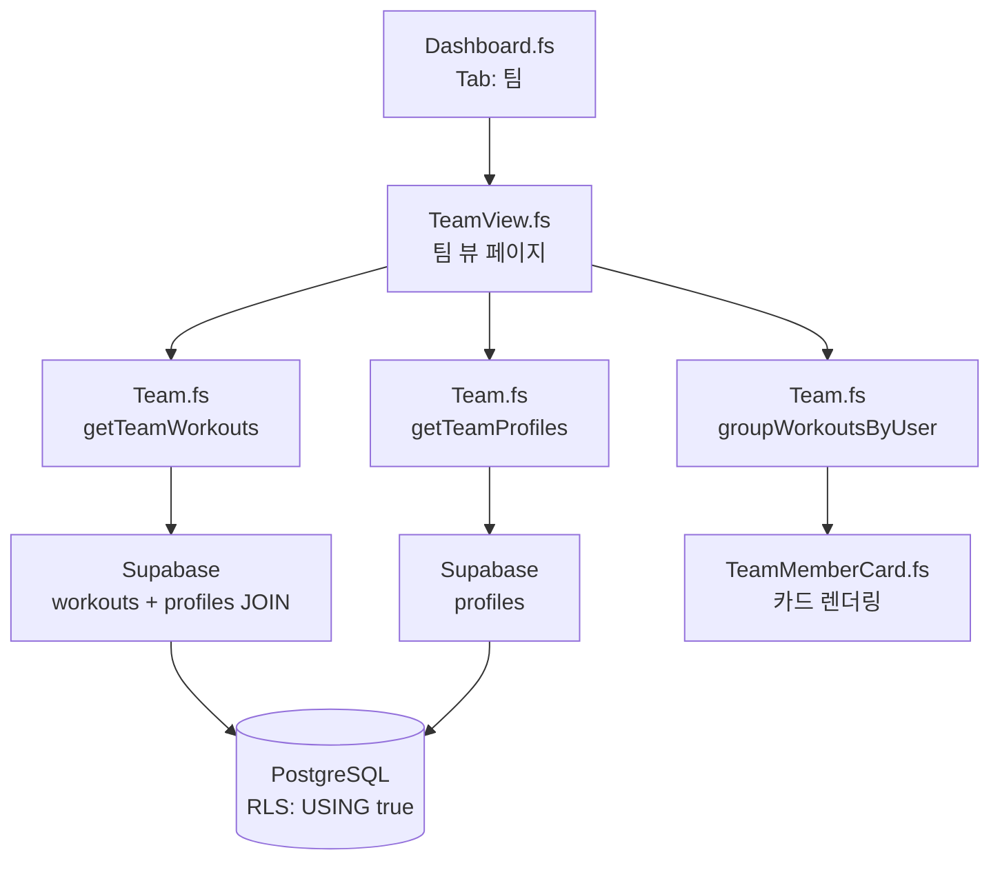
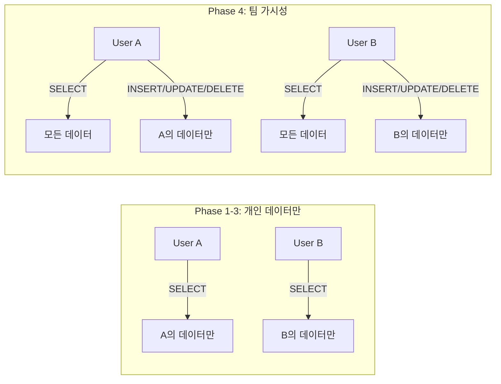
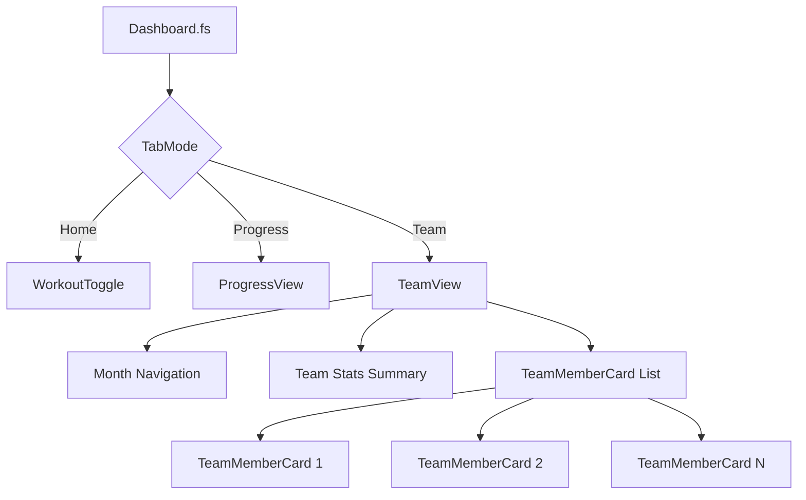

# Phase 4: 팀 기능 튜토리얼

## 개요 (Overview)

Phase 4의 핵심 가치는 **"팀 협업"**입니다.

지금까지 개인의 운동 기록을 관리했다면, Phase 4에서는 팀원들과 함께 운동 현황을 공유합니다. "이번 달에 누가 가장 열심히 운동했을까?" 같은 질문에 답할 수 있게 됩니다.

**이 Phase에서 구현한 것:**
- 팀원별 월별 운동 횟수 조회 (TEAM-01)
- RLS 정책 수정으로 팀 가시성 구현
- Supabase 조인 쿼리로 프로필 정보 포함
- F# 클라이언트 사이드 집계

**구현한 파일:**
- `supabase/migrations/20260210140000_team_visibility_rls.sql` - RLS 정책 업데이트
- `src/Supabase/Types.fs` - 팀 관련 타입 정의
- `src/Supabase/Team.fs` - 팀 데이터 조회 함수
- `src/Components/TeamMemberCard.fs` - 팀원 카드 컴포넌트
- `src/Pages/TeamView.fs` - 팀 뷰 페이지
- `src/Pages/Dashboard.fs` - 팀 탭 추가

## 아키텍처 (Architecture)

### 데이터 흐름



**데이터 흐름 순서:**

1. 사용자가 "팀" 탭 클릭
2. `TeamView.fs`가 마운트되고 `useEffect` 실행
3. 두 API 호출을 병렬로 실행:
   - `getTeamWorkouts`: 운동 기록 + 프로필 조인
   - `getTeamProfiles`: 전체 팀원 목록
4. `groupWorkoutsByUser`로 사용자별 집계
5. `TeamMemberCard`로 각 팀원 렌더링

### RLS 정책 변경

**기존 정책 (Phase 1-3) vs 새 정책 (Phase 4):**



**핵심 원칙:**
- **읽기(SELECT)**: 모든 인증된 사용자가 모든 데이터 조회 가능
- **쓰기(INSERT/UPDATE/DELETE)**: 여전히 본인 데이터만 수정 가능

### 컴포넌트 구조



**컴포넌트 계층:**
- `Dashboard.fs`: 탭 네비게이션 (홈/내기록/팀)
- `TeamView.fs`: 팀 뷰 전체 레이아웃
- `TeamMemberCard.fs`: 개별 팀원 정보 카드

## 핵심 개념 (Key Concepts)

### 1. RLS 정책 수정 패턴

**PostgreSQL의 ALTER POLICY 제한:**

`ALTER POLICY`는 `USING` 표현식을 변경할 수 없습니다. 정책의 조건을 바꾸려면 기존 정책을 삭제하고 새로 만들어야 합니다.

**DROP + CREATE 패턴:**

```sql
-- 1. 기존 정책 삭제 (IF EXISTS로 안전하게)
DROP POLICY IF EXISTS "Users can view own workouts" ON public.workouts;

-- 2. 새 정책 생성
CREATE POLICY "Authenticated users can view all workouts"
  ON public.workouts FOR SELECT
  TO authenticated
  USING (true);
```

**왜 `USING (true)`인가?**

```sql
-- 기존: 본인 데이터만
USING ((SELECT auth.uid()) = user_id)

-- 새 정책: 모든 데이터
USING (true)
```

`USING (true)`는 "항상 참"을 의미합니다. 조건 없이 모든 행에 대해 SELECT 허용.

**주의사항:**
- `INSERT/UPDATE/DELETE` 정책은 그대로 유지
- 사용자는 여전히 본인 데이터만 수정 가능
- 프로필 테이블도 동시에 정책 변경 필요 (조인 시 필요)

### 2. Supabase Foreign Key Join

**문제:** 운동 기록에서 사용자 이름을 표시하려면?

`workouts` 테이블에는 `user_id`만 있고 이름은 `profiles` 테이블에 있습니다.

**일반적인 방법 (비효율적):**

```typescript
// 1. 운동 기록 가져오기
const workouts = await supabase.from('workouts').select('*')

// 2. 각 운동에 대해 프로필 조회 (N번의 추가 쿼리!)
for (const w of workouts) {
  const profile = await supabase.from('profiles').select('*').eq('id', w.user_id)
}
```

**Supabase 조인 문법 (효율적):**

```fsharp
let query =
    supabase
        ?from("workouts")
        ?select("user_id, workout_date, profiles!workouts_user_id_fkey(id, email, display_name)")
        ?gte("workout_date", startDate)
        ?lte("workout_date", endDate)
```

**조인 문법 분석:**

```
profiles!workouts_user_id_fkey(id, email, display_name)
   │            │                    │
   │            │                    └── 프로필에서 가져올 컬럼
   │            └── Foreign Key 이름
   └── 조인할 테이블
```

**Foreign Key 이름은 어디서 오나?**

Supabase가 자동 생성하는 이름 규칙:
```
{참조테이블}_{참조컬럼}_fkey
```

`workouts.user_id` → `profiles.id`를 참조하면:
```
workouts_user_id_fkey
```

**반환 데이터 구조:**

```json
{
  "user_id": "abc-123",
  "workout_date": "2026-02-10",
  "profiles": {
    "id": "abc-123",
    "email": "user@example.com",
    "display_name": "홍길동"
  }
}
```

**F# 타입 정의:**

```fsharp
/// 중첩된 프로필 데이터
[<AllowNullLiteral>]
type NestedProfile =
    abstract id: string
    abstract email: string
    abstract display_name: string option

/// 조인 쿼리 결과 (Raw)
[<AllowNullLiteral>]
type WorkoutWithProfileRaw =
    abstract user_id: string
    abstract workout_date: string
    abstract profiles: NestedProfile  // 키 이름이 "profiles"!
```

**왜 `profiles`인가?**

Supabase는 FK 조인 시 **테이블 이름**을 키로 사용합니다. `WorkoutWithProfileRaw.profiles`가 `NestedProfile`을 참조합니다.

### 3. F# Array.groupBy 활용

**문제:** 사용자별로 운동 횟수를 집계하려면?

운동 기록 배열이 있을 때:

```fsharp
// 입력
[|
  { user_id = "A"; workout_date = "2026-02-01" }
  { user_id = "B"; workout_date = "2026-02-01" }
  { user_id = "A"; workout_date = "2026-02-03" }
  { user_id = "A"; workout_date = "2026-02-05" }
|]

// 원하는 출력
// A: 3회, B: 1회
```

**Array.groupBy 사용:**

```fsharp
let grouped =
    workouts
    |> Array.groupBy (fun w -> w.user_id)
    // 결과: [| ("A", [|..3개..|]); ("B", [|..1개..|]) |]
    |> Array.map (fun (userId, userWorkouts) ->
        {
            UserId = userId
            WorkoutCount = userWorkouts.Length
            // ...
        }
    )
```

**동작 원리:**

1. `groupBy (fun w -> w.user_id)`: user_id가 같은 항목끼리 그룹화
2. 결과 타입: `(string * WorkoutWithProfile[])[]` (튜플의 배열)
3. 각 튜플: `(userId, 해당 사용자의 운동 배열)`
4. `map`으로 각 그룹을 `TeamMemberSummary`로 변환

**전체 집계 코드:**

```fsharp
let groupWorkoutsByUser (workouts: WorkoutWithProfile array) (allProfiles: ProfileRecord array) : TeamMemberSummary array =
    // 1. 프로필 검색용 Map 생성
    let profileMap =
        allProfiles
        |> Array.map (fun p -> p.id, p)
        |> Map.ofArray

    // 2. 운동 기록 그룹화
    let grouped =
        workouts
        |> Array.groupBy (fun w -> w.user_id)
        |> Array.map (fun (userId, userWorkouts) ->
            // 프로필 정보 추출
            let profile = // ...
            {
                UserId = userId
                DisplayName = // ...
                WorkoutCount = userWorkouts.Length
                WorkoutDates = userWorkouts |> Array.map (fun w -> w.workout_date)
            }
        )

    // 3. 운동 0회인 멤버 추가 (아래에서 설명)
    // ...
```

### 4. Optional 값 처리

**문제:** `display_name`이 null일 수 있습니다.

```fsharp
type ProfileRecord = {
    id: string
    email: string
    display_name: string option  // None일 수 있음
}
```

**display_name → email 폴백 패턴:**

```fsharp
let displayName =
    profile
    |> Option.bind (fun p -> p.display_name)  // Some "홍길동" 또는 None
    |> Option.defaultWith (fun () ->
        profile
        |> Option.map (fun p -> p.email)      // email로 대체
        |> Option.defaultValue "Unknown"      // 그것도 없으면 "Unknown"
    )
```

**단계별 분석:**

```fsharp
// 1. profile이 Some {...}일 때
Some { display_name = Some "홍길동"; email = "..." }
|> Option.bind (fun p -> p.display_name)  // → Some "홍길동"
|> Option.defaultWith (...)               // → "홍길동"

// 2. display_name이 None일 때
Some { display_name = None; email = "user@example.com" }
|> Option.bind (fun p -> p.display_name)  // → None
|> Option.defaultWith (fun () ->
    Some { ... }
    |> Option.map (fun p -> p.email)      // → Some "user@example.com"
    |> Option.defaultValue "Unknown"      // → "user@example.com"
)

// 3. profile 자체가 None일 때
None
|> Option.bind (...)                      // → None
|> Option.defaultWith (fun () ->
    None
    |> Option.map (...)                   // → None
    |> Option.defaultValue "Unknown"      // → "Unknown"
)
```

**F# Option 함수 정리:**

| 함수 | 동작 |
|------|------|
| `Option.bind` | `Some`이면 함수 적용, `None`이면 `None` 반환 |
| `Option.map` | `Some`이면 함수 적용 후 `Some`으로 감싸기 |
| `Option.defaultValue` | `None`이면 기본값 반환 |
| `Option.defaultWith` | `None`이면 함수 실행 결과 반환 (지연 평가) |

### 5. 병렬 데이터 페칭

**문제:** 운동 기록과 프로필 목록, 둘 다 필요합니다.

**순차 호출 (느림):**

```fsharp
// ❌ 2초 + 1초 = 3초
let! workouts = getTeamWorkouts startDate endDate  // 2초 소요
let! profiles = getTeamProfiles()                   // 1초 소요
```

**병렬 호출 (빠름):**

```fsharp
// ✅ max(2초, 1초) = 2초
let! workouts = getTeamWorkouts startDate endDate
let! profiles = getTeamProfiles()
// F# promise에서 두 let!이 동시에 시작됨
```

**F# promise 블록 동작:**

`promise { }` 블록 내에서 여러 `let!` 호출은 JavaScript의 `Promise.all`처럼 병렬로 실행됩니다.

**TeamView에서의 사용:**

```fsharp
React.useEffect((fun () ->
    promise {
        try
            let startDate = formatDateString currentYear currentMonth 1
            let lastDay = getDaysInMonth currentYear currentMonth
            let endDate = formatDateString currentYear currentMonth lastDay

            // 병렬로 두 API 호출
            let! workouts = getTeamWorkouts startDate endDate
            let! profiles = getTeamProfiles()

            // 집계
            let teamMembers = groupWorkoutsByUser workouts profiles
            setMembers teamMembers
        with ex ->
            setError (Some "팀 데이터를 불러올 수 없습니다")
    } |> Promise.start
), [| box currentYear; box currentMonth |])
```

### 6. 제로 운동 멤버 처리

**문제:** 이번 달에 운동을 안 한 팀원이 목록에 안 보입니다.

**원인:**

`getTeamWorkouts`는 운동 기록이 있는 사용자만 반환합니다.

```fsharp
// 운동 기록 그룹화
let grouped = workouts |> Array.groupBy (fun w -> w.user_id)
// 결과: 운동 0회인 사용자는 빠짐!
```

**해결: 전체 프로필 목록과 병합**

```fsharp
// 1. 운동 기록이 있는 사용자 ID 집합
let usersWithWorkouts =
    grouped
    |> Array.map (fun m -> m.UserId)
    |> Set.ofArray

// 2. 운동 기록이 없는 사용자 추가
let usersWithoutWorkouts =
    allProfiles
    |> Array.filter (fun p -> not (Set.contains p.id usersWithWorkouts))
    |> Array.map (fun p ->
        {
            UserId = p.id
            DisplayName = p.display_name |> Option.defaultValue p.email
            Email = p.email
            WorkoutCount = 0          // 0회!
            WorkoutDates = [||]       // 빈 배열
        }
    )

// 3. 병합 및 정렬
Array.append grouped usersWithoutWorkouts
|> Array.sortByDescending (fun m -> m.WorkoutCount)
```

**Set을 사용하는 이유:**

`Set.contains`는 O(log n) 복잡도로 빠른 검색이 가능합니다. 반면 `Array.exists`는 O(n)입니다.

## 중요 코드 (Important Code)

### RLS 마이그레이션 SQL

**파일:** `supabase/migrations/20260210140000_team_visibility_rls.sql`

```sql
-- ============================================
-- Phase 4: Team Visibility RLS Updates
-- Allow authenticated users to view all workouts and profiles
-- Keep INSERT/UPDATE/DELETE restricted to own records
-- ============================================

-- WORKOUTS TABLE: Allow team visibility for SELECT
-- (Keep INSERT/UPDATE/DELETE policies unchanged)

-- Drop existing restrictive SELECT policy
DROP POLICY IF EXISTS "Users can view own workouts" ON public.workouts;

-- Create new permissive SELECT policy: all authenticated users can view all workouts
CREATE POLICY "Authenticated users can view all workouts"
  ON public.workouts FOR SELECT
  TO authenticated
  USING (true);

-- PROFILES TABLE: Allow team visibility for SELECT
-- (Keep UPDATE policy unchanged)

-- Drop existing restrictive SELECT policy
DROP POLICY IF EXISTS "Users can view own profile" ON public.profiles;

-- Create new permissive SELECT policy: all authenticated users can view all profiles
CREATE POLICY "Authenticated users can view all profiles"
  ON public.profiles FOR SELECT
  TO authenticated
  USING (true);

-- Update table comments to reflect new policy
COMMENT ON TABLE public.workouts IS 'Daily workout records with RLS enabled. One workout per user per date. All authenticated users can view all workouts; users can only modify their own.';
COMMENT ON TABLE public.profiles IS 'User profiles with RLS enabled. All authenticated users can view all profiles; users can only update their own.';
```

**코드 설명:**

| 줄 | 설명 |
|----|------|
| `DROP POLICY IF EXISTS` | 기존 정책 안전하게 삭제 (없어도 에러 안 남) |
| `CREATE POLICY ... FOR SELECT` | SELECT 전용 정책 |
| `TO authenticated` | 인증된 사용자에게만 적용 |
| `USING (true)` | 모든 행 허용 |
| `COMMENT ON TABLE` | 정책 변경 사항 문서화 |

**마이그레이션 적용:**

```bash
supabase db push
```

### Team.fs 핵심 함수

**파일:** `src/Supabase/Team.fs`

**1. parseWorkoutWithProfile - Raw 데이터 파싱:**

```fsharp
/// Parse raw workout with profile into F# record
let parseWorkoutWithProfile (raw: WorkoutWithProfileRaw) : WorkoutWithProfile =
    // raw.profiles가 null일 수 있음 (프로필이 삭제된 경우 등)
    let profile =
        if isNull raw.profiles then
            None
        else
            Some {
                id = raw.profiles.id
                email = raw.profiles.email
                display_name = raw.profiles.display_name
            }
    {
        user_id = raw.user_id
        workout_date = raw.workout_date
        profile = profile
    }
```

**왜 `isNull` 체크가 필요한가?**

JavaScript에서 조인 결과가 `null`일 수 있습니다. F#의 타입 안전성을 위해 명시적으로 `None`으로 변환합니다.

**2. getTeamWorkouts - 조인 쿼리:**

```fsharp
/// Get all team workouts for a date range with profile info
/// Uses Supabase nested select with foreign key join
let getTeamWorkouts (startDate: string) (endDate: string) : JS.Promise<WorkoutWithProfile array> =
    promise {
        // Query workouts with joined profile data via foreign key
        // profiles!workouts_user_id_fkey references the FK relationship
        let query =
            supabase
                ?from("workouts")
                ?select("user_id, workout_date, profiles!workouts_user_id_fkey(id, email, display_name)")
                ?gte("workout_date", startDate)
                ?lte("workout_date", endDate)
                ?order("workout_date", createObj ["ascending" ==> false])

        let! result = query
        let data = result?data

        if isNull data then
            return [||]
        else
            let rawWorkouts = unbox<WorkoutWithProfileRaw array> data
            return rawWorkouts |> Array.map parseWorkoutWithProfile
    }
```

**쿼리 분석:**

| 메서드 | 설명 |
|--------|------|
| `from("workouts")` | workouts 테이블에서 시작 |
| `select("...")` | 컬럼 선택 + FK 조인 |
| `gte("workout_date", startDate)` | >= startDate |
| `lte("workout_date", endDate)` | <= endDate |
| `order("workout_date", ...)` | 최신순 정렬 |

**3. getTeamProfiles - 전체 프로필:**

```fsharp
/// Get all team member profiles
let getTeamProfiles () : JS.Promise<ProfileRecord array> =
    promise {
        let query =
            supabase
                ?from("profiles")
                ?select("id, email, display_name")
                ?order("email", createObj ["ascending" ==> true])

        let! result = query
        let data = result?data

        if isNull data then
            return [||]
        else
            return unbox<ProfileRecord array> data
    }
```

**왜 별도의 프로필 조회가 필요한가?**

운동 기록이 없는 팀원도 표시하기 위해 전체 프로필 목록이 필요합니다.

**4. groupWorkoutsByUser - 집계:**

```fsharp
/// Group workouts by user and create team member summaries
/// Sorted by workout count descending (most active first)
let groupWorkoutsByUser (workouts: WorkoutWithProfile array) (allProfiles: ProfileRecord array) : TeamMemberSummary array =
    // Create lookup map for profiles
    let profileMap =
        allProfiles
        |> Array.map (fun p -> p.id, p)
        |> Map.ofArray

    // Group workouts by user_id
    let grouped =
        workouts
        |> Array.groupBy (fun w -> w.user_id)
        |> Array.map (fun (userId, userWorkouts) ->
            // Get profile from first workout or from allProfiles
            let profile =
                userWorkouts
                |> Array.tryHead
                |> Option.bind (fun w -> w.profile)
                |> Option.orElse (Map.tryFind userId profileMap)

            let displayName =
                profile
                |> Option.bind (fun p -> p.display_name)
                |> Option.defaultWith (fun () ->
                    profile
                    |> Option.map (fun p -> p.email)
                    |> Option.defaultValue "Unknown"
                )

            let email =
                profile
                |> Option.map (fun p -> p.email)
                |> Option.defaultValue ""

            {
                UserId = userId
                DisplayName = displayName
                Email = email
                WorkoutCount = userWorkouts.Length
                WorkoutDates = userWorkouts |> Array.map (fun w -> w.workout_date)
            }
        )

    // Include profiles with zero workouts
    let usersWithWorkouts = grouped |> Array.map (fun m -> m.UserId) |> Set.ofArray
    let usersWithoutWorkouts =
        allProfiles
        |> Array.filter (fun p -> not (Set.contains p.id usersWithWorkouts))
        |> Array.map (fun p ->
            {
                UserId = p.id
                DisplayName = p.display_name |> Option.defaultValue p.email
                Email = p.email
                WorkoutCount = 0
                WorkoutDates = [||]
            }
        )

    // Combine and sort by workout count descending
    Array.append grouped usersWithoutWorkouts
    |> Array.sortByDescending (fun m -> m.WorkoutCount)
```

**핵심 로직:**

1. `profileMap` 생성: O(1) 프로필 검색용
2. `groupBy user_id`: 사용자별 운동 그룹화
3. 각 그룹에서 프로필 정보 추출
4. `displayName` 폴백: display_name → email → "Unknown"
5. 운동 0회 멤버 추가
6. 운동 횟수 내림차순 정렬

### TeamView.fs 컴포넌트

**파일:** `src/Pages/TeamView.fs`

```fsharp
module Pages.TeamView

open Feliz
open Fable.Core.JsInterop
open Supabase.Types
open Supabase.Team
open Utils.DateHelpers
open Components.TeamMemberCard

/// Team roster view showing all team members and their monthly workout counts
[<ReactComponent>]
let TeamViewPage () =
    // Date navigation state
    let (currentYear, setCurrentYear) = React.useState(System.DateTime.Now.Year)
    let (currentMonth, setCurrentMonth) = React.useState(System.DateTime.Now.Month)

    // Data state
    let (members, setMembers) = React.useState<TeamMemberSummary array>([||])
    let (loading, setLoading) = React.useState(true)
    let (error, setError) = React.useState<string option>(None)

    // Month navigation functions with year rollover
    let goToNextMonth () =
        if currentMonth = 12 then
            setCurrentYear (currentYear + 1)
            setCurrentMonth 1
        else
            setCurrentMonth (currentMonth + 1)

    let goToPrevMonth () =
        if currentMonth = 1 then
            setCurrentYear (currentYear - 1)
            setCurrentMonth 12
        else
            setCurrentMonth (currentMonth - 1)

    // Load team data when month changes
    React.useEffect((fun () ->
        setLoading true
        setError None

        promise {
            try
                // Calculate date range for the month
                let startDate = formatDateString currentYear currentMonth 1
                let lastDay = getDaysInMonth currentYear currentMonth
                let endDate = formatDateString currentYear currentMonth lastDay

                // Fetch team data in parallel
                let! workouts = getTeamWorkouts startDate endDate
                let! profiles = getTeamProfiles()

                // Aggregate by user
                let teamMembers = groupWorkoutsByUser workouts profiles
                setMembers teamMembers
                setLoading false
            with ex ->
                setError (Some "팀 데이터를 불러올 수 없습니다")
                setLoading false
        } |> Promise.start
    ), [| box currentYear; box currentMonth |])

    Html.div [
        prop.className "space-y-4"
        prop.children [
            // Month navigation header
            Html.div [
                prop.className "flex items-center justify-between bg-white rounded-lg shadow-sm p-4"
                prop.children [
                    Html.button [
                        prop.onClick (fun _ -> goToPrevMonth())
                        prop.className "p-2 hover:bg-gray-100 rounded-lg transition-colors"
                        prop.text "<"
                    ]
                    Html.h2 [
                        prop.className "text-lg font-semibold text-gray-800"
                        prop.text (sprintf "%d년 %d월" currentYear currentMonth)
                    ]
                    Html.button [
                        prop.onClick (fun _ -> goToNextMonth())
                        prop.className "p-2 hover:bg-gray-100 rounded-lg transition-colors"
                        prop.text ">"
                    ]
                ]
            ]

            // Team stats summary
            Html.div [
                prop.className "bg-white rounded-lg shadow-sm p-4"
                prop.children [
                    Html.div [
                        prop.className "flex justify-between text-sm text-gray-600"
                        prop.children [
                            Html.span [
                                prop.text (sprintf "팀원 %d명" members.Length)
                            ]
                            Html.span [
                                let totalWorkouts = members |> Array.sumBy (fun m -> m.WorkoutCount)
                                prop.text (sprintf "총 %d회 운동" totalWorkouts)
                            ]
                        ]
                    ]
                ]
            ]

            // Loading/Error/Content states
            // ... (조건부 렌더링)
        ]
    ]
```

**상태 관리:**

| 상태 | 타입 | 용도 |
|------|------|------|
| `currentYear` | int | 현재 표시 연도 |
| `currentMonth` | int | 현재 표시 월 |
| `members` | TeamMemberSummary[] | 팀원 목록 |
| `loading` | bool | 로딩 중 표시 |
| `error` | string option | 에러 메시지 |

**useEffect 의존성:**

```fsharp
[| box currentYear; box currentMonth |]
```

년/월이 변경될 때마다 데이터 다시 로드합니다.

### TeamMemberCard.fs 컴포넌트

**파일:** `src/Components/TeamMemberCard.fs`

```fsharp
module Components.TeamMemberCard

open Feliz
open Supabase.Types

/// Renders a team member card showing display name, email (if different), and workout count
[<ReactComponent>]
let TeamMemberCard (member': TeamMemberSummary) =
    Html.div [
        prop.className "bg-white rounded-lg shadow-sm p-4 flex items-center justify-between"
        prop.children [
            // Left: Member info with avatar
            Html.div [
                prop.className "flex items-center gap-3"
                prop.children [
                    // Avatar placeholder (first letter of display name)
                    Html.div [
                        prop.className "w-10 h-10 rounded-full bg-indigo-100 flex items-center justify-center text-indigo-600 font-semibold"
                        prop.text (
                            member'.DisplayName
                            |> Seq.tryHead
                            |> Option.map string
                            |> Option.defaultValue "?"
                        )
                    ]
                    // Name and optional email
                    Html.div [
                        prop.children [
                            Html.p [
                                prop.className "font-medium text-gray-800"
                                prop.text member'.DisplayName
                            ]
                            // Show email only if different from display name and not empty
                            if member'.DisplayName <> member'.Email && member'.Email <> "" then
                                Html.p [
                                    prop.className "text-sm text-gray-500"
                                    prop.text member'.Email
                                ]
                        ]
                    ]
                ]
            ]

            // Right: Workout count with Korean suffix
            Html.div [
                prop.className "text-right"
                prop.children [
                    Html.span [
                        prop.className (
                            "text-2xl font-bold " +
                            if member'.WorkoutCount > 0 then "text-indigo-600"
                            else "text-gray-400"
                        )
                        prop.text (sprintf "%d" member'.WorkoutCount)
                    ]
                    Html.span [
                        prop.className "text-sm text-gray-500 ml-1"
                        prop.text "회"
                    ]
                ]
            ]
        ]
    ]
```

**주요 기능:**

1. **아바타:** 이름의 첫 글자 표시 (`Seq.tryHead`)
2. **이메일 조건부 표시:** display_name과 다를 때만 표시
3. **운동 횟수 색상:** 0회는 회색, 1회 이상은 인디고색
4. **한글 접미사:** "회"

**왜 `member'`인가?**

F#에서 `member`는 예약어입니다. apostrophe를 붙여 변수명으로 사용합니다.

```fsharp
// ❌ 컴파일 에러
let TeamMemberCard (member: TeamMemberSummary) = ...

// ✅ 정상
let TeamMemberCard (member': TeamMemberSummary) = ...
```

## 배운 점 (Lessons Learned)

### RLS 정책 관리

**1. ALTER POLICY의 한계**

PostgreSQL에서 `ALTER POLICY`는 `USING` 표현식을 변경할 수 없습니다.

```sql
-- ❌ 동작하지 않음
ALTER POLICY "Users can view own workouts"
  ON public.workouts
  USING (true);  -- ERROR: cannot alter USING expression
```

**교훈:** RLS 정책 조건을 바꾸려면 반드시 DROP + CREATE 패턴을 사용하세요.

**2. 관련 테이블 동시 수정**

`workouts` 정책만 바꾸면 조인이 실패합니다.

```sql
-- workouts에서 profiles 조인 시 profiles의 RLS도 체크됨
SELECT w.*, p.*
FROM workouts w
JOIN profiles p ON w.user_id = p.id;
-- profiles SELECT 정책이 막으면 → 빈 결과
```

**교훈:** 조인에 관련된 모든 테이블의 RLS 정책을 함께 수정하세요.

### Supabase 조인 쿼리

**1. Foreign Key 자동 조인**

Supabase는 FK 관계를 자동으로 인식합니다.

```fsharp
// FK 이름 명시
?select("..., profiles!workouts_user_id_fkey(...)")

// 또는 FK가 유일하면 테이블명만으로 가능
?select("..., profiles(...)")
```

**교훈:** FK 관계가 명확하면 Supabase가 조인을 자동 처리합니다.

**2. 중첩 선택 문법**

```
테이블명!FK이름(컬럼1, 컬럼2, ...)
```

괄호 안에 조인된 테이블에서 가져올 컬럼을 지정합니다.

### F# 데이터 처리

**1. Array.groupBy 효율성**

```fsharp
// O(n) 단일 순회로 그룹화
workouts |> Array.groupBy (fun w -> w.user_id)
```

`groupBy`는 해시맵을 내부적으로 사용하여 효율적입니다.

**2. Option 타입 안전성**

```fsharp
// null 가능성을 타입으로 표현
display_name: string option

// 컴파일러가 None 처리를 강제
Option.defaultValue "fallback" maybeString
```

**교훈:** Option 타입으로 null 참조 오류를 컴파일 타임에 방지합니다.

**3. Map vs Array.exists 성능**

```fsharp
// ❌ O(n) 매번 순회
allProfiles |> Array.exists (fun p -> p.id = targetId)

// ✅ O(log n) 빠른 검색
Map.containsKey targetId profileMap
```

**교훈:** 반복 검색이 필요하면 Map이나 Set으로 변환하세요.

## 흔한 실수 (Common Pitfalls)

### 1. RLS 정책 충돌

**증상:** 조인 쿼리가 빈 결과를 반환합니다.

**원인:**
```sql
-- workouts: 모든 사람 볼 수 있음
-- profiles: 본인만 볼 수 있음 ← 문제!
```

`workouts`에서 `profiles`를 조인할 때 `profiles` RLS가 다른 사용자 프로필을 차단합니다.

**해결:**
```sql
-- 두 테이블 모두 SELECT 정책 수정
DROP POLICY IF EXISTS "..." ON public.workouts;
CREATE POLICY "..." ON public.workouts FOR SELECT USING (true);

DROP POLICY IF EXISTS "..." ON public.profiles;
CREATE POLICY "..." ON public.profiles FOR SELECT USING (true);
```

### 2. display_name null 처리

**증상:** 팀원 이름이 빈칸으로 표시됩니다.

**원인:**
```fsharp
// ❌ display_name이 None이면 빈 문자열
member'.DisplayName |> Option.defaultValue ""
```

**해결:**
```fsharp
// ✅ email로 폴백
profile
|> Option.bind (fun p -> p.display_name)
|> Option.defaultWith (fun () ->
    profile
    |> Option.map (fun p -> p.email)
    |> Option.defaultValue "Unknown"
)
```

### 3. 제로 운동 멤버 누락

**증상:** 이번 달 운동 안 한 팀원이 목록에 없습니다.

**원인:**
```fsharp
// 운동 기록 기준으로 그룹화 → 기록 없으면 제외
workouts |> Array.groupBy (fun w -> w.user_id)
```

**해결:**
```fsharp
// 1. 운동 기록 있는 사용자 ID 수집
let usersWithWorkouts = grouped |> Array.map (fun m -> m.UserId) |> Set.ofArray

// 2. 운동 기록 없는 사용자 추가
let usersWithoutWorkouts =
    allProfiles
    |> Array.filter (fun p -> not (Set.contains p.id usersWithWorkouts))
    |> Array.map (fun p -> { WorkoutCount = 0; ... })

// 3. 병합
Array.append grouped usersWithoutWorkouts
```

### 4. FK 조인 키 이름 불일치

**증상:** `profiles` 속성이 undefined입니다.

**원인:**
```fsharp
// ❌ 잘못된 키 이름
type WorkoutWithProfileRaw =
    abstract profile: NestedProfile  // 단수형
```

Supabase는 테이블 이름(`profiles`)을 키로 사용합니다.

**해결:**
```fsharp
// ✅ 올바른 키 이름 (테이블 이름과 일치)
type WorkoutWithProfileRaw =
    abstract profiles: NestedProfile  // 복수형
```

### 5. member 예약어 충돌

**증상:** 컴파일 에러 "Unexpected keyword 'member'"

**원인:**
```fsharp
// ❌ 예약어 사용
let TeamMemberCard (member: TeamMemberSummary) = ...
```

F#에서 `member`는 클래스 멤버 정의에 사용되는 예약어입니다.

**해결:**
```fsharp
// ✅ apostrophe 추가
let TeamMemberCard (member': TeamMemberSummary) = ...
```

## 테스트 (Testing)

### 수동 테스트 체크리스트

**팀 로스터 표시:**
- [ ] "팀" 탭 클릭 시 팀 뷰가 표시되는가?
- [ ] 모든 등록된 팀원이 목록에 나오는가?
- [ ] 이름(또는 이메일)과 운동 횟수가 표시되는가?

**운동 횟수 가시성:**
- [ ] 다른 팀원의 운동 횟수가 보이는가?
- [ ] 운동 0회인 팀원도 목록에 있는가?
- [ ] 운동 횟수 기준 내림차순 정렬인가?

**월 네비게이션:**
- [ ] 이전/다음 버튼으로 월 전환이 되는가?
- [ ] 12월 → 1월, 1월 → 12월 전환 시 연도 변경이 되는가?
- [ ] 월 변경 시 데이터가 다시 로드되는가?

**RLS 프라이버시 확인:**
- [ ] 다른 팀원의 운동 기록 조회가 가능한가? (SELECT)
- [ ] 다른 팀원의 운동 기록 수정은 불가능한가? (UPDATE)

### 개발자 도구 검증

**1. Network 탭에서 쿼리 확인:**

브라우저 개발자 도구 → Network 탭에서:

```
URL: https://xxx.supabase.co/rest/v1/workouts?select=...
Status: 200
Response: [...모든 팀원 데이터...]
```

**2. 로컬 Supabase에서 RLS 테스트:**

```bash
# 1. 사용자 A로 로그인
supabase login --local

# 2. 운동 조회 (모두 보여야 함)
curl 'http://localhost:54321/rest/v1/workouts?select=*' \
  -H "Authorization: Bearer <A_TOKEN>"
# 결과: A, B, C의 모든 운동 기록

# 3. 다른 사용자 운동 수정 시도 (실패해야 함)
curl -X PATCH 'http://localhost:54321/rest/v1/workouts?user_id=eq.B_ID' \
  -H "Authorization: Bearer <A_TOKEN>" \
  -d '{"workout_date": "2026-01-01"}'
# 결과: 0 rows affected (또는 에러)
```

**3. SQL로 직접 확인:**

```sql
-- Supabase SQL Editor에서
-- 1. RLS 정책 확인
SELECT polname, polcmd, polqual
FROM pg_policies
WHERE tablename = 'workouts';

-- 결과 예시:
-- polname: "Authenticated users can view all workouts"
-- polcmd: SELECT
-- polqual: true
```

### 자동화 테스트 아이디어

```fsharp
// 향후 구현 가능한 테스트
module Tests.Team

open Expecto

let tests = testList "Team" [
    test "groupWorkoutsByUser includes zero-workout members" {
        let workouts = [|
            { user_id = "A"; workout_date = "2026-02-01"; profile = None }
        |]
        let allProfiles = [|
            { id = "A"; email = "a@test.com"; display_name = None }
            { id = "B"; email = "b@test.com"; display_name = None }
        |]

        let result = groupWorkoutsByUser workouts allProfiles

        Expect.equal result.Length 2 "Should include both members"
        Expect.exists result (fun m -> m.UserId = "B" && m.WorkoutCount = 0) "B should have 0 workouts"
    }

    test "displayName falls back to email" {
        let profile = { id = "A"; email = "test@example.com"; display_name = None }
        let result = getDisplayName (Some profile)

        Expect.equal result "test@example.com" "Should use email as fallback"
    }
]
```

## 다음 단계 (Next Steps)

### Phase 5: Photo Upload

Phase 5에서는 사진 업로드 기능을 추가합니다.

**핵심 기능:**
- 사진 업로드로 자동 운동 기록 생성
- Supabase Storage 활용
- 이미지 RLS 정책 (본인 사진만 업로드/조회)

**예정 구현:**
- `supabase/migrations/*_storage_bucket.sql` - Storage 버킷 생성
- `src/Supabase/Storage.fs` - 파일 업로드 함수
- `src/Components/PhotoUpload.fs` - 업로드 UI
- 이미지 최적화 및 썸네일

**학습 포인트:**
- Supabase Storage API
- 이미지 파일 RLS 정책
- 파일 업로드 UX 패턴

### Phase 6: Production Deployment

Phase 6에서는 프로덕션 배포를 진행합니다.

**핵심 기능:**
- Vercel 또는 Netlify 배포
- 커스텀 도메인 연결
- 환경 변수 관리
- 모니터링 및 에러 추적

**예정 구현:**
- `vercel.json` 또는 `netlify.toml` 설정
- GitHub Actions CI/CD
- Sentry 에러 모니터링
- 성능 최적화 (번들 크기, 이미지 등)

Phase 4는 "팀 협업"에 집중했고, Phase 5에서는 "사진 인증"으로 운동 기록의 신뢰성을 높입니다.

---

*작성일: 2026-02-10*
*대상 독자: 초보 개발자*
*언어: 한글*
