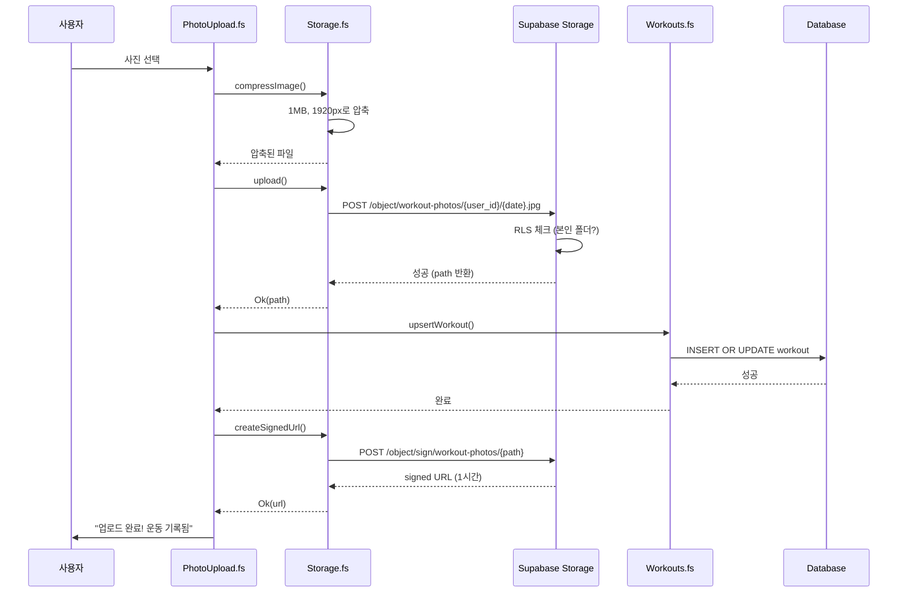
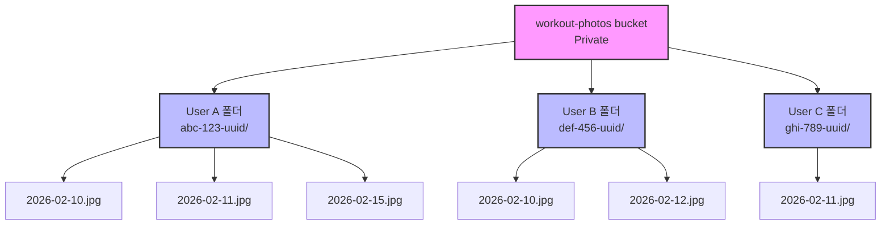
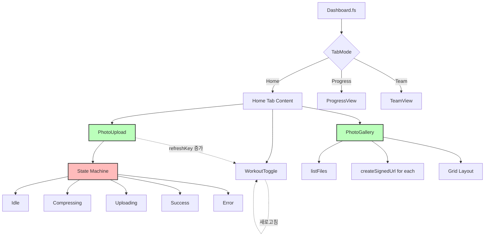

# Phase 5: 사진 업로드 튜토리얼

## 개요 (Overview)

Phase 5의 핵심 가치는 **"사진으로 증명하는 운동 기록"**입니다.

지금까지 버튼 클릭으로 운동 기록을 남겼다면, Phase 5에서는 운동 사진을 올리는 것만으로 자동으로 기록이 생성됩니다. 사진은 비공개로 저장되며, 팀원도 다른 사람의 사진은 볼 수 없습니다.

**이 Phase에서 구현한 것:**
- 사진 업로드로 자동 운동 기록 생성 (WORK-04)
- Supabase Storage를 활용한 비공개 파일 저장
- RLS를 통한 사용자별 사진 격리
- 업로드 진행률 표시
- 클라이언트 사이드 이미지 압축

**구현한 파일:**
- `supabase/migrations/20260210150000_storage_bucket.sql` - 스토리지 버킷 및 RLS
- `src/Supabase/Storage.fs` - 스토리지 API 바인딩
- `src/Components/PhotoUpload.fs` - 사진 업로드 UI
- `src/Components/PhotoGallery.fs` - 사진 갤러리 UI
- `src/Pages/Dashboard.fs` - 대시보드 통합

## 아키텍처 (Architecture)

### 전체 업로드 흐름



**핵심 흐름:**

1. 사용자가 사진 선택 (파일 또는 카메라 촬영)
2. `compressImage`: 클라이언트에서 1MB, 1920px로 압축
3. `upload`: Supabase Storage에 업로드 (진행률 추적)
4. RLS 체크: 본인 폴더(`{user_id}/`)에 저장 중인지 확인
5. `upsertWorkout`: 오늘 날짜로 운동 기록 자동 생성
6. `createSignedUrl`: Private 파일 접근용 임시 URL 생성
7. Success 상태 표시: "업로드 완료! 운동 기록됨"

### 스토리지 폴더 구조



**폴더 구조 설명:**

```
workout-photos/                 # Private bucket (public = false)
├── {user_id_1}/               # User 1의 폴더
│   ├── 2026-02-10.jpg        # 2월 10일 사진
│   └── 2026-02-11.jpg        # 2월 11일 사진
├── {user_id_2}/               # User 2의 폴더
│   └── 2026-02-10.jpg        # 2월 10일 사진
└── ...
```

**RLS 정책이 적용되는 위치:**
- `storage.foldername(name)[1]`: 경로의 첫 번째 폴더명(= user_id) 추출
- 본인 폴더만 INSERT/SELECT/DELETE 가능

### 컴포넌트 구조



**컴포넌트 계층:**
- `Dashboard.fs`: 탭 네비게이션 + `refreshKey` 상태 관리
- `PhotoUpload.fs`: 업로드 UI + 상태 머신 (Idle/Compressing/Uploading/Success/Error)
- `PhotoGallery.fs`: 사진 목록 조회 + 그리드 레이아웃
- `Storage.fs`: Supabase Storage API 바인딩

## 핵심 개념 (Key Concepts)

### 1. Supabase Storage 버킷

**Private vs Public 버킷:**

| 속성 | Private | Public |
|------|---------|--------|
| `public` | `false` | `true` |
| URL 접근 | RLS + 인증 필요 | 누구나 접근 가능 |
| Signed URL | 필수 | 선택 |
| 사용 예 | 개인 사진, 문서 | 프로필 이미지, 로고 |

**버킷 생성 SQL:**

```sql
INSERT INTO storage.buckets (id, name, public, file_size_limit, allowed_mime_types)
VALUES (
  'workout-photos',
  'workout-photos',
  false,                          -- Private
  5242880,                        -- 5MB 제한 (5 * 1024 * 1024 bytes)
  ARRAY['image/jpeg', 'image/png', 'image/webp']::text[]
);
```

**왜 Private 버킷인가?**

1. **개인 정보 보호**: 운동 사진은 민감한 개인 정보
2. **팀 가시성 확장 가능**: 향후 팀원에게 공개하려면 RLS만 수정
3. **외부 접근 차단**: URL만으로는 접근 불가

**파일 크기 제한 이유:**

- 5MB는 대부분의 스마트폰 사진 수용 (압축 전)
- 압축 후 1MB 이하로 줄어들어 저장 비용 절감
- 네트워크 전송 속도 개선

### 2. Storage RLS 정책

**핵심 함수: `storage.foldername()`**

```sql
storage.foldername(name)[1]  -- 경로의 첫 번째 폴더명 추출
```

**예시:**
```sql
-- 경로: "abc-123-uuid/2026-02-10.jpg"
storage.foldername('abc-123-uuid/2026-02-10.jpg')
-- 결과: ARRAY['abc-123-uuid', '2026-02-10.jpg']

storage.foldername('abc-123-uuid/2026-02-10.jpg')[1]
-- 결과: 'abc-123-uuid' (첫 번째 요소)
```

**INSERT 정책 (업로드 권한):**

```sql
CREATE POLICY "Users can upload own photos"
ON storage.objects FOR INSERT
TO authenticated
WITH CHECK (
  bucket_id = 'workout-photos' AND
  (storage.foldername(name))[1] = (SELECT auth.uid()::text)
);
```

**정책 분석:**

| 조건 | 설명 |
|------|------|
| `FOR INSERT` | 파일 업로드 시에만 적용 |
| `TO authenticated` | 로그인한 사용자만 |
| `bucket_id = 'workout-photos'` | 특정 버킷에만 적용 |
| `(storage.foldername(name))[1] = auth.uid()::text` | 경로의 첫 폴더가 본인 user_id와 일치해야 함 |

**SELECT 정책 (조회 권한):**

```sql
CREATE POLICY "Users can view own photos"
ON storage.objects FOR SELECT
TO authenticated
USING (
  bucket_id = 'workout-photos' AND
  (storage.foldername(name))[1] = (SELECT auth.uid()::text)
);
```

**DELETE 정책 (삭제 권한):**

```sql
CREATE POLICY "Users can delete own photos"
ON storage.objects FOR DELETE
TO authenticated
USING (
  bucket_id = 'workout-photos' AND
  (storage.foldername(name))[1] = (SELECT auth.uid()::text)
);
```

**3개 정책이 필요한 이유:**

- PostgreSQL RLS는 `FOR ALL` 대신 `FOR SELECT/INSERT/UPDATE/DELETE` 별도 정책 권장
- 각 작업별로 다른 조건 적용 가능
- 디버깅과 유지보수 용이

### 3. 이미지 압축 (browser-image-compression)

**왜 압축이 필요한가?**

| 문제 | 압축 없이 | 압축 후 |
|------|----------|---------|
| 파일 크기 | 10-15MB (최신 스마트폰) | 1MB 이하 |
| 업로드 시간 | 30-60초 (4G LTE) | 3-5초 |
| 스토리지 비용 | 높음 | 낮음 (10배 이상 절감) |
| 서버 부하 | 높음 | 낮음 (클라이언트 처리) |

**압축 설정:**

```fsharp
let compressImage (file: File) : JS.Promise<File> =
    let options = createObj [
        "maxSizeMB" ==> 1.0          // 최대 1MB
        "maxWidthOrHeight" ==> 1920   // 최대 1920px (Full HD)
        "useWebWorker" ==> true       // 백그라운드 처리 (UI 블로킹 방지)
        "fileType" ==> "image/jpeg"   // JPEG로 통일 (최적 압축률)
    ]
    imageCompressionLib file options
```

**라이브러리가 자동으로 처리하는 것:**

1. **EXIF 회전 보정**: iPhone 세로 사진이 눕지 않음
2. **품질 자동 조정**: maxSizeMB 목표에 맞춰 품질 조정
3. **포맷 변환**: HEIC/PNG → JPEG 변환
4. **웹 워커**: 메인 스레드 블로킹 없이 백그라운드 압축
5. **비율 유지**: 가로세로 비율 보존

**압축 순서:**

```
원본 (예: 4032x3024, 12MB HEIC)
    ↓
JPEG 변환
    ↓
1920x1440 리사이징 (maxWidthOrHeight)
    ↓
품질 조정 (maxSizeMB 목표)
    ↓
최종 (1920x1440, 0.8MB JPEG)
```

### 4. 업로드 진행률 추적

**onUploadProgress 콜백:**

```fsharp
let options = createObj [
    "onUploadProgress" ==> (fun progress ->
        let loaded = progress?loaded |> unbox<float>  // 업로드된 바이트
        let total = progress?total |> unbox<float>    // 전체 바이트
        if total > 0.0 then
            onProgress ((loaded / total) * 100.0)     // 0-100% 계산
    )
]
```

**진행률 계산:**

```
loaded = 200KB, total = 1000KB
→ (200 / 1000) * 100 = 20%
```

**상태 머신 (PhotoUploadState):**

```fsharp
type PhotoUploadState =
    | Idle                    // 대기 중 (초기 상태)
    | Compressing             // 압축 중
    | Uploading of float      // 업로드 중 (진행률 0-100%)
    | Success of string       // 완료 (signed URL)
    | Error of string         // 오류 (메시지)
```

**상태 전이도:**

```
Idle
  ↓ 파일 선택
Compressing
  ↓ 압축 완료
Uploading 0.0
  ↓ 진행률 업데이트
Uploading 50.0
  ↓
Uploading 100.0
  ↓ 업로드 성공
Success "https://..."
  (또는)
  ↓ 오류 발생
Error "업로드 실패"
  ↓ "다시 시도" 버튼
Idle
```

**각 상태별 UI:**

| 상태 | 아이콘 | 배경색 | 표시 내용 |
|------|--------|--------|----------|
| Idle | 📷 | indigo-100 | "사진 올리기" |
| Compressing | ⏳ (애니메이션) | gray-100 | "압축 중..." |
| Uploading | - | gray-100 | 진행바 + "50%" |
| Success | ✅ | green-100 | "업로드 완료! 운동 기록됨" |
| Error | ❌ | red-100 | 에러 메시지 + "다시 시도" |

### 5. Signed URL (서명된 URL)

**왜 필요한가?**

Private 버킷은 직접 URL 접근이 불가능합니다.

```
❌ https://xxx.supabase.co/storage/v1/object/public/workout-photos/abc/2026-02-10.jpg
   → 403 Forbidden (public 버킷 아님)

✅ https://xxx.supabase.co/storage/v1/object/sign/workout-photos/abc/2026-02-10.jpg?token=...
   → 200 OK (임시 인증 토큰 포함)
```

**Signed URL = 임시 인증 토큰:**

- URL에 `?token=...` 파라미터 포함
- 토큰에 유효 기간 포함 (expiresIn)
- 만료 후 접근 불가 (보안)

**생성 방법:**

```fsharp
let createSignedUrl (bucket: string) (path: string) (expiresIn: int) : JS.Promise<Result<string, string>> =
    promise {
        // expiresIn: 초 단위 (3600 = 1시간)
        let! result = supabase?storage?from(bucket)?createSignedUrl(path, expiresIn)
        let error = result?error
        if isNull error then
            let data = result?data
            let url = data?signedUrl |> unbox<string>
            return Ok url
        else
            let errorMsg = error?message |> unbox<string>
            return Error errorMsg
    }
```

**사용 예:**

```fsharp
// 1시간 유효한 URL 생성
let! urlResult = createSignedUrl "workout-photos" "abc-123/2026-02-10.jpg" 3600

match urlResult with
| Ok url ->
    // 로 표시 가능
    Html.img [ prop.src url ]
| Error msg ->
    // 에러 처리
    ()
```

**만료 시간 선택 가이드:**

| 유효 기간 | 초(expiresIn) | 사용 예 |
|----------|--------------|---------|
| 1분 | 60 | 일회성 다운로드 링크 |
| 1시간 | 3600 | 갤러리 표시 (기본값) |
| 1일 | 86400 | 공유 링크 |
| 1주 | 604800 | 장기 공유 |

**주의사항:**

- 만료 후 새 URL 필요 (자동 갱신 없음)
- 긴 유효 기간 = 보안 위험 증가
- 갤러리는 페이지 로드마다 새 URL 생성 권장

### 6. 사진 업로드 → 운동 기록 연결

**핵심 흐름 (WORK-04):**

```fsharp
match uploadResult with
| Ok uploadedPath ->
    // 1. 업로드 성공

    // 2. 오늘 날짜로 운동 기록 자동 생성
    let! _ = upsertWorkout userId today

    // 3. Signed URL 생성
    let! urlResult = createSignedUrl bucketName uploadedPath 3600

    // 4. 성공 UI
    setUploadState (Success url)

    // 5. 부모 컴포넌트에 알림 (WorkoutToggle 새로고침용)
    onUploadComplete()
```

**왜 `upsertWorkout`을 사용하나?**

```fsharp
// upsert = INSERT OR UPDATE

// 시나리오 1: 오늘 아직 운동 안 함
upsertWorkout userId "2026-02-10"
→ INSERT (새 기록 생성)

// 시나리오 2: 오늘 이미 운동 버튼 눌렀음
upsertWorkout userId "2026-02-10"
→ UPDATE (기존 기록 유지, 오류 없음)

// 시나리오 3: 오늘 사진 여러 장 업로드
upsertWorkout userId "2026-02-10"  // 첫 번째
→ INSERT
upsertWorkout userId "2026-02-10"  // 두 번째
→ UPDATE (중복 기록 방지)
```

**운동 기록 생성 이점:**

1. **일관성**: 사진 업로드 = 운동 기록 (자동)
2. **중복 방지**: 같은 날짜는 하나의 기록만
3. **통계 정확성**: 캘린더/진행률에 즉시 반영
4. **사용자 편의**: 버튼 클릭 불필요

**refreshKey 패턴 (Dashboard 통합):**

```fsharp
// Dashboard.fs
let (refreshKey, setRefreshKey) = React.useState(0)

// PhotoUpload 완료 시 refreshKey 증가
let handleUploadComplete () =
    setRefreshKey (refreshKey + 1)

// WorkoutToggle은 refreshKey를 useEffect 의존성으로 사용
React.useEffect((fun () ->
    // 데이터 다시 로드
    loadWorkoutStatus()
), [| box refreshKey |])
```

**동작:**

1. 사진 업로드 완료
2. `refreshKey` 0 → 1 증가
3. `WorkoutToggle` useEffect 실행
4. `hasWorkedOut` 상태 업데이트
5. 버튼 ⭕ → 💪 변경

## 중요 코드 (Important Code)

### Storage.fs - 스토리지 바인딩

**파일:** `src/Supabase/Storage.fs`

**1. 이미지 압축:**

```fsharp
// Import browser-image-compression library
[<Import("default", "browser-image-compression")>]
let private imageCompressionLib: File -> obj -> JS.Promise<File> = jsNative

/// Compress image to max 1MB, 1920px
let compressImage (file: File) : JS.Promise<File> =
    let options = createObj [
        "maxSizeMB" ==> 1.0          // 최대 1MB
        "maxWidthOrHeight" ==> 1920   // 최대 1920px (Full HD)
        "useWebWorker" ==> true       // UI 블로킹 방지
        "fileType" ==> "image/jpeg"   // JPEG로 통일
    ]
    imageCompressionLib file options
```

**코드 설명:**

| 줄 | 설명 |
|----|------|
| `[<Import(...)>]` | JavaScript 라이브러리 임포트 (Fable interop) |
| `jsNative` | F#에서 JS 함수 호출을 위한 마커 |
| `createObj` | JS 객체 생성 (F# 레코드 → JS object) |
| `==>` | Fable의 키-값 페어 연산자 |

**2. 파일 업로드 (진행률 추적):**

```fsharp
/// Upload file to storage bucket with progress callback
/// Returns path on success, error message on failure
let upload (bucket: string) (path: string) (file: File) (onProgress: float -> unit) : JS.Promise<Result<string, string>> =
    promise {
        let options = createObj [
            "cacheControl" ==> "3600"      // 1시간 캐시
            "upsert" ==> true              // 같은 경로 덮어쓰기 허용
            "onUploadProgress" ==> (fun progress ->
                // progress 객체: { loaded: number, total: number }
                let loaded = progress?loaded |> unbox<float>
                let total = progress?total |> unbox<float>
                if total > 0.0 then
                    onProgress ((loaded / total) * 100.0)
            )
        ]
        let! result = supabase?storage?from(bucket)?upload(path, file, options)
        let error = result?error
        if isNull error then
            let data = result?data
            let uploadedPath = data?path |> unbox<string>
            return Ok uploadedPath  // 성공: path 반환
        else
            let errorMsg = error?message |> unbox<string>
            return Error errorMsg   // 실패: 에러 메시지
    }
```

**Result 타입 사용 이유:**

```fsharp
// F# Result 타입으로 성공/실패 명확히 구분
type Result<'T, 'TError> =
    | Ok of 'T
    | Error of 'TError

// 호출하는 쪽에서 패턴 매칭으로 안전하게 처리
match uploadResult with
| Ok path -> // 성공 처리
| Error msg -> // 에러 처리
```

**3. Signed URL 생성:**

```fsharp
/// Create signed URL for private file access
/// expiresIn is in seconds (e.g., 3600 = 1 hour)
let createSignedUrl (bucket: string) (path: string) (expiresIn: int) : JS.Promise<Result<string, string>> =
    promise {
        let! result = supabase?storage?from(bucket)?createSignedUrl(path, expiresIn)
        let error = result?error
        if isNull error then
            let data = result?data
            let url = data?signedUrl |> unbox<string>
            return Ok url
        else
            let errorMsg = error?message |> unbox<string>
            return Error errorMsg
    }
```

**Supabase Storage API 메서드:**

| 메서드 | 설명 |
|--------|------|
| `from(bucket)` | 버킷 선택 |
| `upload(path, file, options)` | 파일 업로드 |
| `createSignedUrl(path, expiresIn)` | Signed URL 생성 |
| `remove(paths)` | 파일 삭제 |
| `list(folder)` | 폴더 내 파일 목록 |

**4. 파일 목록 조회:**

```fsharp
/// List files in user's folder
let listFiles (bucket: string) (folder: string) : JS.Promise<Result<string array, string>> =
    promise {
        let! result = supabase?storage?from(bucket)?list(folder)
        let error = result?error
        if isNull error then
            let data = result?data |> unbox<obj array>
            // 각 item은 { name: string, ... } 객체
            let names = data |> Array.map (fun item -> item?name |> unbox<string>)
            return Ok names
        else
            let errorMsg = error?message |> unbox<string>
            return Error errorMsg
    }
```

**반환 데이터 예:**

```json
[
  { "name": "2026-02-10.jpg", "id": "...", "created_at": "...", ... },
  { "name": "2026-02-11.jpg", "id": "...", "created_at": "...", ... }
]
```

### PhotoUpload.fs - 업로드 컴포넌트

**파일:** `src/Components/PhotoUpload.fs`

**상태 머신 구현:**

```fsharp
[<ReactComponent>]
let PhotoUploadButton (userId: string) (onUploadComplete: unit -> unit) =
    // 상태 관리
    let (uploadState, setUploadState) = React.useState<PhotoUploadState>(Idle)

    let handleFileSelected (file: File) =
        async {
            try
                // 1. 압축 중 표시
                setUploadState Compressing

                // 2. 이미지 압축
                let! compressed = compressImage file |> Async.AwaitPromise

                // 3. 업로드 시작
                setUploadState (Uploading 0.0)

                // 4. 경로 생성 ({user_id}/{date}.jpg)
                let today = getTodayDateString()
                let path = buildPath userId today

                // 5. 업로드 (진행률 콜백)
                let! uploadResult =
                    upload bucketName path compressed (fun progress ->
                        setUploadState (Uploading progress)
                    )
                    |> Async.AwaitPromise

                match uploadResult with
                | Result.Ok uploadedPath ->
                    // 6. 운동 기록 생성 (핵심!)
                    let! _ = upsertWorkout userId today |> Async.AwaitPromise

                    // 7. Signed URL 생성
                    let! urlResult = createSignedUrl bucketName uploadedPath 3600 |> Async.AwaitPromise

                    let finalUrl =
                        match urlResult with
                        | Result.Ok url -> url
                        | Result.Error _ -> ""  // URL 실패해도 업로드는 성공

                    // 8. 성공 상태
                    setUploadState (PhotoUploadState.Success finalUrl)
                    onUploadComplete()

                | Result.Error msg ->
                    setUploadState (PhotoUploadState.Error msg)

            with ex ->
                setUploadState (PhotoUploadState.Error "사진 업로드 실패. 다시 시도해주세요.")
        } |> Async.StartImmediate
```

**Async 블록 사용 이유:**

```fsharp
// F# async { }는 순차 비동기 코드 작성에 편리
async {
    let! result1 = operation1 |> Async.AwaitPromise
    // result1 완료 후 다음 실행
    let! result2 = operation2 |> Async.AwaitPromise
    // ...
}
```

**파일 입력 오버레이 패턴:**

```fsharp
Html.div [
    prop.className "relative"
    prop.children [
        // 1. 숨겨진 실제 input
        Html.input [
            prop.type' "file"
            prop.accept "image/*"
            prop.custom ("capture", "environment")  // 모바일 후면 카메라
            prop.className "absolute inset-0 w-full h-full opacity-0 cursor-pointer z-10"
            prop.onChange handleFileSelected
        ]

        // 2. 보이는 커스텀 버튼 (아래 레이어)
        Html.div [
            prop.className "flex items-center gap-2 px-4 py-3 bg-indigo-100 ..."
            prop.children [
                Html.span [ prop.text "📷" ]
                Html.span [ prop.text "사진 올리기" ]
            ]
        ]
    ]
]
```

**왜 이 패턴인가?**

- `<input type="file">`의 기본 스타일은 브라우저마다 다름
- `opacity-0`로 투명하게 하고 위에 배치 (z-10)
- 아래 커스텀 버튼이 보이지만 클릭은 input으로 전달

**capture 속성:**

```fsharp
prop.custom ("capture", "environment")
```

- `"environment"`: 후면 카메라 (기본)
- `"user"`: 전면 카메라 (셀카)
- 모바일에서 카메라 직접 실행, 데스크톱에서는 무시

**상태별 UI 렌더링:**

```fsharp
match uploadState with
| Idle ->
    Html.div [
        prop.className "... bg-indigo-100 ..."
        prop.children [ /* 사진 올리기 버튼 */ ]
    ]

| Compressing ->
    Html.div [
        prop.className "... bg-gray-100 ..."
        prop.children [
            Html.span [ prop.className "animate-spin"; prop.text "⏳" ]
            Html.span [ prop.text "압축 중..." ]
        ]
    ]

| Uploading progress ->
    Html.div [
        prop.children [
            Html.span [ prop.text (sprintf "%.0f%%" progress) ]
            // 진행 바
            Html.div [
                prop.className "w-full h-2 bg-gray-200 rounded-full"
                prop.children [
                    Html.div [
                        prop.className "h-full bg-indigo-600 transition-all"
                        prop.style [ style.width (length.percent (int progress)) ]
                    ]
                ]
            ]
        ]
    ]

| Success url ->
    Html.div [
        prop.className "... bg-green-100 ..."
        prop.children [ /* 업로드 완료! 운동 기록됨 */ ]
    ]

| Error msg ->
    Html.div [
        prop.className "... bg-red-100 ..."
        prop.children [
            Html.span [ prop.text msg ]
            Html.button [ prop.onClick (fun _ -> setUploadState Idle); prop.text "다시 시도" ]
        ]
    ]
```

### PhotoGallery.fs - 갤러리 컴포넌트

**파일:** `src/Components/PhotoGallery.fs`

**병렬 URL 생성 (Promise.all):**

```fsharp
React.useEffect((fun () ->
    promise {
        try
            setLoading true
            setError None

            // 1. 파일 목록 조회
            let! filesResult = listFiles bucketName userId

            match filesResult with
            | Ok filenames ->
                // 2. 이미지 파일만 필터링
                let imageFiles =
                    filenames
                    |> Array.filter (fun name ->
                        name.EndsWith(".jpg") ||
                        name.EndsWith(".jpeg") ||
                        name.EndsWith(".png") ||
                        name.EndsWith(".webp")
                    )

                // 3. 각 파일에 대해 Signed URL 생성 (병렬!)
                let! photoItems =
                    imageFiles
                    |> Array.map (fun filename ->
                        promise {
                            let path = sprintf "%s/%s" userId filename
                            let! urlResult = createSignedUrl bucketName path 3600
                            match urlResult with
                            | Ok url ->
                                return Some {
                                    Filename = filename
                                    SignedUrl = url
                                    Date = extractDate filename
                                }
                            | Error _ ->
                                return None
                        }
                    )
                    |> Promise.all  // 병렬 실행!

                // 4. 성공한 항목만 추출
                let validPhotos =
                    photoItems
                    |> Array.choose id  // None 제거
                    |> Array.sortByDescending (fun p -> p.Date)  // 최신순

                setPhotos validPhotos
                setLoading false

            | Error msg ->
                setError (Some "사진을 불러올 수 없습니다")
                setLoading false

        with ex ->
            setError (Some "사진 로딩 실패")
            setLoading false
    } |> Promise.start
), [| box userId |])
```

**Promise.all의 성능 이점:**

```
순차 실행:
파일1 URL 생성 (500ms)
파일2 URL 생성 (500ms)
파일3 URL 생성 (500ms)
총 1500ms

병렬 실행 (Promise.all):
파일1, 2, 3 URL 동시 생성
총 500ms (가장 느린 하나의 시간)
```

**날짜 추출 함수:**

```fsharp
/// Extract date from filename (remove extension)
let private extractDate (filename: string) : string =
    if filename.EndsWith(".jpg") then
        filename.Substring(0, filename.Length - 4)
    elif filename.EndsWith(".jpeg") then
        filename.Substring(0, filename.Length - 5)
    elif filename.EndsWith(".png") then
        filename.Substring(0, filename.Length - 4)
    elif filename.EndsWith(".webp") then
        filename.Substring(0, filename.Length - 5)
    else
        filename
```

**사용 예:**

```fsharp
extractDate "2026-02-10.jpg"   // "2026-02-10"
extractDate "2026-02-11.jpeg"  // "2026-02-11"
```

**한글 날짜 포맷팅:**

```fsharp
/// Format date for display (YYYY-MM-DD -> YYYY년 M월 D일)
let private formatDateKorean (dateStr: string) : string =
    let parts = dateStr.Split('-')
    if parts.Length = 3 then
        sprintf "%s년 %d월 %d일"
            parts.[0]              // 2026
            (int parts.[1])        // 2 (0 제거)
            (int parts.[2])        // 10
    else
        dateStr
```

**결과:**

```
"2026-02-10" → "2026년 2월 10일"
"2026-12-01" → "2026년 12월 1일"
```

**그리드 레이아웃:**

```fsharp
Html.div [
    prop.className "grid grid-cols-2 md:grid-cols-3 gap-4"
    prop.children (
        photos
        |> Array.map (fun photo ->
            Html.div [
                prop.key photo.Filename
                prop.className "relative aspect-square rounded-lg overflow-hidden shadow-sm"
                prop.children [
                    // 사진
                    Html.img [
                        prop.src photo.SignedUrl
                        prop.alt (sprintf "%s 운동 사진" photo.Date)
                        prop.className "w-full h-full object-cover"
                    ]
                    // 날짜 오버레이 (하단)
                    Html.div [
                        prop.className "absolute bottom-0 left-0 right-0 bg-gradient-to-t from-black/60 to-transparent p-2"
                        prop.children [
                            Html.span [
                                prop.className "text-white text-sm font-medium"
                                prop.text (formatDateKorean photo.Date)
                            ]
                        ]
                    ]
                ]
            ]
        )
        |> Array.toList
    )
]
```

**Tailwind 클래스 설명:**

| 클래스 | 설명 |
|--------|------|
| `grid grid-cols-2` | 모바일: 2열 그리드 |
| `md:grid-cols-3` | 중간 화면 이상: 3열 그리드 |
| `gap-4` | 그리드 간격 1rem |
| `aspect-square` | 1:1 비율 (정사각형) |
| `object-cover` | 이미지 비율 유지하며 채우기 |
| `bg-gradient-to-t` | 위로 그라데이션 |
| `from-black/60` | 검은색 60% 불투명도에서 시작 |

### Dashboard.fs - 통합

**파일:** `src/Pages/Dashboard.fs`

**refreshKey 패턴:**

```fsharp
[<ReactComponent>]
let Dashboard (userId: string) =
    let (tabMode, setTabMode) = React.useState(Home)
    let (refreshKey, setRefreshKey) = React.useState(0)

    let handleUploadComplete () =
        // 업로드 완료 시 refreshKey 증가
        setRefreshKey (refreshKey + 1)

    Html.div [
        match tabMode with
        | Home ->
            Html.div [
                prop.children [
                    // 환영 메시지
                    Html.h1 [ prop.text "오늘도 운동하셨나요?" ]

                    // 운동 토글 (refreshKey를 prop으로 전달)
                    WorkoutToggle userId refreshKey

                    // 사진 업로드 (완료 콜백 전달)
                    PhotoUploadButton userId handleUploadComplete

                    // 사진 갤러리
                    PhotoGallery userId
                ]
            ]
        | Progress ->
            ProgressView userId
        | Team ->
            TeamView ()
    ]
```

**WorkoutToggle에서 refreshKey 사용:**

```fsharp
[<ReactComponent>]
let WorkoutToggle (userId: string) (refreshKey: int) =
    let (hasWorkedOut, setHasWorkedOut) = React.useState(false)
    let (loading, setLoading) = React.useState(true)

    // refreshKey가 변경될 때마다 데이터 다시 로드
    React.useEffect((fun () ->
        promise {
            let today = getTodayDateString()
            let! workouts = getWorkouts userId (Some today) (Some today)
            let exists = workouts.Length > 0
            setHasWorkedOut exists
            setLoading false
        } |> Promise.start
    ), [| box refreshKey |])  // 의존성에 refreshKey 포함

    // ... 버튼 렌더링
```

**동작 흐름:**

```
1. 초기 상태: refreshKey = 0
   → WorkoutToggle useEffect 실행
   → hasWorkedOut = false (오늘 운동 안 함)
   → 버튼: ⭕

2. 사진 업로드 완료
   → handleUploadComplete() 호출
   → setRefreshKey(1)
   → refreshKey 변경 감지

3. WorkoutToggle useEffect 재실행
   → 데이터 다시 로드
   → hasWorkedOut = true (방금 운동 기록 생성됨)
   → 버튼: 💪
```

## 배운 점 (Lessons Learned)

### Supabase Storage 패턴

**1. Private 버킷 + RLS = 안전한 파일 저장**

Private 버킷은 RLS 정책과 결합하여 강력한 파일 격리를 제공합니다.

```sql
-- 버킷: private
-- RLS: 본인 폴더만 접근
→ 팀원도 다른 사람의 사진 못 봄
```

**2. 폴더 기반 사용자 격리**

경로 규칙 `{user_id}/{filename}`을 정하고 `storage.foldername()`으로 RLS 적용.

```
user_a/2026-02-10.jpg  ← A만 접근 가능
user_b/2026-02-10.jpg  ← B만 접근 가능
```

**3. Signed URL로 임시 접근 제공**

Private 파일도 Signed URL로 제한된 시간 동안 공유 가능.

```
만료 시간 = 보안 vs 편의 트레이드오프
1시간: 갤러리 표시용 (기본값)
1일: 공유 링크용
```

### 이미지 처리

**1. 클라이언트 압축으로 서버 부하 감소**

`browser-image-compression`을 사용하면:
- 서버 CPU 사용 없음 (클라이언트에서 처리)
- 네트워크 전송량 90% 감소 (10MB → 1MB)
- 저장 비용 절감

**2. 라이브러리가 복잡한 문제 해결**

직접 구현하기 어려운 것들:
- EXIF 회전 보정 (iOS 사진 눕는 문제)
- 품질 자동 조정 (목표 파일 크기에 맞춤)
- 포맷 변환 (HEIC → JPEG)
- 웹 워커 (백그라운드 처리)

**3. JPEG로 통일하는 이유**

- 압축률 최고 (사진용)
- 모든 브라우저 지원
- 투명도 필요 없음 (운동 사진)
- PNG보다 10배 작음

### F# 비동기 패턴

**1. Result 타입으로 일관된 오류 처리**

```fsharp
// 모든 Storage 함수가 Result<T, string> 반환
let upload ... : Promise<Result<string, string>>
let createSignedUrl ... : Promise<Result<string, string>>

// 호출하는 쪽에서 패턴 매칭
match result with
| Ok value -> // 성공 처리
| Error msg -> // 에러 처리 (컴파일러가 강제)
```

예외(`try-catch`)보다 명확하고 타입 안전.

**2. async { } vs promise { }**

| 블록 | 사용 시기 |
|------|----------|
| `async { }` | F# 비동기 코드 (Async.AwaitPromise로 Promise 변환 가능) |
| `promise { }` | JavaScript Promise와 직접 상호작용 (Supabase API) |

**3. Promise.all로 병렬 실행**

```fsharp
// 순차 실행 (느림)
let! url1 = createSignedUrl ...
let! url2 = createSignedUrl ...
let! url3 = createSignedUrl ...

// 병렬 실행 (빠름)
[| promise1; promise2; promise3 |]
|> Promise.all
```

갤러리에서 사진 10장의 URL을 생성할 때 10배 빠름.

### 상태 머신 UI 패턴

**1. Discriminated Union으로 명확한 상태**

```fsharp
type PhotoUploadState =
    | Idle
    | Compressing
    | Uploading of float
    | Success of string
    | Error of string
```

각 상태가 타입으로 정의되어:
- 불가능한 상태 조합 방지 (예: Compressing + Success 동시 불가)
- 컴파일러가 모든 상태 처리 강제
- 코드 리뷰 시 한눈에 흐름 파악

**2. 상태별 UI 렌더링**

```fsharp
match uploadState with
| Idle -> // 파란색 버튼
| Compressing -> // 회색 + 스피너
| Uploading progress -> // 진행 바
| Success url -> // 초록색 체크
| Error msg -> // 빨간색 + 재시도
```

각 상태마다 독립적인 UI = 유지보수 용이.

## 흔한 실수 (Common Pitfalls)

### 1. 버킷 생성 누락

**증상:** 업로드 시 "Bucket not found" 오류

**원인:**

```fsharp
// 코드에서 "workout-photos" 버킷 사용
upload "workout-photos" path file onProgress

// 하지만 마이그레이션 실행 안 함
// → storage.buckets 테이블에 레코드 없음
```

**해결:**

```bash
# 마이그레이션 적용
supabase db push
# 또는 로컬 개발
supabase db reset
```

```sql
-- 마이그레이션 파일 확인
INSERT INTO storage.buckets (id, name, ...) VALUES ('workout-photos', ...);
```

### 2. RLS 정책 누락

**증상:** 업로드 성공했지만 갤러리에서 조회 불가

**원인:**

```sql
-- INSERT 정책만 있고 SELECT 정책 없음
CREATE POLICY "..." FOR INSERT ...
-- SELECT 정책 없음!
```

**해결:**

```sql
-- 세 가지 정책 모두 필요
CREATE POLICY "..." FOR INSERT ...  -- 업로드
CREATE POLICY "..." FOR SELECT ...  -- 조회
CREATE POLICY "..." FOR DELETE ...  -- 삭제
```

**디버깅:**

```bash
# Supabase SQL Editor에서
SELECT polname, polcmd FROM pg_policies WHERE tablename = 'objects';
# 결과: INSERT, SELECT, DELETE 정책 모두 있어야 함
```

### 3. 대용량 파일 업로드

**증상:** 업로드 타임아웃 또는 매우 느린 진행

**원인:**

```fsharp
// 압축 없이 원본 업로드
let! uploadResult = upload bucketName path file onProgress
// 원본: 12MB → 4G 네트워크에서 30-60초
```

**해결:**

```fsharp
// 반드시 압축 후 업로드
let! compressed = compressImage file
let! uploadResult = upload bucketName path compressed onProgress
// 압축 후: 0.8MB → 3-5초
```

**압축 없을 때 vs 있을 때:**

| 항목 | 압축 없음 | 압축 있음 |
|------|----------|----------|
| 파일 크기 | 12MB | 0.8MB |
| 업로드 시간 (4G) | 30-60초 | 3-5초 |
| 저장 비용 (1000장) | $2.40/월 | $0.16/월 |

### 4. MIME 타입 불일치

**증상:** "Invalid file type" 오류

**원인:**

```sql
-- 버킷 설정: JPEG, PNG, WebP만 허용
allowed_mime_types: ['image/jpeg', 'image/png', 'image/webp']

-- 사용자가 GIF 업로드 시도
file.type = 'image/gif'
→ 거부됨
```

**해결 방법 1: allowed_mime_types 확장**

```sql
-- GIF 추가
UPDATE storage.buckets
SET allowed_mime_types = ARRAY['image/jpeg', 'image/png', 'image/webp', 'image/gif']::text[]
WHERE id = 'workout-photos';
```

**해결 방법 2: 클라이언트에서 체크**

```fsharp
let handleFileSelected (file: File) =
    let allowedTypes = [| "image/jpeg"; "image/png"; "image/webp" |]
    if not (Array.contains file.type allowedTypes) then
        setUploadState (Error "JPEG, PNG, WebP 파일만 업로드 가능합니다")
    else
        // 업로드 진행
        ()
```

### 5. 운동 기록 생성 실패

**증상:** 사진은 업로드되지만 운동 버튼이 ⭕ 그대로

**원인:**

```fsharp
// upsertWorkout 호출 누락
match uploadResult with
| Ok uploadedPath ->
    // ❌ 운동 기록 생성 안 함
    setUploadState (Success url)
```

**해결:**

```fsharp
match uploadResult with
| Ok uploadedPath ->
    // ✅ 반드시 운동 기록 생성
    let! _ = upsertWorkout userId today
    setUploadState (Success url)
    onUploadComplete()  // refreshKey 증가
```

**검증 방법:**

```bash
# Supabase SQL Editor에서
SELECT * FROM workouts WHERE user_id = '...' ORDER BY workout_date DESC LIMIT 10;
# 오늘 날짜 기록 있어야 함
```

### 6. Signed URL 만료

**증상:** 갤러리 사진이 한 시간 후 깨짐

**원인:**

```fsharp
// 1시간 만료 URL 생성
createSignedUrl bucketName path 3600

// 1시간 후 URL 만료
→ 
→ 403 Forbidden
```

**해결 방법 1: 페이지 로드마다 새 URL 생성**

```fsharp
// PhotoGallery의 useEffect에 의존성 없음 (마운트 시에만)
React.useEffect((fun () ->
    // 새 Signed URL 생성
    loadPhotos()
), [| box userId |])

// 페이지 새로고침 = 새 URL
```

**해결 방법 2: 긴 만료 시간 (주의: 보안 위험)**

```fsharp
// 1일 유효
createSignedUrl bucketName path 86400
```

**해결 방법 3: Public 버킷으로 변경 (보안 포기)**

```sql
-- 권장하지 않음 (사진이 비공개여야 함)
UPDATE storage.buckets SET public = true WHERE id = 'workout-photos';
```

### 7. capture 속성 브라우저 호환성

**증상:** 데스크톱 Chrome에서 카메라가 안 뜸

**원인:**

```fsharp
// capture="environment"는 모바일 전용
prop.custom ("capture", "environment")
// 데스크톱: 무시됨 (파일 선택 다이얼로그 표시)
```

**해결:**

이것은 정상 동작입니다. `capture` 속성은:
- **모바일**: 카메라 직접 실행
- **데스크톱**: 무시 (파일 선택 다이얼로그)

둘 다 지원하려면:

```fsharp
Html.input [
    prop.accept "image/*"
    prop.custom ("capture", "environment")
    // 모바일: 카메라, 데스크톱: 파일 선택
]
```

## 테스트 (Testing)

### 수동 테스트 체크리스트

**업로드 기능:**

- [ ] 데스크톱에서 파일 선택 업로드 성공
- [ ] 모바일에서 카메라 촬영 업로드 성공
- [ ] 대용량 파일 (5MB+) 업로드 시 자동 압축 확인
- [ ] 업로드 중 진행률 표시 (0% → 100%)
- [ ] 업로드 완료 후 "운동 기록됨" 메시지 표시
- [ ] 업로드 후 운동 버튼 ⭕ → 💪 변경

**진행률 표시:**

- [ ] Compressing 상태에서 스피너 애니메이션
- [ ] Uploading 상태에서 % 증가
- [ ] 진행 바 width 애니메이션

**RLS 보안:**

- [ ] 다른 사용자 폴더 업로드 시도 시 실패
- [ ] 다른 사용자 사진 URL 직접 접근 시 403
- [ ] 본인 폴더만 listFiles로 조회됨

**갤러리 표시:**

- [ ] 업로드한 사진이 갤러리에 즉시 표시
- [ ] 사진 최신순 정렬
- [ ] 날짜 오버레이 표시 (YYYY년 M월 D일)
- [ ] 모바일 2열, 데스크톱 3열 그리드
- [ ] 사진 없을 때 "아직 업로드한 사진이 없습니다" 메시지

**연동 테스트:**

- [ ] 사진 업로드 → WorkoutToggle 새로고침
- [ ] 같은 날짜 여러 사진 업로드 가능 (중복 기록 안 생김)
- [ ] 새로고침 후 데이터 유지
- [ ] 캘린더에 해당 날짜 표시

### 개발자 도구 검증

**1. Network 탭 (업로드):**

```
Request:
POST https://xxx.supabase.co/storage/v1/object/workout-photos/abc-123/2026-02-10.jpg
Authorization: Bearer <token>
Content-Type: multipart/form-data

Response:
200 OK
{ "Key": "abc-123/2026-02-10.jpg" }
```

**2. Network 탭 (Signed URL 생성):**

```
Request:
POST https://xxx.supabase.co/storage/v1/object/sign/workout-photos/abc-123/2026-02-10.jpg
{ "expiresIn": 3600 }

Response:
200 OK
{ "signedURL": "https://...?token=..." }
```

**3. Application 탭:**

- Local Storage → Supabase 세션 확인
- Cookies → `sb-xxx-auth-token` 존재

**4. Console 로그:**

```javascript
// 압축 전/후 크기 확인
console.log('Original size:', file.size);
console.log('Compressed size:', compressed.size);

// 진행률 로그
console.log('Upload progress:', progress + '%');
```

### SQL로 RLS 검증

**테스트 1: 본인 폴더 업로드 (성공해야 함)**

```sql
BEGIN;
-- 사용자 A로 가장
SET LOCAL ROLE authenticated;
SET LOCAL request.jwt.claims = '{"sub": "user-a-uuid"}';

-- A 폴더에 업로드 시도 (WITH CHECK 통과?)
SELECT
  bucket_id = 'workout-photos' AND
  (storage.foldername('user-a-uuid/2026-02-10.jpg'))[1] = 'user-a-uuid'
  AS can_insert;
-- 결과: true

ROLLBACK;
```

**테스트 2: 다른 사람 폴더 업로드 (실패해야 함)**

```sql
BEGIN;
SET LOCAL ROLE authenticated;
SET LOCAL request.jwt.claims = '{"sub": "user-a-uuid"}';

-- B 폴더에 업로드 시도 (실패!)
SELECT
  bucket_id = 'workout-photos' AND
  (storage.foldername('user-b-uuid/2026-02-10.jpg'))[1] = 'user-a-uuid'
  AS can_insert;
-- 결과: false

ROLLBACK;
```

**테스트 3: SELECT 정책**

```sql
BEGIN;
SET LOCAL ROLE authenticated;
SET LOCAL request.jwt.claims = '{"sub": "user-a-uuid"}';

-- A 폴더 조회 (성공)
SELECT * FROM storage.objects
WHERE bucket_id = 'workout-photos'
  AND (storage.foldername(name))[1] = 'user-a-uuid';
-- 결과: A의 파일들

-- B 폴더 조회 (빈 결과)
SELECT * FROM storage.objects
WHERE bucket_id = 'workout-photos'
  AND (storage.foldername(name))[1] = 'user-b-uuid';
-- 결과: 빈 배열 (RLS에 의해 필터링됨)

ROLLBACK;
```

### Curl로 API 테스트

**업로드:**

```bash
# 파일 업로드
curl -X POST \
  'https://xxx.supabase.co/storage/v1/object/workout-photos/user-a-uuid/2026-02-10.jpg' \
  -H "Authorization: Bearer $TOKEN" \
  -F 'file=@photo.jpg'

# 성공 응답:
# { "Key": "user-a-uuid/2026-02-10.jpg" }
```

**Signed URL 생성:**

```bash
curl -X POST \
  'https://xxx.supabase.co/storage/v1/object/sign/workout-photos/user-a-uuid/2026-02-10.jpg' \
  -H "Authorization: Bearer $TOKEN" \
  -d '{"expiresIn": 3600}'

# 성공 응답:
# { "signedURL": "https://...?token=..." }
```

## 다음 단계 (Next Steps)

### Phase 6: Production Ready

Phase 6에서는 프로덕션 배포를 준비합니다.

**핵심 기능:**
- PWA (오프라인 지원)
- 성능 최적화
- 관리자 도구
- 모니터링 및 에러 추적

**예정 구현:**
- `public/manifest.json` - PWA 설정
- `public/service-worker.js` - 오프라인 캐싱
- 번들 크기 최적화 (코드 스플리팅)
- Sentry 에러 모니터링
- Admin 페이지 (사용자 관리)

**학습 포인트:**
- Service Worker API
- IndexedDB (오프라인 데이터)
- 성능 프로파일링
- 배포 자동화 (GitHub Actions)

### 추가 개선 아이디어

**1. 사진 편집 기능:**
- 크롭/회전
- 필터 적용
- 텍스트 오버레이 (날짜, 메모)

**2. 팀 공유:**
- RLS 정책 수정으로 팀원에게 사진 공개
- 팀 갤러리 페이지

**3. 앨범 기능:**
- 월별/연도별 앨범
- 슬라이드쇼

**4. 썸네일 생성:**
- Edge Function으로 서버사이드 리사이징
- 목록 로딩 속도 개선

Phase 5는 "사진으로 증명"에 집중했고, Phase 6에서는 "실전 배포"를 목표로 합니다.

---

*작성일: 2026-02-10*
*대상 독자: 초보 개발자*
*언어: 한글*
