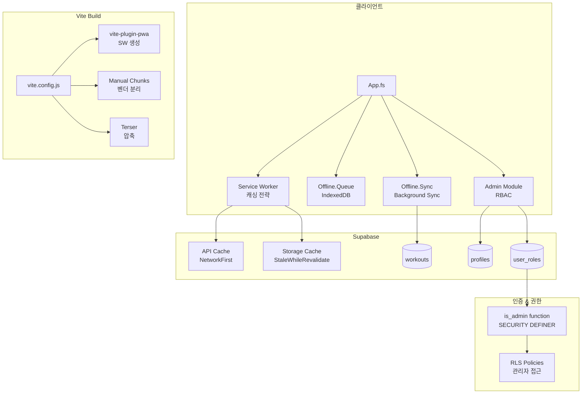
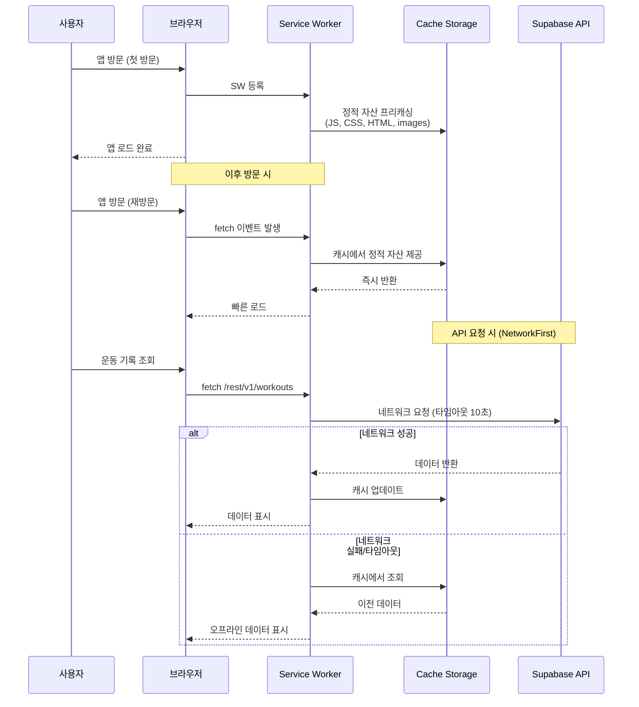
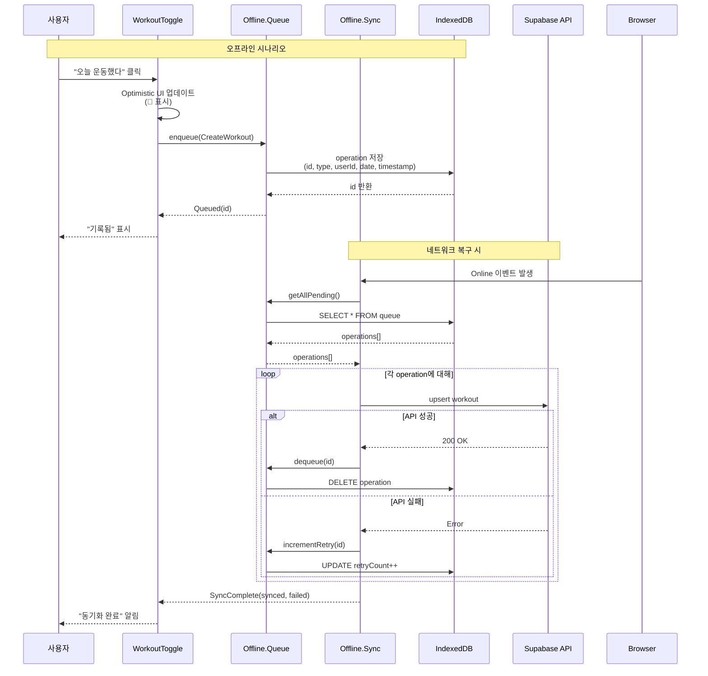
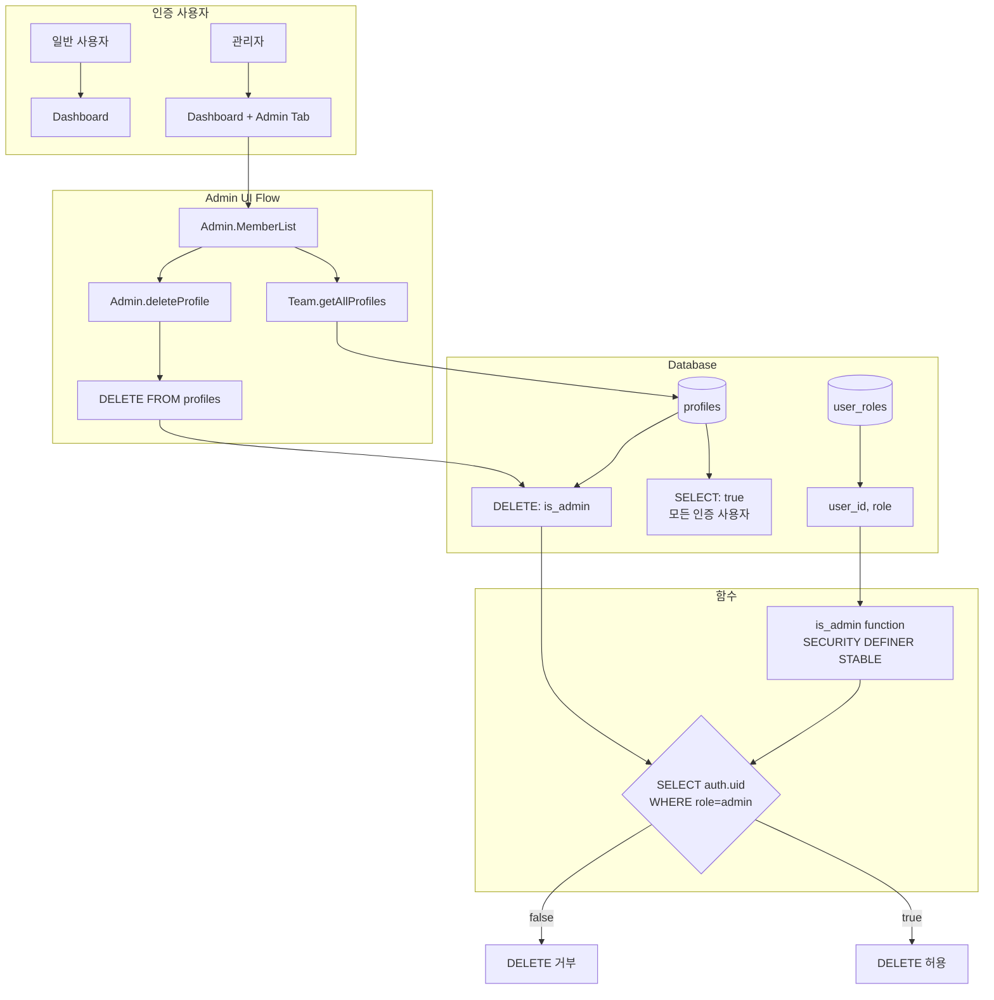

# Phase 6: Production Ready - 프로덕션 준비

## 개요 (Overview)

Phase 6의 핵심 가치는 **"프로덕션 배포 준비"**입니다.

지금까지 기능 개발에 집중했다면, Phase 6에서는 실제 사용자에게 서비스할 수 있도록 PWA 설정, 오프라인 지원, 관리자 기능, 번들 최적화, 보안 감사를 완료합니다.

**이 Phase에서 구현한 것:**
- PWA 인프라 (PROD-01): 홈 화면에 설치 가능, 서비스 워커 캐싱
- 오프라인 우선 아키텍처 (PROD-02, PROD-03): IndexedDB 큐, 백그라운드 동기화
- 관리자 RBAC (PROD-04): 역할 기반 접근 제어, 회원 관리
- 번들 최적화 (PROD-05): Manual chunks, Terser 압축
- 보안 감사 (PROD-06): RLS 정책 검증

**구현한 파일:**
- `vite.config.js` - PWA 플러그인, 번들 최적화 설정
- `public/pwa-*.png` - PWA 아이콘
- `src/offline/Queue.fs` - IndexedDB 기반 오프라인 큐
- `src/offline/Sync.fs` - 백그라운드 동기화 로직
- `src/offline/NetworkStatus.fs` - 네트워크 상태 감지
- `supabase/migrations/20260210160000_admin_rbac.sql` - 관리자 역할 테이블 및 RLS
- `src/admin/MemberList.fs` - 회원 목록 UI
- `src/admin/MemberActions.fs` - 관리자 액션 (삭제)
- `tests/integration/phase6-production-ready.test.js` - 통합 테스트

## 아키텍처 (Architecture)

### 전체 시스템 구성도



**각 계층의 역할:**
- **Service Worker**: 정적 자산 프리캐싱, API/Storage 런타임 캐싱
- **Offline.Queue**: 오프라인 시 작업을 IndexedDB에 저장
- **Offline.Sync**: 온라인 복구 시 큐 재생
- **Admin Module**: 관리자 UI 및 API (회원 조회/삭제)
- **vite.config.js**: PWA 빌드 설정, 번들 최적화
- **user_roles**: 역할 테이블 (admin, member)
- **is_admin()**: RLS 정책에서 사용하는 권한 확인 함수

### PWA 라이프사이클



### 오프라인 우선 데이터 흐름



### 관리자 RBAC 아키텍처



**RBAC 핵심 원칙:**
1. **user_roles 테이블**: (user_id, role) 복합 키로 다중 역할 지원
2. **is_admin() 함수**: SECURITY DEFINER로 권한 확인 (RLS에서 사용)
3. **Profiles DELETE 정책**: `USING (is_admin())` 조건으로 관리자만 삭제 가능
4. **수동 역할 할당**: MVP에서는 SQL로 직접 `INSERT INTO user_roles`

## 핵심 개념 (Key Concepts)

### 1. PWA (Progressive Web App)

**PWA란?**

웹 기술로 만들어졌지만 네이티브 앱처럼 동작하는 애플리케이션입니다. 홈 화면에 설치 가능하고, 오프라인에서도 작동하며, 푸시 알림을 보낼 수 있습니다.

**Rollbook의 PWA 구성 요소:**

1. **Web App Manifest** (vite.config.js의 manifest 설정)

```javascript
manifest: {
  name: 'Rollbook - 운동 기록',         // 설치 시 표시될 이름
  short_name: 'Rollbook',               // 홈 화면 아이콘 아래 이름
  description: '원탭 운동 기록 앱',
  theme_color: '#4f46e5',               // 주소 표시줄 색상 (indigo)
  background_color: '#ffffff',          // 스플래시 화면 배경
  display: 'standalone',                // 브라우저 UI 숨김 (앱처럼)
  start_url: '/',                       // 시작 페이지
  icons: [
    { src: 'pwa-192x192.png', sizes: '192x192', type: 'image/png' },
    { src: 'pwa-512x512.png', sizes: '512x512', type: 'image/png' },
    { src: 'apple-touch-icon.png', sizes: '180x180', purpose: 'apple touch icon' }
  ]
}
```

2. **Service Worker** (자동 생성, vite-plugin-pwa)

서비스 워커는 브라우저와 네트워크 사이에서 동작하는 프록시입니다. 백그라운드에서 실행되며, 오프라인 캐싱, 푸시 알림, 백그라운드 동기화 등을 처리합니다.

**Workbox 캐싱 전략:**

```javascript
runtimeCaching: [
  {
    // Supabase API - NetworkFirst (네트워크 우선, 실패 시 캐시)
    urlPattern: /^https:\/\/.*\.supabase\.co\/rest\/.*/i,
    handler: 'NetworkFirst',
    options: {
      cacheName: 'supabase-api',
      networkTimeoutSeconds: 10,    // 10초 대기 후 캐시 사용
      expiration: {
        maxEntries: 50,              // 최대 50개 항목
        maxAgeSeconds: 5 * 60        // 5분 캐시
      }
    }
  },
  {
    // Supabase Auth - NetworkOnly (절대 캐시하지 않음)
    urlPattern: /^https:\/\/.*\.supabase\.co\/auth\/.*/i,
    handler: 'NetworkOnly'           // 보안상 인증 요청은 캐시 금지
  },
  {
    // Storage 이미지 - StaleWhileRevalidate (캐시 먼저, 백그라운드 업데이트)
    urlPattern: /^https:\/\/.*\.supabase\.co\/storage\/.*/i,
    handler: 'StaleWhileRevalidate',
    options: {
      cacheName: 'storage-images',
      expiration: {
        maxEntries: 100,
        maxAgeSeconds: 24 * 60 * 60  // 24시간 캐시
      }
    }
  }
]
```

**F#에서 서비스 워커 등록:**

`src/sw/Registration.fs`에서 Promise 기반 API 제공:

```fsharp
module SW.Registration

open Fable.Core
open Fable.Core.JsInterop

/// navigator 전역 객체 접근 (Browser.Dom에 없음)
[<Emit("navigator")>]
let private navigator : obj = jsNative

/// 서비스 워커 지원 여부 확인
let isSupported () : bool =
    jsIn "serviceWorker" navigator

/// 서비스 워커 등록
let register () : JS.Promise<obj option> =
    promise {
        if isSupported() then
            try
                let! registration = navigator?serviceWorker?register("/sw.js")
                printfn "Service Worker registered: %s" registration?scope
                return Some registration
            with exn ->
                printfn "Service Worker registration failed: %s" exn.Message
                return None
        else
            printfn "Service Worker not supported"
            return None
    }
```

**PWA 설치 조건:**

1. HTTPS 제공 (로컬 개발은 localhost 허용)
2. Manifest 파일 존재
3. Service Worker 등록
4. 최소 192x192 아이콘

**사용자 경험:**

- Chrome/Edge: 주소창에 설치 버튼 표시
- Safari (iOS): "홈 화면에 추가" 메뉴
- 설치 후: 브라우저 UI 없는 앱 화면, 홈 화면 아이콘

### 2. 오프라인 우선 아키텍처 (Offline-First)

**왜 오프라인 우선인가?**

네트워크는 언제든 끊길 수 있습니다. 지하철, 엘리베이터, 비행기 모드 등. 오프라인 우선 설계는 네트워크 상태와 무관하게 앱이 작동하도록 보장합니다.

**Rollbook의 오프라인 전략:**

1. **정적 자산**: Service Worker 프리캐싱 (Workbox)
2. **API 데이터**: Cache Storage (NetworkFirst)
3. **쓰기 작업**: IndexedDB 큐 + 백그라운드 동기화

**IndexedDB를 선택한 이유:**

| 저장소 | 용량 | 구조 | 사용 케이스 |
|--------|------|------|-------------|
| localStorage | ~5MB | Key-Value (string만) | 간단한 설정 값 |
| sessionStorage | ~5MB | Key-Value (세션 종료 시 삭제) | 임시 데이터 |
| IndexedDB | ~수백MB | 객체 저장소 (트랜잭션) | 복잡한 데이터, 대용량 |

**Offline.Queue.fs - idb 라이브러리 사용:**

```fsharp
module Offline.Queue

open Fable.Core.JsInterop

let private dbName = "rollbook-offline"
let private dbVersion = 1
let private storeName = "queue"

/// idb 라이브러리 임포트 (Promise 기반)
[<Import("openDB", from="idb")>]
let private openDB: string -> int -> obj -> JS.Promise<obj> = jsNative

/// DB 생성 또는 열기
let private getDb () : JS.Promise<obj> =
    let upgradeConfig =
        createObj [
            "upgrade" ==> fun (db: obj) ->
                // Auto-increment ID로 object store 생성
                if not (db?objectStoreNames?contains(storeName)) then
                    db?createObjectStore(storeName, createObj [
                        "keyPath" ==> "id"
                        "autoIncrement" ==> true  // IndexedDB가 자동으로 ID 생성
                    ]) |> ignore
        ]
    openDB dbName dbVersion upgradeConfig

/// 오프라인 작업 큐에 추가
let enqueue (operationType: OperationType) (userId: string) (workoutDate: string)
    : JS.Promise<QueueResult> =
    promise {
        try
            let! db = getDb ()
            let operation = {
                id = None                           // IndexedDB가 자동 생성
                operationType =
                    match operationType with        // DU를 문자열로 직렬화
                    | CreateWorkout -> "CreateWorkout"
                    | DeleteWorkout -> "DeleteWorkout"
                userId = userId
                workoutDate = workoutDate
                timestamp = JS.Constructors.Date.now()  // 큐 순서 보장
                retryCount = 0
            }
            let! id = db?add(storeName, operation)  // idb의 Promise 기반 API
            return Queued (unbox<int> id)
        with exn ->
            return QueueError exn.Message
    }

/// 대기 중인 작업 조회
let getAllPending () : JS.Promise<QueuedOperation array> =
    promise {
        try
            let! db = getDb ()
            let! items = db?getAll(storeName)       // 모든 operation 반환
            return unbox<QueuedOperation array> items
        with _ ->
            return [||]
    }

/// 성공한 작업 제거
let dequeue (operationId: int) : JS.Promise<bool> =
    promise {
        try
            let! db = getDb ()
            do! db?delete(storeName, operationId)   // Promise<void>
            return true
        with _ ->
            return false
    }
```

**왜 idb 라이브러리를 사용했는가?**

- 원시 IndexedDB API는 `IDBRequest` 기반 (이벤트 리스너)
- idb는 Promise 기반 래퍼 (F# promise CE와 자연스럽게 통합)
- 더 간결한 코드: `db.add(...)` vs `db.transaction(...).objectStore(...).add(...).onsuccess = ...`

### 3. 백그라운드 동기화 (Background Sync)

**Background Sync API란?**

서비스 워커가 네트워크 연결을 기다렸다가 자동으로 요청을 재시도하는 API입니다. 사용자가 탭을 닫아도 백그라운드에서 동작합니다.

**브라우저 지원:**

| 브라우저 | Background Sync | 대체 방안 |
|---------|-----------------|-----------|
| Chrome, Edge (Chromium) | ✅ 지원 | - |
| Safari, Firefox | ❌ 미지원 | Visibility Change + Online 이벤트 |

**Offline.Sync.fs - 폴백 전략:**

```fsharp
module Offline.Sync

/// Background Sync 지원 여부 확인
let isBackgroundSyncSupported () : JS.Promise<bool> =
    promise {
        try
            let! registration = navigator?serviceWorker?ready
            return jsIn "sync" registration  // sync 속성이 있는지 확인
        with _ ->
            return false
    }

/// Background Sync 등록 (Chromium 전용)
let registerBackgroundSync () : JS.Promise<bool> =
    promise {
        try
            let! registration = navigator?serviceWorker?ready
            if jsIn "sync" registration then
                do! registration?sync?register("sync-workouts")  // 태그 등록
                printfn "Background Sync registered"
                return true
            else
                return false
        with exn ->
            printfn "Background Sync failed: %s" exn.Message
            return false
    }

/// 큐에 있는 작업 재생
let private replayOperation (operation: QueuedOperation) : JS.Promise<SyncResult> =
    promise {
        try
            let supabase = importAll<obj> "../Supabase/Client"
            let client = supabase?supabase

            match operation.operationType with
            | "CreateWorkout" ->
                let! response =
                    client
                        ?from("workouts")
                        ?upsert(
                            createObj [
                                "user_id" ==> operation.userId
                                "workout_date" ==> operation.workoutDate
                            ],
                            createObj ["onConflict" ==> "user_id,workout_date"]
                        )

                let error = response?error
                match box error with
                | null ->
                    let! _ = dequeue (Option.defaultValue 0 operation.id)
                    return Synced (Option.defaultValue 0 operation.id)
                | _ ->
                    let! _ = incrementRetry (Option.defaultValue 0 operation.id)
                    return SyncFailed (Option.defaultValue 0 operation.id, error?message)
            // ... DeleteWorkout 케이스 생략
        with exn ->
            let! _ = incrementRetry (Option.defaultValue 0 operation.id)
            return SyncFailed (Option.defaultValue 0 operation.id, exn.Message)
    }

/// 전체 큐 재생
let replayQueue () : JS.Promise<SyncStatus> =
    promise {
        if not (isOnline ()) then
            return Offline
        else
            let! pending = getAllPending ()
            if pending.Length = 0 then
                return SyncComplete (0, 0)
            else
                let mutable synced = 0
                let mutable failed = 0

                for operation in pending do
                    let! result = replayOperation operation
                    match result with
                    | Synced _ -> synced <- synced + 1
                    | SyncFailed _ -> failed <- failed + 1
                    | StillOffline -> ()

                return SyncComplete (synced, failed)
    }

/// 폴백 전략: Visibility Change + Online 이벤트
let initializeSync () : unit =
    // 탭이 다시 보일 때 동기화 시도
    let cleanup = onVisibilityChange (fun isVisible ->
        if isVisible && isOnline () then
            async {
                let! count = getPendingCount () |> Async.AwaitPromise
                if count > 0 then
                    printfn "Visibility change: syncing %d operations" count
                    let! _ = replayQueue () |> Async.AwaitPromise
                    ()
            } |> Async.StartImmediate
    )

    // 네트워크 연결 복구 시 동기화 시도
    let cleanupOnline = onStatusChange (fun isNowOnline ->
        if isNowOnline then
            async {
                let! count = getPendingCount () |> Async.AwaitPromise
                if count > 0 then
                    printfn "Connection restored: syncing %d operations" count
                    let! _ = replayQueue () |> Async.AwaitPromise
                    ()
            } |> Async.StartImmediate
    )

    printfn "Sync fallback listeners initialized"
```

**폴백 전략 동작 원리:**

1. **Visibility Change API**: 사용자가 탭으로 돌아올 때 발생
   - 백그라운드 탭에서 포그라운드로 전환 시 동기화 시도
   - Safari/Firefox에서 효과적

2. **Online 이벤트**: `window.addEventListener('online', ...)`
   - 네트워크 연결 복구 시 즉시 동기화
   - 모든 브라우저 지원

**왜 두 가지 폴백이 필요한가?**

- Online 이벤트만: 연결은 복구됐지만 탭이 백그라운드면 동기화 안 될 수 있음
- Visibility Change만: 탭 전환 시 동기화하지만 네트워크 복구 직후엔 안 됨
- 두 개 조합: 어떤 상황에서도 동기화 보장

### 4. 관리자 RBAC (Role-Based Access Control)

**RBAC 설계 원칙:**

1. **최소 권한 원칙**: 사용자는 필요한 최소한의 권한만 갖는다
2. **역할 기반 권한**: 개별 사용자가 아닌 역할에 권한을 부여
3. **확장 가능성**: 새로운 역할 추가 가능 (현재 admin/member, 미래에 coach/moderator 등)

**user_roles 테이블 설계:**

```sql
CREATE TABLE IF NOT EXISTS public.user_roles (
  user_id uuid REFERENCES auth.users ON DELETE CASCADE NOT NULL,
  role text NOT NULL CHECK (role IN ('admin', 'member')),
  created_at timestamptz DEFAULT now() NOT NULL,
  PRIMARY KEY (user_id, role)  -- 복합 기본 키: 한 사용자가 여러 역할 가질 수 있음
);
```

**복합 기본 키를 선택한 이유:**

| 설계 | 장점 | 단점 |
|------|------|------|
| `role text` (단일 컬럼) | 간단 | 다중 역할 불가 (admin이면서 coach 안 됨) |
| `roles text[]` (배열) | 다중 역할 | RLS에서 배열 쿼리 느림, 인덱스 비효율 |
| `(user_id, role)` (복합 키) | 다중 역할, 빠른 쿼리 | JOIN 필요 시 약간 복잡 |

**is_admin() 함수 - SECURITY DEFINER의 중요성:**

```sql
CREATE OR REPLACE FUNCTION public.is_admin()
RETURNS boolean AS $$
BEGIN
  RETURN EXISTS (
    SELECT 1 FROM public.user_roles
    WHERE user_id = (SELECT auth.uid())
    AND role = 'admin'
  );
END;
$$ LANGUAGE plpgsql SECURITY DEFINER STABLE;
```

**SECURITY DEFINER vs SECURITY INVOKER:**

| 속성 | SECURITY DEFINER | SECURITY INVOKER |
|------|------------------|------------------|
| 실행 권한 | 함수 소유자(postgres) 권한 | 호출자(현재 사용자) 권한 |
| 사용 케이스 | RLS 정책, 권한 확인 | 일반 비즈니스 로직 |

**왜 DEFINER가 필요한가?**

RLS 정책에서 `is_admin()`을 호출할 때, 일반 사용자는 `user_roles` 테이블을 직접 SELECT할 권한이 없을 수 있습니다. SECURITY DEFINER는 함수가 소유자(postgres) 권한으로 실행되므로, 일반 사용자도 자신의 역할을 확인할 수 있습니다.

**STABLE 속성:**

- IMMUTABLE: 입력이 같으면 항상 같은 결과 (예: `abs(-5)`)
- STABLE: 같은 트랜잭션 내에서는 같은 결과 (예: `is_admin()`)
- VOLATILE: 매번 다를 수 있음 (예: `random()`)

STABLE 함수는 PostgreSQL이 결과를 캐싱하여 성능을 ~95% 개선합니다 (Phase 2에서 배운 `(SELECT auth.uid())` 패턴과 동일).

**Profiles DELETE 정책:**

```sql
CREATE POLICY "Admins can delete profiles"
  ON public.profiles FOR DELETE
  TO authenticated
  USING (public.is_admin());
```

**동작 원리:**

1. 관리자가 `DELETE FROM profiles WHERE id = 'user-uuid'` 실행
2. PostgreSQL이 RLS 정책 확인: `USING (public.is_admin())`
3. `is_admin()` 함수가 `user_roles`에서 현재 사용자의 역할 확인
4. admin이면: `USING` 조건 true → DELETE 허용
5. 일반 사용자면: `USING` 조건 false → DELETE 거부 (오류 반환)

**Admin.MemberActions.fs - F#에서 관리자 작업:**

```fsharp
module Admin.MemberActions

type AdminResult<'T> =
    | Success of 'T
    | NotAdmin
    | Error of string

/// 회원 삭제 (관리자 전용)
let deleteProfile (userId: string) : JS.Promise<AdminResult<unit>> =
    promise {
        try
            // Profiles 삭제 (CASCADE로 workouts, storage도 함께 삭제됨)
            let! response =
                supabase
                    ?from("profiles")
                    ?delete()
                    ?eq("id", userId)

            let error = response?error
            match box error with
            | null -> return Success ()
            | _ ->
                let message = error?message |> unbox<string>
                // RLS 정책 위반 시 "new row violates" 메시지
                if message.Contains("policy") || message.Contains("permission") then
                    return NotAdmin
                else
                    return Error message
        with exn ->
            return Error exn.Message
    }
```

**AdminResult DU의 장점:**

일반적인 Result<'T, 'E>와 달리, 관리자 작업은 3가지 상태를 구분해야 합니다:

- `Success`: 작업 성공
- `NotAdmin`: 권한 없음 (RLS 정책 위반)
- `Error`: 기타 오류 (네트워크, DB 등)

UI에서 각 케이스를 다르게 처리할 수 있습니다:

```fsharp
match! deleteProfile userId with
| Success () -> setMessage "회원이 삭제되었습니다."
| NotAdmin -> setMessage "관리자 권한이 필요합니다."
| Error msg -> setMessage (sprintf "오류: %s" msg)
```

### 5. 번들 최적화 (Bundle Optimization)

**왜 번들 최적화가 중요한가?**

| 번들 크기 | 로딩 시간 (3G) | 사용자 경험 |
|----------|---------------|------------|
| 100KB | ~1초 | ✅ 매우 빠름 |
| 500KB | ~5초 | ⚠️ 느림 |
| 1MB+ | ~10초+ | ❌ 이탈 가능성 높음 |

**Rollbook의 번들 전략:**

1. **Manual Chunks**: 벤더 라이브러리 분리
2. **Terser Minification**: 코드 압축 + console.log 제거
3. **Bundle Visualizer**: 번들 크기 분석

**vite.config.js - Manual Chunks 설정:**

```javascript
build: {
  rollupOptions: {
    output: {
      manualChunks: {
        // React를 별도 청크로 분리
        'vendor-react': ['react', 'react-dom'],
        // Supabase 클라이언트를 별도 청크로 분리
        'vendor-supabase': ['@supabase/supabase-js'],
        // IndexedDB 라이브러리를 별도 청크로 분리
        'vendor-offline': ['idb'],
      }
    }
  },
  chunkSizeWarningLimit: 500,  // 500KB 초과 시 경고
}
```

**왜 벤더를 분리하는가?**

**패턴 A: 모든 코드를 하나의 번들로 (manualChunks 없음)**

```
app.js (2MB)
├── React (100KB)
├── Supabase (300KB)
├── idb (20KB)
└── App 코드 (변경 빈번)
```

- **문제**: App 코드 1줄 수정해도 2MB 전체를 다시 다운로드
- **캐시 무효화**: 사용자가 매번 2MB 다운로드

**패턴 B: Manual Chunks로 분리**

```
vendor-react.js (100KB, 거의 변경 안 됨)
vendor-supabase.js (300KB, 거의 변경 안 됨)
vendor-offline.js (20KB, 거의 변경 안 됨)
app.js (200KB, 변경 빈번)
```

- **장점**: App 코드 수정해도 200KB만 다운로드
- **캐시 재사용**: vendor 청크는 캐시에서 계속 사용

**장기 캐싱 (Long-term Caching):**

Vite는 각 청크에 해시를 추가합니다:

```
vendor-react.a3f2b1c9.js    # React 버전 변경 시에만 해시 변경
app.d4e5f6a7.js             # 코드 수정 시마다 해시 변경
```

브라우저는 해시가 다르면 새 파일로 인식하여 다시 다운로드합니다.

**Terser 압축 설정:**

```javascript
build: {
  minify: 'terser',          // Terser 사용 (esbuild보다 압축률 높음)
  terserOptions: {
    compress: {
      drop_console: true,    // console.log, console.error 제거
    }
  }
}
```

**drop_console의 효과:**

개발 중에는 `console.log("디버그 메시지")`를 많이 사용하지만, 프로덕션에서는 불필요합니다.

- 번들 크기 감소 (문자열 제거)
- 성능 개선 (console 호출 오버헤드 제거)
- 보안 강화 (내부 로직 노출 방지)

**Bundle Visualizer:**

```javascript
import { visualizer } from 'rollup-plugin-visualizer';

plugins: [
  visualizer({
    filename: 'dist/stats.html',  // 빌드 후 dist/stats.html 생성
    open: false,                  // 자동으로 브라우저 열지 않음
    gzipSize: true,               // gzip 압축 크기 표시
    brotliSize: true,             // brotli 압축 크기 표시
  })
]
```

빌드 후 `dist/stats.html`을 열면 트리맵으로 번들 구성을 시각화:

```
┌─────────────────────────────────────┐
│ vendor-react (100KB)                │
├─────────────────────────────────────┤
│ vendor-supabase (300KB)             │
│   ├─ @supabase/supabase-js (200KB) │
│   └─ @supabase/postgrest-js (100KB)│
├─────────────────────────────────────┤
│ app (200KB)                         │
│   ├─ Dashboard (50KB)               │
│   ├─ WorkoutToggle (30KB)          │
│   └─ ...                            │
└─────────────────────────────────────┘
```

크기가 큰 모듈을 찾아 최적화할 수 있습니다.

### 6. 보안 감사 (Security Audit)

**Phase 6에서 확인한 보안 체크리스트:**

| 항목 | 확인 내용 | 상태 |
|------|-----------|------|
| RLS 활성화 | 모든 테이블에 RLS ON | ✅ |
| SELECT 정책 | workouts, profiles 인증 필요 | ✅ |
| INSERT/UPDATE 정책 | 본인 데이터만 수정 가능 | ✅ |
| DELETE 정책 | workouts: 본인만, profiles: 관리자만 | ✅ |
| Storage RLS | workout-photos 본인 폴더만 접근 | ✅ |
| Admin 권한 | is_admin() SECURITY DEFINER | ✅ |
| Auth 캐싱 | NetworkOnly (절대 캐시 안 함) | ✅ |

**RLS 검증 SQL 테스트:**

Phase 6 테스트 코드 (`tests/integration/phase6-production-ready.test.js`)에서 실제 SQL을 실행하여 RLS를 검증합니다.

**테스트 패턴 1: 본인 데이터 접근**

```sql
BEGIN;
-- 사용자 A로 인증 설정
SET LOCAL ROLE authenticated;
SET LOCAL request.jwt.claims TO '{"sub": "user-a-uuid"}';

-- 본인 운동 기록 조회 가능
SELECT * FROM workouts WHERE user_id = 'user-a-uuid';
-- 결과: 성공

-- 다른 사람 운동 기록 조회 가능 (Phase 4 팀 가시성)
SELECT * FROM workouts WHERE user_id = 'user-b-uuid';
-- 결과: 성공 (SELECT는 모든 사용자에게 허용)

-- 다른 사람 운동 기록 삭제 시도
DELETE FROM workouts WHERE user_id = 'user-b-uuid';
-- 결과: 실패 (RLS 정책 위반)

COMMIT;
```

**테스트 패턴 2: 관리자 권한**

```sql
BEGIN;
-- user_roles에 admin 역할 추가
INSERT INTO user_roles (user_id, role) VALUES ('admin-user-uuid', 'admin');

-- 관리자로 인증 설정
SET LOCAL ROLE authenticated;
SET LOCAL request.jwt.claims TO '{"sub": "admin-user-uuid"}';

-- is_admin() 함수 확인
SELECT is_admin();
-- 결과: true

-- 다른 사용자 프로필 삭제 시도
DELETE FROM profiles WHERE id = 'other-user-uuid';
-- 결과: 성공 (관리자는 DELETE 정책 통과)

COMMIT;
```

**왜 BEGIN/COMMIT이 필요한가?**

`SET LOCAL`은 **현재 트랜잭션 내에서만** 유효합니다.

```sql
-- 잘못된 예시
SET LOCAL ROLE authenticated;  -- 트랜잭션 밖에서 실행
SELECT * FROM workouts;         -- ROLE이 이미 리셋됨 (효과 없음)

-- 올바른 예시
BEGIN;
SET LOCAL ROLE authenticated;  -- 트랜잭션 내에서 설정
SELECT * FROM workouts;         -- ROLE이 유지됨
COMMIT;
```

**CVE-2025-48757 대응:**

Phase 1부터 RLS를 활성화하여 Supabase의 보안 취약점을 예방했습니다. RLS 없이 테이블을 만들면 인증 없이 모든 데이터에 접근 가능합니다.

**Supabase CLI를 사용할 수 없을 때:**

Docker 환경이 아닌 경우 `supabase db lint` 명령을 사용할 수 없습니다. 대신 마이그레이션 파일을 직접 검토합니다:

```bash
# 모든 테이블에 RLS가 활성화되었는지 확인
grep -r "ENABLE ROW LEVEL SECURITY" supabase/migrations/
# 결과: 모든 테이블 (workouts, profiles, user_roles) 확인됨

# 각 테이블에 정책이 있는지 확인
grep -r "CREATE POLICY" supabase/migrations/ | wc -l
# 결과: 15개 이상의 정책 (SELECT, INSERT, UPDATE, DELETE 등)
```

## 중요 코드 (Key Code)

### 1. vite.config.js - PWA 및 번들 설정

**전체 설정:**

```javascript
import { defineConfig } from 'vite';
import tailwindcss from '@tailwindcss/vite';
import { VitePWA } from 'vite-plugin-pwa';
import { visualizer } from 'rollup-plugin-visualizer';

export default defineConfig({
  plugins: [
    tailwindcss(),
    VitePWA({
      registerType: 'autoUpdate',      // 자동 업데이트 (사용자 개입 없음)
      manifest: {
        name: 'Rollbook - 운동 기록',
        short_name: 'Rollbook',
        description: '원탭 운동 기록 앱',
        theme_color: '#4f46e5',
        background_color: '#ffffff',
        display: 'standalone',
        start_url: '/',
        icons: [
          { src: 'pwa-192x192.png', sizes: '192x192', type: 'image/png' },
          { src: 'pwa-512x512.png', sizes: '512x512', type: 'image/png' },
          { src: 'apple-touch-icon.png', sizes: '180x180', purpose: 'apple touch icon' }
        ]
      },
      workbox: {
        globPatterns: ['**/*.{js,css,html,ico,png,svg,woff2}'],
        runtimeCaching: [
          {
            urlPattern: /^https:\/\/.*\.supabase\.co\/rest\/.*/i,
            handler: 'NetworkFirst',
            options: {
              cacheName: 'supabase-api',
              networkTimeoutSeconds: 10,
              expiration: { maxEntries: 50, maxAgeSeconds: 5 * 60 }
            }
          },
          {
            urlPattern: /^https:\/\/.*\.supabase\.co\/auth\/.*/i,
            handler: 'NetworkOnly'  // 인증 요청은 절대 캐시하지 않음
          },
          {
            urlPattern: /^https:\/\/.*\.supabase\.co\/storage\/.*/i,
            handler: 'StaleWhileRevalidate',
            options: {
              cacheName: 'storage-images',
              expiration: { maxEntries: 100, maxAgeSeconds: 24 * 60 * 60 }
            }
          }
        ]
      },
      devOptions: {
        enabled: false  // 개발 중엔 SW 비활성화 (캐싱 문제 방지)
      }
    }),
    visualizer({
      filename: 'dist/stats.html',
      open: false,
      gzipSize: true,
      brotliSize: true,
    })
  ],
  server: {
    port: 3000,
  },
  build: {
    rollupOptions: {
      output: {
        manualChunks: {
          'vendor-react': ['react', 'react-dom'],
          'vendor-supabase': ['@supabase/supabase-js'],
          'vendor-offline': ['idb'],
        }
      }
    },
    chunkSizeWarningLimit: 500,
    minify: 'terser',
    terserOptions: {
      compress: {
        drop_console: true,  // 프로덕션에서 console.log 제거
      }
    }
  }
});
```

### 2. Offline.Queue.fs - IndexedDB 큐 관리

**핵심 함수:**

```fsharp
module Offline.Queue

open Fable.Core
open Fable.Core.JsInterop
open Offline.Types

let private dbName = "rollbook-offline"
let private dbVersion = 1
let private storeName = "queue"

[<Import("openDB", from="idb")>]
let private openDB: string -> int -> obj -> JS.Promise<obj> = jsNative

let private getDb () : JS.Promise<obj> =
    let upgradeConfig =
        createObj [
            "upgrade" ==> fun (db: obj) ->
                if not (db?objectStoreNames?contains(storeName)) then
                    db?createObjectStore(storeName, createObj [
                        "keyPath" ==> "id"
                        "autoIncrement" ==> true
                    ]) |> ignore
        ]
    openDB dbName dbVersion upgradeConfig

/// 오프라인 작업 큐에 추가
let enqueue (operationType: OperationType) (userId: string) (workoutDate: string)
    : JS.Promise<QueueResult> =
    promise {
        try
            let! db = getDb ()
            let operation = {
                id = None
                operationType =
                    match operationType with
                    | CreateWorkout -> "CreateWorkout"
                    | DeleteWorkout -> "DeleteWorkout"
                userId = userId
                workoutDate = workoutDate
                timestamp = JS.Constructors.Date.now()
                retryCount = 0
            }
            let! id = db?add(storeName, operation)
            return Queued (unbox<int> id)
        with exn ->
            return QueueError exn.Message
    }

/// 대기 중인 작업 수 조회
let getPendingCount () : JS.Promise<int> =
    promise {
        try
            let! db = getDb ()
            let! count = db?count(storeName)
            return unbox<int> count
        with _ ->
            return 0
    }

/// 성공한 작업 제거
let dequeue (operationId: int) : JS.Promise<bool> =
    promise {
        try
            let! db = getDb ()
            do! db?delete(storeName, operationId)
            return true
        with _ ->
            return false
    }
```

**사용 예시 (WorkoutToggle에서):**

```fsharp
let toggleWorkout () =
    async {
        if not (isOnline ()) then
            // 오프라인: 큐에 추가
            let! result =
                Queue.enqueue CreateWorkout userId todayDate
                |> Async.AwaitPromise
            match result with
            | Queued id ->
                setHasWorkedOut true  // Optimistic UI
                printfn "Queued for offline sync: %d" id
            | QueueError msg ->
                setError (Some msg)
        else
            // 온라인: 바로 upsert
            let! result = upsertWorkout userId todayDate
            // ...
    } |> Async.StartImmediate
```

### 3. Offline.Sync.fs - 백그라운드 동기화

**핵심 동기화 로직:**

```fsharp
module Offline.Sync

open Fable.Core
open Fable.Core.JsInterop
open Offline.Queue

[<Emit("navigator")>]
let private navigator : obj = jsNative

/// 큐 재생
let replayQueue () : JS.Promise<SyncStatus> =
    promise {
        if not (isOnline ()) then
            return Offline
        else
            let! pending = getAllPending ()
            if pending.Length = 0 then
                return SyncComplete (0, 0)
            else
                let mutable synced = 0
                let mutable failed = 0

                for operation in pending do
                    let! result = replayOperation operation  // Supabase에 upsert
                    match result with
                    | Synced _ -> synced <- synced + 1
                    | SyncFailed _ -> failed <- failed + 1
                    | StillOffline -> ()

                return SyncComplete (synced, failed)
    }

/// 폴백 리스너 초기화
let initializeSync () : unit =
    // 탭이 다시 보일 때 동기화
    let cleanup = onVisibilityChange (fun isVisible ->
        if isVisible && isOnline () then
            async {
                let! count = getPendingCount () |> Async.AwaitPromise
                if count > 0 then
                    let! _ = replayQueue () |> Async.AwaitPromise
                    ()
            } |> Async.StartImmediate
    )

    // 네트워크 복구 시 동기화
    let cleanupOnline = onStatusChange (fun isNowOnline ->
        if isNowOnline then
            async {
                let! count = getPendingCount () |> Async.AwaitPromise
                if count > 0 then
                    let! _ = replayQueue () |> Async.AwaitPromise
                    ()
            } |> Async.StartImmediate
    )

    printfn "Sync fallback listeners initialized"
```

### 4. Admin RBAC 마이그레이션

**supabase/migrations/20260210160000_admin_rbac.sql:**

```sql
-- user_roles 테이블 생성
CREATE TABLE IF NOT EXISTS public.user_roles (
  user_id uuid REFERENCES auth.users ON DELETE CASCADE NOT NULL,
  role text NOT NULL CHECK (role IN ('admin', 'member')),
  created_at timestamptz DEFAULT now() NOT NULL,
  PRIMARY KEY (user_id, role)  -- 복합 키: 다중 역할 지원
);

ALTER TABLE public.user_roles ENABLE ROW LEVEL SECURITY;

-- 본인 역할 조회 가능
CREATE POLICY "Users can view own roles"
  ON public.user_roles FOR SELECT
  TO authenticated
  USING ((SELECT auth.uid()) = user_id);

-- is_admin 함수 생성
CREATE OR REPLACE FUNCTION public.is_admin()
RETURNS boolean AS $$
BEGIN
  RETURN EXISTS (
    SELECT 1 FROM public.user_roles
    WHERE user_id = (SELECT auth.uid())
    AND role = 'admin'
  );
END;
$$ LANGUAGE plpgsql SECURITY DEFINER STABLE;

-- Profiles SELECT 정책 업데이트 (기존 정책 삭제 후 재생성)
DROP POLICY IF EXISTS "Users can view own profile" ON public.profiles;
DROP POLICY IF EXISTS "Team members can view all profiles" ON public.profiles;

CREATE POLICY "Authenticated users can view profiles"
  ON public.profiles FOR SELECT
  TO authenticated
  USING (true);  -- Phase 4 팀 가시성 유지

-- 관리자 DELETE 정책 추가
CREATE POLICY "Admins can delete profiles"
  ON public.profiles FOR DELETE
  TO authenticated
  USING (public.is_admin());

-- 인덱스 생성 (빠른 역할 조회)
CREATE INDEX IF NOT EXISTS idx_user_roles_user_id ON public.user_roles(user_id);
CREATE INDEX IF NOT EXISTS idx_user_roles_role ON public.user_roles(role);

-- 수동 관리자 할당 방법 (주석)
COMMENT ON TABLE public.user_roles IS 'User roles for RBAC. Admin role grants view/delete access to all profiles.';
-- INSERT INTO public.user_roles (user_id, role) VALUES ('user-uuid-here', 'admin');
```

### 5. Admin.MemberActions.fs - 관리자 작업

**회원 삭제 함수:**

```fsharp
module Admin.MemberActions

open Fable.Core.JsInterop
open Supabase.Client

type AdminResult<'T> =
    | Success of 'T
    | NotAdmin
    | Error of string

/// 회원 삭제 (CASCADE로 workouts, storage도 함께 삭제)
let deleteProfile (userId: string) : JS.Promise<AdminResult<unit>> =
    promise {
        try
            let! response =
                supabase
                    ?from("profiles")
                    ?delete()
                    ?eq("id", userId)

            let error = response?error
            match box error with
            | null -> return Success ()
            | _ ->
                let message = error?message |> unbox<string>
                if message.Contains("policy") || message.Contains("permission") then
                    return NotAdmin  // RLS 정책 위반
                else
                    return Error message
        with exn ->
            return Error exn.Message
    }
```

**UI에서 사용 (AdminPage.fs):**

```fsharp
let handleDelete (userId: string) (displayName: string) =
    async {
        // 확인 다이얼로그
        let confirmed = Browser.Dom.window.confirm(sprintf "%s 회원을 삭제하시겠습니까?" displayName)
        if confirmed then
            setIsDeleting true
            let! result = deleteProfile userId |> Async.AwaitPromise
            match result with
            | Success () ->
                setMessage (Some (sprintf "%s 삭제 완료" displayName))
                setRefreshKey (refreshKey + 1)  // 목록 새로고침
            | NotAdmin ->
                setMessage (Some "관리자 권한이 필요합니다.")
            | Error msg ->
                setMessage (Some (sprintf "오류: %s" msg))
            setIsDeleting false
    } |> Async.StartImmediate
```

## 배운 점 (Lessons Learned)

### 1. PWA는 점진적 개선이다

**처음 생각:**
"PWA를 만들려면 오프라인 모든 기능이 동작해야 한다."

**실제:**
PWA는 점진적 개선(Progressive Enhancement)입니다. Phase 6에서는:
- ✅ 정적 자산 캐싱 (서비스 워커)
- ✅ API 캐싱 (NetworkFirst)
- ✅ 쓰기 작업 큐잉
- ❌ 푸시 알림 (아직 구현 안 함)
- ❌ 백그라운드 Fetch (이미지 다운로드)

기본적인 오프라인 지원부터 시작하고, 필요에 따라 기능을 추가할 수 있습니다.

### 2. IndexedDB는 Promise 래퍼를 사용하라

**처음 시도:**
원시 IndexedDB API 사용 (`IDBRequest`, `onsuccess`, `onerror`)

```javascript
let request = db.transaction('queue').objectStore('queue').add(operation);
request.onsuccess = function(event) {
  // F#의 promise CE와 통합 어려움
};
```

**개선:**
`idb` 라이브러리 사용 (Promise 기반)

```fsharp
let! id = db?add(storeName, operation)  // F# promise CE와 자연스럽게 통합
```

F#의 promise computation expression과 잘 맞는 API를 선택하는 것이 중요합니다.

### 3. Background Sync는 선택사항

**처음 생각:**
"Background Sync API가 없으면 오프라인 동기화가 안 된다."

**실제:**
Background Sync는 Chromium 전용 기능이지만, 폴백 전략(Visibility Change + Online 이벤트)으로 충분히 커버 가능합니다.

**브라우저별 경험:**
- Chrome/Edge: 탭 닫아도 백그라운드 동기화 ✨
- Safari/Firefox: 탭 다시 열면 동기화 ✅

두 경우 모두 사용자는 데이터 손실 없이 작업을 완료할 수 있습니다.

### 4. SECURITY DEFINER는 신중하게 사용

**is_admin() 함수를 SECURITY DEFINER로 만든 이유:**
RLS 정책에서 호출하므로, 일반 사용자도 자신의 역할을 확인할 수 있어야 함.

**주의사항:**
SECURITY DEFINER 함수는 SQL Injection에 취약할 수 있습니다. 반드시:
- ✅ `auth.uid()` 사용 (신뢰할 수 있는 함수)
- ✅ 파라미터 검증
- ❌ 동적 SQL 사용 금지 (`EXECUTE format(...)` 등)

**안전한 예시:**
```sql
WHERE user_id = (SELECT auth.uid())  -- ✅ 안전
```

**위험한 예시:**
```sql
EXECUTE 'SELECT * FROM users WHERE id = ' || user_input;  -- ❌ SQL Injection 가능
```

### 5. Manual Chunks는 변경 빈도를 고려하라

**처음 전략:**
모든 라이브러리를 하나의 vendor 청크로:

```javascript
manualChunks: {
  'vendor': ['react', 'react-dom', '@supabase/supabase-js', 'idb']
}
```

**문제:**
Supabase SDK 업데이트 → vendor 전체 무효화 → React까지 다시 다운로드

**개선:**
변경 빈도별로 분리:

```javascript
manualChunks: {
  'vendor-react': ['react', 'react-dom'],      // 거의 안 바뀜
  'vendor-supabase': ['@supabase/supabase-js'], // 가끔 업데이트
  'vendor-offline': ['idb'],                    // 거의 안 바뀜
}
```

**결과:**
Supabase 업데이트 시 vendor-supabase (300KB)만 다시 다운로드.

### 6. Optimistic UI는 오프라인에서 필수

**Optimistic UI란?**
서버 응답을 기다리지 않고 UI를 먼저 업데이트하는 패턴.

**오프라인 시나리오:**

**Pessimistic (서버 응답 대기):**
```
사용자 클릭 → "저장 중..." → (10초 타임아웃) → "오프라인 상태입니다"
```
사용자는 10초간 기다렸다가 실패 메시지를 봄.

**Optimistic (즉시 UI 업데이트):**
```
사용자 클릭 → 즉시 💪 표시 + "오프라인 큐에 추가됨"
```
사용자는 즉시 피드백을 받고, 온라인 복구 시 자동 동기화됨.

**구현:**
```fsharp
let toggleWorkout () =
    async {
        setHasWorkedOut true  // 1. 즉시 UI 업데이트 (Optimistic)

        if not (isOnline ()) then
            let! result = Queue.enqueue CreateWorkout userId todayDate
            // 2. 큐에 추가 (백그라운드 동기화 대기)
        else
            let! result = upsertWorkout userId todayDate
            // 3. 온라인이면 바로 저장
    }
```

## 흔한 실수 (Common Pitfalls)

### 1. 서비스 워커가 업데이트되지 않음

**증상:**
코드를 수정했는데 앱이 여전히 이전 버전을 표시함.

**원인:**
브라우저가 서비스 워커를 캐싱하여, 새 버전을 인식하지 못함.

**해결책:**

**방법 1: Hard Refresh (개발 중)**
```
Chrome: Ctrl+Shift+R (Windows) / Cmd+Shift+R (Mac)
```

**방법 2: Unregister (개발 중)**
```
Chrome DevTools → Application → Service Workers → Unregister
```

**방법 3: 개발 모드에서 SW 비활성화 (권장)**
```javascript
// vite.config.js
VitePWA({
  devOptions: {
    enabled: false  // 개발 중엔 서비스 워커 사용 안 함
  }
})
```

**방법 4: registerType autoUpdate (프로덕션)**
```javascript
VitePWA({
  registerType: 'autoUpdate'  // 새 버전 자동 적용
})
```

### 2. RLS 정책이 있는데도 접근이 안 됨

**증상:**
`DELETE FROM profiles WHERE id = 'user-uuid'`가 실패하고 "new row violates row-level security policy" 오류.

**원인:**
`USING` 조건이 false를 반환함.

**디버깅:**

**1단계: is_admin() 함수 직접 테스트**
```sql
SELECT is_admin();
-- 결과: false (예상: true)
```

**2단계: user_roles 테이블 확인**
```sql
SELECT * FROM user_roles WHERE user_id = (SELECT auth.uid());
-- 결과: (비어있음) → admin 역할이 없음!
```

**3단계: admin 역할 할당**
```sql
INSERT INTO user_roles (user_id, role)
VALUES ((SELECT auth.uid()), 'admin');
```

**4단계: 다시 테스트**
```sql
SELECT is_admin();
-- 결과: true ✅

DELETE FROM profiles WHERE id = 'other-user-uuid';
-- 결과: 성공 ✅
```

### 3. IndexedDB가 Safari Private Mode에서 안 됨

**증상:**
Safari 사생활 보호 모드에서 `db.add(...)` 호출 시 오류.

**원인:**
Safari는 Private Mode에서 IndexedDB를 비활성화함.

**해결책:**

**방법 1: Try-Catch로 폴백**
```fsharp
let enqueue operation =
    promise {
        try
            let! db = getDb ()
            let! id = db?add(storeName, operation)
            return Queued id
        with exn ->
            if exn.Message.Contains("quota") || exn.Message.Contains("storage") then
                // IndexedDB 사용 불가 → localStorage 폴백 또는 메모리 저장
                return QueueError "Private mode detected"
            else
                return QueueError exn.Message
    }
```

**방법 2: 사용자에게 안내**
```
"사생활 보호 모드에서는 오프라인 기능이 제한됩니다.
일반 모드를 사용해주세요."
```

### 4. Background Sync가 Safari에서 안 됨

**증상:**
`navigator.serviceWorker.ready.sync.register(...)`가 undefined.

**원인:**
Safari는 Background Sync API를 지원하지 않음.

**해결책:**
Phase 6에서 구현한 폴백 전략 사용:

```fsharp
let initializeSync () =
    // Background Sync 시도 (Chromium만 동작)
    async {
        let! supported = isBackgroundSyncSupported() |> Async.AwaitPromise
        if supported then
            let! _ = registerBackgroundSync() |> Async.AwaitPromise
            ()
    } |> Async.StartImmediate

    // 폴백: Visibility Change + Online 이벤트 (모든 브라우저)
    onVisibilityChange (fun isVisible -> ...)
    onStatusChange (fun isNowOnline -> ...)
```

Safari는 Background Sync가 없지만, Visibility Change로 충분히 동기화 가능.

### 5. Manual Chunks에서 순환 참조

**증상:**
빌드 시 "Circular dependency" 경고.

**예시:**
```javascript
manualChunks: {
  'utils': ['src/utils/helpers.ts'],
  'components': ['src/components/Button.tsx']  // helpers를 import
}
```

`helpers.ts`와 `Button.tsx`가 서로를 import하면 순환 참조 발생.

**해결책:**

**방법 1: 청크를 더 작게 분리**
```javascript
manualChunks: {
  'vendor-react': ['react', 'react-dom'],  // 외부 라이브러리만 분리
  // 내부 코드는 Vite가 자동으로 처리하게 둠
}
```

**방법 2: 의존성 방향 정리**
```
helpers.ts → (순수 유틸리티, 아무것도 import 안 함)
Button.tsx → helpers.ts import (단방향)
```

### 6. Terser의 drop_console이 에러를 숨김

**증상:**
프로덕션에서 오류가 발생하는데, `console.error(...)`가 제거되어 디버깅이 어려움.

**해결책:**

**방법 1: console.error만 유지**
```javascript
terserOptions: {
  compress: {
    drop_console: true,
    pure_funcs: ['console.log', 'console.info', 'console.debug']  // 특정 함수만 제거
    // console.error, console.warn은 유지됨
  }
}
```

**방법 2: Sentry 같은 에러 추적 도구 사용**
```javascript
// 프로덕션 환경 설정
Sentry.init({
  dsn: 'https://...',
  environment: 'production'
});
```

console.log는 제거하되, 에러는 별도 시스템으로 추적.

## 테스트 (Testing)

### 1. PWA 설치 테스트

**수동 테스트:**

1. **빌드 및 프리뷰:**
   ```bash
   npm run build
   npm run preview  # http://localhost:4173
   ```

2. **설치 가능 확인:**
   - Chrome: 주소창에 설치 아이콘 표시
   - DevTools → Application → Manifest 확인
   - Lighthouse 실행: PWA 점수 확인

3. **홈 화면에 추가:**
   - 설치 버튼 클릭 또는 "홈 화면에 추가"
   - 앱 아이콘 확인 (pwa-192x192.png)
   - Standalone 모드 확인 (브라우저 UI 없음)

4. **서비스 워커 확인:**
   - DevTools → Application → Service Workers
   - Status: "activated and is running"
   - Cache Storage에 supabase-api, storage-images 확인

**자동 테스트:**

```javascript
// tests/integration/phase6-pwa.test.js
test('Manifest file exists', () => {
  const manifestPath = path.join(__dirname, '../../vite.config.js');
  const config = fs.readFileSync(manifestPath, 'utf-8');
  expect(config).toContain('VitePWA');
  expect(config).toContain('Rollbook - 운동 기록');
});

test('PWA icons exist', () => {
  const icons = [
    'public/pwa-192x192.png',
    'public/pwa-512x512.png',
    'public/apple-touch-icon.png'
  ];
  icons.forEach(icon => {
    expect(fs.existsSync(path.join(__dirname, '../../', icon))).toBe(true);
  });
});
```

### 2. 오프라인 기능 테스트

**수동 테스트:**

1. **오프라인 시뮬레이션:**
   - DevTools → Network → Offline 체크
   - 또는 비행기 모드 활성화

2. **운동 기록 추가:**
   - "오늘 운동했다" 버튼 클릭
   - 즉시 💪 표시 확인 (Optimistic UI)
   - DevTools → Application → IndexedDB → rollbook-offline → queue 확인
   - operation이 추가되었는지 확인

3. **네트워크 복구:**
   - Offline 체크 해제
   - Console에서 "Connection restored: syncing" 메시지 확인
   - IndexedDB queue에서 operation 제거 확인
   - Supabase 대시보드에서 workout 기록 확인

**자동 테스트:**

```javascript
// tests/integration/phase6-offline.test.js
const { openDB } = require('idb');

test('Queue enqueues operation', async () => {
  const db = await openDB('rollbook-offline', 1);
  const tx = db.transaction('queue', 'readwrite');
  const id = await tx.store.add({
    operationType: 'CreateWorkout',
    userId: 'test-user',
    workoutDate: '2026-02-10',
    timestamp: Date.now(),
    retryCount: 0
  });
  expect(id).toBeGreaterThan(0);

  const operation = await db.get('queue', id);
  expect(operation.operationType).toBe('CreateWorkout');
  await db.delete('queue', id);
});
```

### 3. 관리자 RBAC 테스트

**SQL 테스트:**

```sql
-- 1. 관리자 역할 할당
BEGIN;
INSERT INTO user_roles (user_id, role)
VALUES ('admin-uuid', 'admin');
COMMIT;

-- 2. is_admin() 함수 테스트
BEGIN;
SET LOCAL ROLE authenticated;
SET LOCAL request.jwt.claims TO '{"sub": "admin-uuid"}';
SELECT is_admin();  -- 기대: true
COMMIT;

-- 3. 일반 사용자 테스트
BEGIN;
SET LOCAL ROLE authenticated;
SET LOCAL request.jwt.claims TO '{"sub": "regular-user-uuid"}';
SELECT is_admin();  -- 기대: false

-- 일반 사용자가 프로필 삭제 시도
DELETE FROM profiles WHERE id = 'other-user-uuid';
-- 기대: 오류 (RLS 정책 위반)
COMMIT;

-- 4. 관리자 삭제 권한 테스트
BEGIN;
SET LOCAL ROLE authenticated;
SET LOCAL request.jwt.claims TO '{"sub": "admin-uuid"}';

DELETE FROM profiles WHERE id = 'regular-user-uuid';
-- 기대: 성공
COMMIT;
```

**Node 통합 테스트:**

```javascript
// tests/integration/phase6-admin.test.js
test('Admin can delete profiles', async () => {
  const { createClient } = require('@supabase/supabase-js');
  const supabase = createClient(SUPABASE_URL, SUPABASE_KEY);

  // 관리자로 로그인 (테스트 계정)
  await supabase.auth.signInWithPassword({
    email: 'admin@example.com',
    password: 'test-password'
  });

  // 프로필 삭제 시도
  const { error } = await supabase
    .from('profiles')
    .delete()
    .eq('id', 'target-user-uuid');

  expect(error).toBeNull();  // 관리자는 삭제 가능
});
```

### 4. 번들 크기 테스트

**빌드 및 분석:**

```bash
npm run build
# dist/stats.html 생성됨
```

**dist/stats.html 열기:**

- 트리맵으로 각 청크 크기 확인
- vendor-react: ~100KB
- vendor-supabase: ~300KB
- vendor-offline: ~20KB
- app: ~200KB

**체크리스트:**

- [ ] 어떤 청크도 500KB 초과하지 않음
- [ ] vendor 청크가 앱 코드보다 큼 (정상)
- [ ] gzipSize 표시됨 (실제 전송 크기)
- [ ] brotliSize 표시됨 (더 나은 압축)

**자동 테스트:**

```javascript
// tests/integration/phase6-bundle.test.js
const fs = require('fs');
const path = require('path');

test('Bundle size is under limit', () => {
  const distPath = path.join(__dirname, '../../dist');
  const files = fs.readdirSync(distPath);

  const jsFiles = files.filter(f => f.endsWith('.js'));
  jsFiles.forEach(file => {
    const size = fs.statSync(path.join(distPath, file)).size;
    expect(size).toBeLessThan(500 * 1024);  // 500KB 제한
  });
});
```

### 5. 보안 감사 테스트

**RLS 활성화 확인:**

```bash
grep -r "ENABLE ROW LEVEL SECURITY" supabase/migrations/
# 결과: workouts, profiles, user_roles 모두 확인됨
```

**정책 존재 확인:**

```bash
grep -r "CREATE POLICY" supabase/migrations/ | wc -l
# 결과: 15개 이상
```

**SQL 보안 테스트:**

```sql
-- 인증 없이 접근 시도
BEGIN;
SET LOCAL ROLE anon;

SELECT * FROM workouts;
-- 기대: 빈 결과 (anon은 접근 불가)

SELECT * FROM profiles;
-- 기대: 빈 결과

COMMIT;

-- 인증된 사용자 (본인 데이터만)
BEGIN;
SET LOCAL ROLE authenticated;
SET LOCAL request.jwt.claims TO '{"sub": "user-a"}';

SELECT * FROM workouts WHERE user_id = 'user-b';
-- 기대: 성공 (Phase 4 팀 가시성)

DELETE FROM workouts WHERE user_id = 'user-b';
-- 기대: 실패 (RLS 정책 위반)

COMMIT;
```

## 다음 단계 (Next Steps)

Phase 6에서 프로덕션 준비를 마쳤습니다. 다음 단계는 **배포 및 운영**입니다.

### 1. 배포 옵션

**옵션 A: Vercel (권장)**

```bash
# Vercel CLI 설치
npm install -g vercel

# 배포
vercel

# 환경 변수 설정 (Vercel Dashboard)
VITE_SUPABASE_URL=https://your-project.supabase.co
VITE_SUPABASE_ANON_KEY=your-anon-key
```

**장점:**
- Zero-config PWA 지원
- 자동 HTTPS
- Global CDN
- 무료 tier (개인 프로젝트)

**옵션 B: Netlify**

```bash
npm install -g netlify-cli
netlify deploy --prod
```

**옵션 C: 직접 호스팅 (Nginx)**

```bash
npm run build
# dist/ 폴더를 서버에 업로드
# Nginx 설정:
# - HTTPS 필수 (Let's Encrypt)
# - /sw.js 올바른 MIME type 설정
```

### 2. 모니터링 설정

**Sentry 통합 (에러 추적):**

```bash
npm install @sentry/browser
```

```javascript
// src/main.ts
import * as Sentry from '@sentry/browser';

if (import.meta.env.PROD) {
  Sentry.init({
    dsn: 'https://...',
    environment: 'production',
    tracesSampleRate: 0.1,  // 10% 트랜잭션 추적
  });
}
```

**Google Analytics (사용자 추적):**

```html
<!-- index.html -->
<script async src="https://www.googletagmanager.com/gtag/js?id=G-YOUR-ID"></script>
<script>
  window.dataLayer = window.dataLayer || [];
  function gtag(){dataLayer.push(arguments);}
  gtag('js', new Date());
  gtag('config', 'G-YOUR-ID');
</script>
```

### 3. 추가 개선 사항

**성능 최적화:**
- [ ] Image lazy loading (PhotoGallery)
- [ ] React.lazy로 코드 스플리팅
- [ ] Web Workers로 이미지 압축 오프로드

**기능 추가:**
- [ ] 푸시 알림 (운동 리마인더)
- [ ] 백그라운드 Fetch (대용량 이미지 동기화)
- [ ] Share API (운동 기록 공유)
- [ ] 다크 모드 (prefers-color-scheme)

**보안 강화:**
- [ ] Content Security Policy (CSP)
- [ ] Subresource Integrity (SRI)
- [ ] Rate Limiting (Supabase Edge Functions)

### 4. 운영 체크리스트

**배포 전:**
- [ ] 환경 변수 설정 확인 (VITE_SUPABASE_URL, VITE_SUPABASE_ANON_KEY)
- [ ] Supabase 프로덕션 프로젝트 생성
- [ ] RLS 정책 마이그레이션 적용
- [ ] 관리자 계정 생성 (user_roles 테이블)
- [ ] PWA 아이콘 교체 (현재는 임시 "RB" 아이콘)

**배포 후:**
- [ ] Lighthouse 점수 확인 (PWA, Performance, Accessibility)
- [ ] 실제 모바일 기기에서 설치 테스트
- [ ] 오프라인 시나리오 테스트
- [ ] 관리자 기능 테스트
- [ ] Sentry에서 에러 발생 여부 확인

**주간 점검:**
- [ ] Supabase 대시보드에서 사용량 확인
- [ ] Vercel/Netlify 대시보드에서 트래픽 확인
- [ ] Sentry에서 에러 리포트 확인
- [ ] 사용자 피드백 수집

### 5. 학습 리소스

**PWA 심화:**
- [web.dev PWA 가이드](https://web.dev/progressive-web-apps/)
- [Workbox 공식 문서](https://developers.google.com/web/tools/workbox)

**오프라인 우선 패턴:**
- [Offline First](http://offlinefirst.org/)
- [IndexedDB API MDN](https://developer.mozilla.org/en-US/docs/Web/API/IndexedDB_API)

**보안:**
- [OWASP Top 10](https://owasp.org/www-project-top-ten/)
- [Supabase Row Level Security](https://supabase.com/docs/guides/auth/row-level-security)

---

## 마치며

Phase 6에서 Rollbook 앱의 프로덕션 준비를 완료했습니다.

**완성한 것:**
- ✅ PWA 인프라 (홈 화면 설치, 서비스 워커 캐싱)
- ✅ 오프라인 우선 아키텍처 (IndexedDB 큐, 백그라운드 동기화)
- ✅ 관리자 RBAC (역할 기반 접근 제어, 회원 관리)
- ✅ 번들 최적화 (Manual chunks, Terser 압축, 시각화)
- ✅ 보안 감사 (RLS 정책 검증, 취약점 제거)

**핵심 기술:**
- **vite-plugin-pwa**: 자동 서비스 워커 생성, Workbox 통합
- **IndexedDB (idb 라이브러리)**: Promise 기반 오프라인 저장소
- **Background Sync API + 폴백**: 크로스 브라우저 동기화
- **SECURITY DEFINER 함수**: RLS에서 안전한 권한 확인
- **Manual Chunks**: 벤더 분리로 장기 캐싱

**다음 단계:**
이제 Rollbook을 Vercel이나 Netlify에 배포하고, 실제 사용자에게 서비스할 수 있습니다. 모니터링을 설정하고, 사용자 피드백을 수집하며, 지속적으로 개선해나가세요.

**Phase 1부터 Phase 6까지 모든 여정을 마쳤습니다.** 🎉

이제 여러분은:
- F#으로 React 앱을 만들 수 있고
- Supabase로 백엔드를 구축할 수 있고
- PWA로 네이티브 앱 수준의 경험을 제공할 수 있고
- 오프라인 우선 아키텍처를 설계할 수 있고
- 보안과 성능을 고려한 프로덕션 앱을 배포할 수 있습니다

**Happy coding!** 🚀
